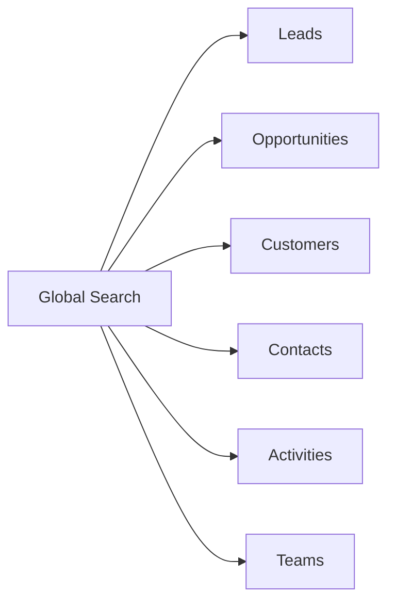
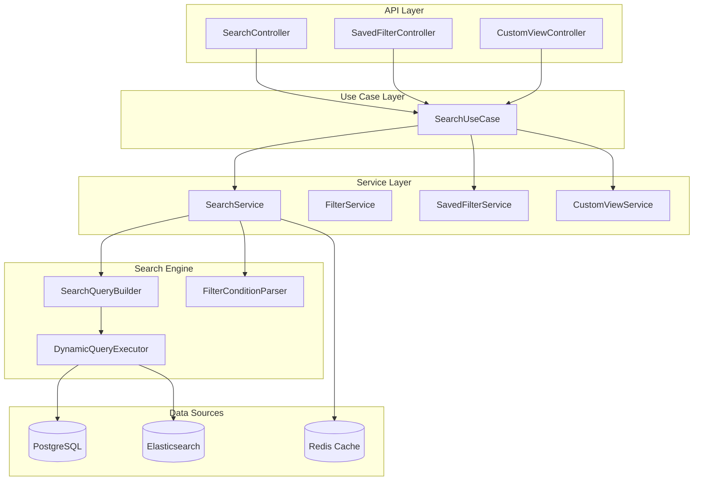

# Advanced Search Module - Thiết Kế Chi Tiết

**Module:** CRM Advanced Search & Filtering  
**Phiên bản:** 1.0  
**Ngày tạo:** 2025-12-07  
**Tác giả:** AI Assistant

---

## Mục Lục

1. [Tổng Quan](#1-tổng-quan)
2. [Kiến Trúc Module](#2-kiến-trúc-module)
3. [Domain Entities](#3-domain-entities)
4. [Service Layer](#4-service-layer)
5. [API Endpoints](#5-api-endpoints)
6. [Database Schema](#6-database-schema)
7. [Search Engine Integration](#7-search-engine-integration)
8. [Filter Builder](#8-filter-builder)
9. [Implementation Guide](#9-implementation-guide)

---

## 1. Tổng Quan

### 1.1. Mục Tiêu

Advanced Search Module cung cấp khả năng:
- **Full-text Search:** Tìm kiếm text trong tất cả entities
- **Advanced Filtering:** Filter nhiều criteria với AND/OR logic
- **Saved Filters:** Lưu và chia sẻ filter configurations
- **Dynamic Views:** Tạo custom views với filters và columns
- **Global Search:** Tìm kiếm cross-entity từ một input
- **Recent Searches:** Lưu lịch sử tìm kiếm

### 1.2. Features Overview

| Feature | Description | Priority |
|---------|-------------|----------|
| **Basic Search** | Text search trong entity fields | High |
| **Field Filters** | Filter theo từng field | High |
| **Advanced Filters** | Multiple conditions với AND/OR | High |
| **Saved Filters** | Lưu filter để reuse | Medium |
| **Custom Views** | Saved filter + column selection | Medium |
| **Global Search** | Search across entities | Medium |
| **Full-text Search** | Elasticsearch integration | Low |
| **Search Suggestions** | Auto-complete suggestions | Low |

### 1.3. Supported Entities



---

## 2. Kiến Trúc Module

### 2.1. Package Structure

```
crm/src/main/java/serp/project/crm/
├── core/
│   ├── domain/
│   │   ├── entity/
│   │   │   ├── SavedFilterEntity.java
│   │   │   ├── CustomViewEntity.java
│   │   │   ├── SearchHistoryEntity.java
│   │   │   └── FilterConditionEntity.java
│   │   ├── dto/
│   │   │   ├── request/
│   │   │   │   ├── SearchRequest.java
│   │   │   │   ├── AdvancedSearchRequest.java
│   │   │   │   ├── GlobalSearchRequest.java
│   │   │   │   ├── CreateSavedFilterRequest.java
│   │   │   │   └── CreateCustomViewRequest.java
│   │   │   └── response/
│   │   │       ├── SearchResultResponse.java
│   │   │       ├── GlobalSearchResponse.java
│   │   │       ├── SavedFilterResponse.java
│   │   │       ├── CustomViewResponse.java
│   │   │       └── SearchSuggestionResponse.java
│   │   └── enums/
│   │       ├── FilterOperator.java
│   │       ├── LogicalOperator.java
│   │       ├── SortDirection.java
│   │       └── FieldType.java
│   ├── service/
│   │   ├── ISearchService.java
│   │   ├── IFilterService.java
│   │   ├── ISavedFilterService.java
│   │   ├── ICustomViewService.java
│   │   └── impl/
│   │       ├── SearchService.java
│   │       ├── FilterService.java
│   │       ├── SavedFilterService.java
│   │       └── CustomViewService.java
│   ├── usecase/
│   │   └── SearchUseCase.java
│   ├── port/
│   │   └── store/
│   │       ├── ISavedFilterStorePort.java
│   │       ├── ICustomViewStorePort.java
│   │       └── ISearchHistoryStorePort.java
│   └── search/
│       ├── SearchQueryBuilder.java
│       ├── FilterConditionParser.java
│       ├── DynamicQueryExecutor.java
│       └── SearchIndexer.java
├── infrastructure/
│   └── store/
│       ├── adapter/
│       │   ├── SavedFilterAdapter.java
│       │   └── CustomViewAdapter.java
│       ├── model/
│       │   ├── SavedFilterModel.java
│       │   ├── CustomViewModel.java
│       │   └── SearchHistoryModel.java
│       └── repository/
│           ├── SavedFilterRepository.java
│           ├── CustomViewRepository.java
│           └── SearchHistoryRepository.java
└── ui/
    └── controller/
        ├── SearchController.java
        ├── SavedFilterController.java
        └── CustomViewController.java
```

### 2.2. Architecture Diagram



---

## 3. Domain Entities

### 3.1. SavedFilterEntity

```java
package serp.project.crm.core.domain.entity;

import lombok.*;
import lombok.experimental.SuperBuilder;
import java.util.List;

@NoArgsConstructor
@AllArgsConstructor
@Getter
@Setter
@SuperBuilder
public class SavedFilterEntity extends BaseEntity {
    private String name;
    private String description;
    private String entityType;            // LEAD, OPPORTUNITY, CUSTOMER, etc.
    
    private List<FilterConditionEntity> conditions;
    private String sortField;
    private String sortDirection;         // ASC, DESC
    
    private Boolean isPublic;             // Visible to all users
    private Boolean isPinned;             // Pinned to quick access
    private String color;                 // UI color indicator
    private String icon;                  // UI icon
    
    private Long usageCount;              // How many times used
    
    public void setDefaults() {
        if (this.isPublic == null) this.isPublic = false;
        if (this.isPinned == null) this.isPinned = false;
        if (this.sortDirection == null) this.sortDirection = "DESC";
        if (this.usageCount == null) this.usageCount = 0L;
    }
    
    public void incrementUsage() {
        this.usageCount++;
    }
}
```

### 3.2. FilterConditionEntity

```java
package serp.project.crm.core.domain.entity;

import lombok.*;
import serp.project.crm.core.domain.enums.FilterOperator;
import serp.project.crm.core.domain.enums.LogicalOperator;
import serp.project.crm.core.domain.enums.FieldType;

@NoArgsConstructor
@AllArgsConstructor
@Getter
@Setter
@Builder
public class FilterConditionEntity {
    private Long id;
    private Long filterId;
    private Integer conditionOrder;
    
    private String fieldName;             // e.g., "leadStatus", "estimatedValue"
    private String fieldDisplayName;      // e.g., "Lead Status", "Estimated Value"
    private FieldType fieldType;          // STRING, NUMBER, DATE, BOOLEAN, ENUM, REFERENCE
    
    private FilterOperator operator;      // EQUALS, CONTAINS, GREATER_THAN, etc.
    private String value;                 // Single value or JSON array for IN operator
    private String value2;                // For BETWEEN operator
    
    private LogicalOperator logicalOperator; // AND, OR - combine with next condition
    
    // For grouped conditions (parentheses)
    private Integer groupId;              // Group identifier
    private Boolean isGroupStart;
    private Boolean isGroupEnd;
}
```

### 3.3. CustomViewEntity

```java
package serp.project.crm.core.domain.entity;

import lombok.*;
import lombok.experimental.SuperBuilder;
import java.util.List;

@NoArgsConstructor
@AllArgsConstructor
@Getter
@Setter
@SuperBuilder
public class CustomViewEntity extends BaseEntity {
    private String name;
    private String description;
    private String entityType;
    
    // Filter configuration
    private Long savedFilterId;           // Optional: link to saved filter
    private List<FilterConditionEntity> conditions; // Or inline conditions
    
    // Column configuration
    private List<ViewColumnEntity> columns;
    
    // Sorting
    private String defaultSortField;
    private String defaultSortDirection;
    
    // Settings
    private Boolean isDefault;            // Default view for this entity type
    private Boolean isPublic;
    private Integer pageSize;             // Default page size
    
    // UI Settings
    private String displayMode;           // TABLE, KANBAN, CARD
    private String color;
    private String icon;
    
    public void setDefaults() {
        if (this.isDefault == null) this.isDefault = false;
        if (this.isPublic == null) this.isPublic = false;
        if (this.pageSize == null) this.pageSize = 20;
        if (this.displayMode == null) this.displayMode = "TABLE";
        if (this.defaultSortDirection == null) this.defaultSortDirection = "DESC";
    }
}

@Data
@Builder
@NoArgsConstructor
@AllArgsConstructor
public class ViewColumnEntity {
    private String fieldName;
    private String displayName;
    private Integer width;
    private Integer order;
    private Boolean isVisible;
    private Boolean isSortable;
    private Boolean isFilterable;
    private String format;                // DATE_FORMAT, CURRENCY, PERCENTAGE, etc.
}
```

### 3.4. SearchHistoryEntity

```java
package serp.project.crm.core.domain.entity;

import lombok.*;
import lombok.experimental.SuperBuilder;
import java.time.LocalDateTime;

@NoArgsConstructor
@AllArgsConstructor
@Getter
@Setter
@SuperBuilder
public class SearchHistoryEntity extends BaseEntity {
    private Long userId;
    private String entityType;            // null for global search
    private String searchQuery;
    private String filterConfig;          // JSON of applied filters
    private Integer resultCount;
    private LocalDateTime searchedAt;
}
```

### 3.5. Enums

```java
// FilterOperator.java
public enum FilterOperator {
    // Equality
    EQUALS("=", "equals"),
    NOT_EQUALS("!=", "not equals"),
    
    // String
    CONTAINS("contains", "contains"),
    NOT_CONTAINS("!contains", "not contains"),
    STARTS_WITH("starts", "starts with"),
    ENDS_WITH("ends", "ends with"),
    MATCHES_REGEX("regex", "matches regex"),
    
    // Numeric
    GREATER_THAN(">", "greater than"),
    GREATER_THAN_OR_EQUALS(">=", "greater than or equals"),
    LESS_THAN("<", "less than"),
    LESS_THAN_OR_EQUALS("<=", "less than or equals"),
    BETWEEN("between", "between"),
    
    // Date
    IS_TODAY("today", "is today"),
    IS_YESTERDAY("yesterday", "is yesterday"),
    IS_THIS_WEEK("this_week", "is this week"),
    IS_LAST_WEEK("last_week", "is last week"),
    IS_THIS_MONTH("this_month", "is this month"),
    IS_LAST_MONTH("last_month", "is last month"),
    IS_THIS_YEAR("this_year", "is this year"),
    IS_BEFORE("before", "is before"),
    IS_AFTER("after", "is after"),
    IS_ON_OR_BEFORE("on_or_before", "is on or before"),
    IS_ON_OR_AFTER("on_or_after", "is on or after"),
    IN_LAST_N_DAYS("last_n_days", "in last N days"),
    IN_NEXT_N_DAYS("next_n_days", "in next N days"),
    
    // List
    IN("in", "in list"),
    NOT_IN("not_in", "not in list"),
    
    // Null
    IS_NULL("is_null", "is empty"),
    IS_NOT_NULL("is_not_null", "is not empty"),
    
    // Boolean
    IS_TRUE("is_true", "is true"),
    IS_FALSE("is_false", "is false");
    
    private final String symbol;
    private final String displayName;
    
    FilterOperator(String symbol, String displayName) {
        this.symbol = symbol;
        this.displayName = displayName;
    }
}

// FieldType.java
public enum FieldType {
    STRING, NUMBER, DECIMAL, BOOLEAN, DATE, DATETIME, 
    ENUM, REFERENCE, PHONE, EMAIL, URL, TEXT
}
```

---

## 4. Service Layer

### 4.1. ISearchService

```java
package serp.project.crm.core.service;

import serp.project.crm.core.domain.dto.request.*;
import serp.project.crm.core.domain.dto.response.*;
import serp.project.crm.core.domain.dto.PageRequest;
import org.springframework.data.util.Pair;

import java.util.List;

public interface ISearchService {
    
    // Basic search
    <T> SearchResultResponse<T> search(
        String entityType, 
        String query, 
        Long tenantId, 
        PageRequest pageRequest
    );
    
    // Advanced search with filters
    <T> SearchResultResponse<T> advancedSearch(
        AdvancedSearchRequest request, 
        Long tenantId, 
        PageRequest pageRequest
    );
    
    // Global search across entities
    GlobalSearchResponse globalSearch(
        String query, 
        Long tenantId, 
        int limit
    );
    
    // Search with saved filter
    <T> SearchResultResponse<T> searchWithFilter(
        Long savedFilterId, 
        Long tenantId, 
        PageRequest pageRequest
    );
    
    // Search suggestions
    List<SearchSuggestionResponse> getSuggestions(
        String entityType, 
        String query, 
        Long tenantId, 
        int limit
    );
    
    // Search history
    List<SearchHistoryEntity> getSearchHistory(Long userId, Long tenantId, int limit);
    void saveSearchHistory(String entityType, String query, int resultCount, Long userId, Long tenantId);
    void clearSearchHistory(Long userId, Long tenantId);
    
    // Field metadata
    List<SearchableFieldInfo> getSearchableFields(String entityType);
}
```

### 4.2. SearchService Implementation

```java
package serp.project.crm.core.service.impl;

import lombok.RequiredArgsConstructor;
import lombok.extern.slf4j.Slf4j;
import org.springframework.stereotype.Service;
import serp.project.crm.core.domain.dto.request.*;
import serp.project.crm.core.domain.dto.response.*;
import serp.project.crm.core.search.*;
import serp.project.crm.core.service.*;

import java.util.*;

@Service
@RequiredArgsConstructor
@Slf4j
public class SearchService implements ISearchService {
    
    private final SearchQueryBuilder queryBuilder;
    private final DynamicQueryExecutor queryExecutor;
    private final FilterConditionParser conditionParser;
    private final ISearchHistoryStorePort historyStore;
    private final ISavedFilterStorePort filterStore;
    
    @Override
    public <T> SearchResultResponse<T> search(
            String entityType, 
            String query, 
            Long tenantId, 
            PageRequest pageRequest) {
        
        // Build simple search query
        SearchQuery searchQuery = queryBuilder.buildSimpleSearch(entityType, query, tenantId);
        
        // Execute and return results
        return executeSearch(searchQuery, pageRequest);
    }
    
    @Override
    public <T> SearchResultResponse<T> advancedSearch(
            AdvancedSearchRequest request, 
            Long tenantId, 
            PageRequest pageRequest) {
        
        // Parse conditions
        List<FilterConditionEntity> conditions = conditionParser.parse(request.getConditions());
        
        // Build advanced search query
        SearchQuery searchQuery = queryBuilder.buildAdvancedSearch(
            request.getEntityType(),
            conditions,
            request.getSortField(),
            request.getSortDirection(),
            tenantId
        );
        
        // Execute and return results
        return executeSearch(searchQuery, pageRequest);
    }
    
    @Override
    public GlobalSearchResponse globalSearch(String query, Long tenantId, int limit) {
        GlobalSearchResponse response = new GlobalSearchResponse();
        
        // Search each entity type
        List<String> entityTypes = List.of("LEAD", "OPPORTUNITY", "CUSTOMER", "CONTACT", "ACTIVITY");
        
        for (String entityType : entityTypes) {
            try {
                SearchQuery searchQuery = queryBuilder.buildSimpleSearch(entityType, query, tenantId);
                searchQuery.setLimit(limit);
                
                List<GlobalSearchResult> results = queryExecutor.executeGlobalSearch(searchQuery);
                response.addResults(entityType, results);
                
            } catch (Exception e) {
                log.warn("Failed to search {}: {}", entityType, e.getMessage());
            }
        }
        
        response.setQuery(query);
        response.setTotalResults(response.getAllResults().size());
        
        return response;
    }
    
    @Override
    public <T> SearchResultResponse<T> searchWithFilter(
            Long savedFilterId, 
            Long tenantId, 
            PageRequest pageRequest) {
        
        // Get saved filter
        SavedFilterEntity filter = filterStore.findById(savedFilterId, tenantId)
            .orElseThrow(() -> new IllegalArgumentException("Filter not found"));
        
        // Increment usage
        filter.incrementUsage();
        filterStore.save(filter);
        
        // Build and execute query
        SearchQuery searchQuery = queryBuilder.buildFromSavedFilter(filter, tenantId);
        return executeSearch(searchQuery, pageRequest);
    }
    
    @Override
    public List<SearchSuggestionResponse> getSuggestions(
            String entityType, 
            String query, 
            Long tenantId, 
            int limit) {
        
        List<SearchSuggestionResponse> suggestions = new ArrayList<>();
        
        // Get field suggestions based on query
        if (query.contains(":")) {
            // Field-specific search: "status:qualified"
            String[] parts = query.split(":", 2);
            String fieldName = parts[0];
            String fieldValue = parts.length > 1 ? parts[1] : "";
            
            suggestions.addAll(getFieldValueSuggestions(entityType, fieldName, fieldValue, tenantId, limit));
        } else {
            // General suggestions
            suggestions.addAll(getRecentSearches(entityType, query, tenantId, limit / 2));
            suggestions.addAll(getPopularSearches(entityType, query, tenantId, limit / 2));
        }
        
        return suggestions.stream().limit(limit).toList();
    }
    
    private <T> SearchResultResponse<T> executeSearch(SearchQuery searchQuery, PageRequest pageRequest) {
        searchQuery.setOffset((pageRequest.getPage() - 1) * pageRequest.getSize());
        searchQuery.setLimit(pageRequest.getSize());
        
        SearchExecutionResult<T> executionResult = queryExecutor.execute(searchQuery);
        
        return SearchResultResponse.<T>builder()
            .items(executionResult.getItems())
            .total(executionResult.getTotal())
            .page(pageRequest.getPage())
            .size(pageRequest.getSize())
            .totalPages((int) Math.ceil((double) executionResult.getTotal() / pageRequest.getSize()))
            .executionTimeMs(executionResult.getExecutionTimeMs())
            .build();
    }
}
```

### 4.3. SearchQueryBuilder

```java
package serp.project.crm.core.search;

import lombok.RequiredArgsConstructor;
import lombok.extern.slf4j.Slf4j;
import org.springframework.stereotype.Component;
import serp.project.crm.core.domain.entity.*;
import serp.project.crm.core.domain.enums.*;

import java.util.*;

@Component
@RequiredArgsConstructor
@Slf4j
public class SearchQueryBuilder {
    
    private static final Map<String, List<String>> SEARCHABLE_FIELDS = Map.of(
        "LEAD", List.of("name", "email", "phone", "company", "industry", "notes"),
        "OPPORTUNITY", List.of("name", "description", "notes"),
        "CUSTOMER", List.of("name", "email", "phone", "website", "industry", "notes"),
        "CONTACT", List.of("name", "email", "phone", "jobPosition", "notes"),
        "ACTIVITY", List.of("subject", "description", "notes")
    );
    
    public SearchQuery buildSimpleSearch(String entityType, String query, Long tenantId) {
        List<String> searchFields = SEARCHABLE_FIELDS.getOrDefault(entityType, List.of("name"));
        
        StringBuilder whereClause = new StringBuilder("tenant_id = :tenantId AND (");
        
        for (int i = 0; i < searchFields.size(); i++) {
            if (i > 0) whereClause.append(" OR ");
            whereClause.append(String.format("LOWER(%s) LIKE LOWER(:query)", 
                toSnakeCase(searchFields.get(i))));
        }
        whereClause.append(")");
        
        return SearchQuery.builder()
            .entityType(entityType)
            .tableName(getTableName(entityType))
            .whereClause(whereClause.toString())
            .parameters(Map.of("tenantId", tenantId, "query", "%" + query + "%"))
            .orderBy("created_at DESC")
            .build();
    }
    
    public SearchQuery buildAdvancedSearch(
            String entityType,
            List<FilterConditionEntity> conditions,
            String sortField,
            String sortDirection,
            Long tenantId) {
        
        StringBuilder whereClause = new StringBuilder("tenant_id = :tenantId");
        Map<String, Object> parameters = new HashMap<>();
        parameters.put("tenantId", tenantId);
        
        if (conditions != null && !conditions.isEmpty()) {
            whereClause.append(" AND (");
            
            for (int i = 0; i < conditions.size(); i++) {
                FilterConditionEntity condition = conditions.get(i);
                
                if (i > 0) {
                    LogicalOperator logicalOp = conditions.get(i - 1).getLogicalOperator();
                    whereClause.append(logicalOp == LogicalOperator.OR ? " OR " : " AND ");
                }
                
                String conditionSql = buildConditionSql(condition, i, parameters);
                whereClause.append(conditionSql);
            }
            
            whereClause.append(")");
        }
        
        String orderBy = sortField != null 
            ? toSnakeCase(sortField) + " " + (sortDirection != null ? sortDirection : "DESC")
            : "created_at DESC";
        
        return SearchQuery.builder()
            .entityType(entityType)
            .tableName(getTableName(entityType))
            .whereClause(whereClause.toString())
            .parameters(parameters)
            .orderBy(orderBy)
            .build();
    }
    
    private String buildConditionSql(FilterConditionEntity condition, int index, Map<String, Object> params) {
        String fieldName = toSnakeCase(condition.getFieldName());
        String paramName = "p" + index;
        
        switch (condition.getOperator()) {
            case EQUALS:
                params.put(paramName, condition.getValue());
                return String.format("%s = :%s", fieldName, paramName);
                
            case NOT_EQUALS:
                params.put(paramName, condition.getValue());
                return String.format("%s != :%s", fieldName, paramName);
                
            case CONTAINS:
                params.put(paramName, "%" + condition.getValue() + "%");
                return String.format("LOWER(%s) LIKE LOWER(:%s)", fieldName, paramName);
                
            case STARTS_WITH:
                params.put(paramName, condition.getValue() + "%");
                return String.format("LOWER(%s) LIKE LOWER(:%s)", fieldName, paramName);
                
            case ENDS_WITH:
                params.put(paramName, "%" + condition.getValue());
                return String.format("LOWER(%s) LIKE LOWER(:%s)", fieldName, paramName);
                
            case GREATER_THAN:
                params.put(paramName, parseNumeric(condition.getValue()));
                return String.format("%s > :%s", fieldName, paramName);
                
            case GREATER_THAN_OR_EQUALS:
                params.put(paramName, parseNumeric(condition.getValue()));
                return String.format("%s >= :%s", fieldName, paramName);
                
            case LESS_THAN:
                params.put(paramName, parseNumeric(condition.getValue()));
                return String.format("%s < :%s", fieldName, paramName);
                
            case LESS_THAN_OR_EQUALS:
                params.put(paramName, parseNumeric(condition.getValue()));
                return String.format("%s <= :%s", fieldName, paramName);
                
            case BETWEEN:
                params.put(paramName + "_1", parseNumeric(condition.getValue()));
                params.put(paramName + "_2", parseNumeric(condition.getValue2()));
                return String.format("%s BETWEEN :%s_1 AND :%s_2", fieldName, paramName, paramName);
                
            case IN:
                List<String> values = parseList(condition.getValue());
                params.put(paramName, values);
                return String.format("%s IN (:%s)", fieldName, paramName);
                
            case NOT_IN:
                List<String> notInValues = parseList(condition.getValue());
                params.put(paramName, notInValues);
                return String.format("%s NOT IN (:%s)", fieldName, paramName);
                
            case IS_NULL:
                return String.format("%s IS NULL", fieldName);
                
            case IS_NOT_NULL:
                return String.format("%s IS NOT NULL", fieldName);
                
            case IS_TODAY:
                return String.format("DATE(%s) = CURRENT_DATE", fieldName);
                
            case IS_THIS_WEEK:
                return String.format("DATE(%s) >= DATE_TRUNC('week', CURRENT_DATE)", fieldName);
                
            case IS_THIS_MONTH:
                return String.format("DATE(%s) >= DATE_TRUNC('month', CURRENT_DATE)", fieldName);
                
            case IN_LAST_N_DAYS:
                int days = Integer.parseInt(condition.getValue());
                return String.format("DATE(%s) >= CURRENT_DATE - INTERVAL '%d days'", fieldName, days);
                
            default:
                throw new IllegalArgumentException("Unsupported operator: " + condition.getOperator());
        }
    }
    
    private String getTableName(String entityType) {
        return switch (entityType.toUpperCase()) {
            case "LEAD" -> "leads";
            case "OPPORTUNITY" -> "opportunities";
            case "CUSTOMER" -> "customers";
            case "CONTACT" -> "contacts";
            case "ACTIVITY" -> "activities";
            case "TEAM" -> "teams";
            default -> throw new IllegalArgumentException("Unknown entity type: " + entityType);
        };
    }
    
    private String toSnakeCase(String camelCase) {
        return camelCase.replaceAll("([a-z])([A-Z])", "$1_$2").toLowerCase();
    }
}
```

---

## 5. API Endpoints

### 5.1. SearchController

```java
package serp.project.crm.ui.controller;

import jakarta.validation.Valid;
import lombok.RequiredArgsConstructor;
import lombok.extern.slf4j.Slf4j;
import org.springframework.http.ResponseEntity;
import org.springframework.web.bind.annotation.*;
import serp.project.crm.core.domain.dto.PageRequest;
import serp.project.crm.core.domain.dto.request.*;
import serp.project.crm.core.usecase.SearchUseCase;
import serp.project.crm.kernel.utils.AuthUtils;

@RestController
@RequestMapping("/api/v1/search")
@RequiredArgsConstructor
@Slf4j
public class SearchController {
    
    private final SearchUseCase searchUseCase;
    private final AuthUtils authUtils;
    
    // Global search
    @GetMapping
    public ResponseEntity<?> globalSearch(
            @RequestParam String q,
            @RequestParam(defaultValue = "10") Integer limit) {
        Long tenantId = authUtils.getCurrentTenantId()
            .orElseThrow(() -> new IllegalArgumentException("Tenant ID not found"));
        
        var response = searchUseCase.globalSearch(q, tenantId, limit);
        return ResponseEntity.status(response.getCode()).body(response);
    }
    
    // Entity-specific search
    @GetMapping("/{entityType}")
    public ResponseEntity<?> search(
            @PathVariable String entityType,
            @RequestParam(required = false) String q,
            @RequestParam(defaultValue = "1") Integer page,
            @RequestParam(defaultValue = "20") Integer size,
            @RequestParam(required = false) String sortField,
            @RequestParam(defaultValue = "DESC") String sortDirection) {
        Long tenantId = authUtils.getCurrentTenantId()
            .orElseThrow(() -> new IllegalArgumentException("Tenant ID not found"));
        
        PageRequest pageRequest = PageRequest.builder()
            .page(page)
            .size(size)
            .sortField(sortField)
            .sortDirection(sortDirection)
            .build();
        
        var response = searchUseCase.search(entityType, q, tenantId, pageRequest);
        return ResponseEntity.status(response.getCode()).body(response);
    }
    
    // Advanced search with filters
    @PostMapping("/{entityType}/advanced")
    public ResponseEntity<?> advancedSearch(
            @PathVariable String entityType,
            @Valid @RequestBody AdvancedSearchRequest request,
            @RequestParam(defaultValue = "1") Integer page,
            @RequestParam(defaultValue = "20") Integer size) {
        Long tenantId = authUtils.getCurrentTenantId()
            .orElseThrow(() -> new IllegalArgumentException("Tenant ID not found"));
        
        request.setEntityType(entityType);
        PageRequest pageRequest = PageRequest.builder().page(page).size(size).build();
        
        var response = searchUseCase.advancedSearch(request, tenantId, pageRequest);
        return ResponseEntity.status(response.getCode()).body(response);
    }
    
    // Search with saved filter
    @GetMapping("/{entityType}/filter/{filterId}")
    public ResponseEntity<?> searchWithFilter(
            @PathVariable String entityType,
            @PathVariable Long filterId,
            @RequestParam(defaultValue = "1") Integer page,
            @RequestParam(defaultValue = "20") Integer size) {
        Long tenantId = authUtils.getCurrentTenantId()
            .orElseThrow(() -> new IllegalArgumentException("Tenant ID not found"));
        
        PageRequest pageRequest = PageRequest.builder().page(page).size(size).build();
        
        var response = searchUseCase.searchWithFilter(filterId, tenantId, pageRequest);
        return ResponseEntity.status(response.getCode()).body(response);
    }
    
    // Suggestions
    @GetMapping("/{entityType}/suggestions")
    public ResponseEntity<?> getSuggestions(
            @PathVariable String entityType,
            @RequestParam String q,
            @RequestParam(defaultValue = "10") Integer limit) {
        Long tenantId = authUtils.getCurrentTenantId()
            .orElseThrow(() -> new IllegalArgumentException("Tenant ID not found"));
        
        var response = searchUseCase.getSuggestions(entityType, q, tenantId, limit);
        return ResponseEntity.status(response.getCode()).body(response);
    }
    
    // Searchable fields
    @GetMapping("/{entityType}/fields")
    public ResponseEntity<?> getSearchableFields(@PathVariable String entityType) {
        Long tenantId = authUtils.getCurrentTenantId()
            .orElseThrow(() -> new IllegalArgumentException("Tenant ID not found"));
        
        var response = searchUseCase.getSearchableFields(entityType);
        return ResponseEntity.status(response.getCode()).body(response);
    }
    
    // Search history
    @GetMapping("/history")
    public ResponseEntity<?> getSearchHistory(
            @RequestParam(defaultValue = "20") Integer limit) {
        Long userId = authUtils.getCurrentUserId()
            .orElseThrow(() -> new IllegalArgumentException("User ID not found"));
        Long tenantId = authUtils.getCurrentTenantId()
            .orElseThrow(() -> new IllegalArgumentException("Tenant ID not found"));
        
        var response = searchUseCase.getSearchHistory(userId, tenantId, limit);
        return ResponseEntity.status(response.getCode()).body(response);
    }
    
    @DeleteMapping("/history")
    public ResponseEntity<?> clearSearchHistory() {
        Long userId = authUtils.getCurrentUserId()
            .orElseThrow(() -> new IllegalArgumentException("User ID not found"));
        Long tenantId = authUtils.getCurrentTenantId()
            .orElseThrow(() -> new IllegalArgumentException("Tenant ID not found"));
        
        var response = searchUseCase.clearSearchHistory(userId, tenantId);
        return ResponseEntity.status(response.getCode()).body(response);
    }
}
```

### 5.2. SavedFilterController

```java
package serp.project.crm.ui.controller;

import jakarta.validation.Valid;
import lombok.RequiredArgsConstructor;
import lombok.extern.slf4j.Slf4j;
import org.springframework.http.ResponseEntity;
import org.springframework.web.bind.annotation.*;
import serp.project.crm.core.domain.dto.PageRequest;
import serp.project.crm.core.domain.dto.request.*;
import serp.project.crm.core.usecase.SearchUseCase;
import serp.project.crm.kernel.utils.AuthUtils;

@RestController
@RequestMapping("/api/v1/saved-filters")
@RequiredArgsConstructor
@Slf4j
public class SavedFilterController {
    
    private final SearchUseCase searchUseCase;
    private final AuthUtils authUtils;
    
    @PostMapping
    public ResponseEntity<?> createSavedFilter(@Valid @RequestBody CreateSavedFilterRequest request) {
        Long tenantId = authUtils.getCurrentTenantId()
            .orElseThrow(() -> new IllegalArgumentException("Tenant ID not found"));
        
        var response = searchUseCase.createSavedFilter(request, tenantId);
        return ResponseEntity.status(response.getCode()).body(response);
    }
    
    @GetMapping
    public ResponseEntity<?> getAllSavedFilters(
            @RequestParam(required = false) String entityType,
            @RequestParam(defaultValue = "1") Integer page,
            @RequestParam(defaultValue = "20") Integer size) {
        Long tenantId = authUtils.getCurrentTenantId()
            .orElseThrow(() -> new IllegalArgumentException("Tenant ID not found"));
        
        PageRequest pageRequest = PageRequest.builder().page(page).size(size).build();
        
        var response = searchUseCase.getAllSavedFilters(entityType, tenantId, pageRequest);
        return ResponseEntity.status(response.getCode()).body(response);
    }
    
    @GetMapping("/{id}")
    public ResponseEntity<?> getSavedFilterById(@PathVariable Long id) {
        Long tenantId = authUtils.getCurrentTenantId()
            .orElseThrow(() -> new IllegalArgumentException("Tenant ID not found"));
        
        var response = searchUseCase.getSavedFilterById(id, tenantId);
        return ResponseEntity.status(response.getCode()).body(response);
    }
    
    @PutMapping("/{id}")
    public ResponseEntity<?> updateSavedFilter(
            @PathVariable Long id,
            @Valid @RequestBody UpdateSavedFilterRequest request) {
        Long tenantId = authUtils.getCurrentTenantId()
            .orElseThrow(() -> new IllegalArgumentException("Tenant ID not found"));
        
        var response = searchUseCase.updateSavedFilter(id, request, tenantId);
        return ResponseEntity.status(response.getCode()).body(response);
    }
    
    @DeleteMapping("/{id}")
    public ResponseEntity<?> deleteSavedFilter(@PathVariable Long id) {
        Long tenantId = authUtils.getCurrentTenantId()
            .orElseThrow(() -> new IllegalArgumentException("Tenant ID not found"));
        
        var response = searchUseCase.deleteSavedFilter(id, tenantId);
        return ResponseEntity.status(response.getCode()).body(response);
    }
    
    @PostMapping("/{id}/pin")
    public ResponseEntity<?> pinFilter(@PathVariable Long id) {
        Long tenantId = authUtils.getCurrentTenantId()
            .orElseThrow(() -> new IllegalArgumentException("Tenant ID not found"));
        
        var response = searchUseCase.pinFilter(id, tenantId);
        return ResponseEntity.status(response.getCode()).body(response);
    }
    
    @PostMapping("/{id}/unpin")
    public ResponseEntity<?> unpinFilter(@PathVariable Long id) {
        Long tenantId = authUtils.getCurrentTenantId()
            .orElseThrow(() -> new IllegalArgumentException("Tenant ID not found"));
        
        var response = searchUseCase.unpinFilter(id, tenantId);
        return ResponseEntity.status(response.getCode()).body(response);
    }
}
```

### 5.3. API Summary

| Method | Endpoint | Description |
|--------|----------|-------------|
| **Search** | | |
| `GET` | `/api/v1/search?q=` | Global search |
| `GET` | `/api/v1/search/{entityType}?q=` | Entity search |
| `POST` | `/api/v1/search/{entityType}/advanced` | Advanced search |
| `GET` | `/api/v1/search/{entityType}/filter/{id}` | Search với saved filter |
| `GET` | `/api/v1/search/{entityType}/suggestions` | Search suggestions |
| `GET` | `/api/v1/search/{entityType}/fields` | Searchable fields |
| `GET` | `/api/v1/search/history` | Search history |
| `DELETE` | `/api/v1/search/history` | Clear history |
| **Saved Filters** | | |
| `POST` | `/api/v1/saved-filters` | Create filter |
| `GET` | `/api/v1/saved-filters` | List filters |
| `GET` | `/api/v1/saved-filters/{id}` | Get filter |
| `PUT` | `/api/v1/saved-filters/{id}` | Update filter |
| `DELETE` | `/api/v1/saved-filters/{id}` | Delete filter |
| `POST` | `/api/v1/saved-filters/{id}/pin` | Pin filter |
| `POST` | `/api/v1/saved-filters/{id}/unpin` | Unpin filter |

---

## 6. Database Schema

```sql
-- Saved Filters
CREATE TABLE saved_filters (
    id BIGSERIAL PRIMARY KEY,
    name VARCHAR(255) NOT NULL,
    description TEXT,
    entity_type VARCHAR(50) NOT NULL,
    conditions JSONB NOT NULL,
    sort_field VARCHAR(100),
    sort_direction VARCHAR(10) DEFAULT 'DESC',
    is_public BOOLEAN DEFAULT false,
    is_pinned BOOLEAN DEFAULT false,
    color VARCHAR(20),
    icon VARCHAR(50),
    usage_count BIGINT DEFAULT 0,
    tenant_id BIGINT NOT NULL,
    created_by BIGINT,
    updated_by BIGINT,
    created_at TIMESTAMP DEFAULT CURRENT_TIMESTAMP,
    updated_at TIMESTAMP DEFAULT CURRENT_TIMESTAMP
);

CREATE INDEX idx_saved_filters_tenant ON saved_filters(tenant_id);
CREATE INDEX idx_saved_filters_entity ON saved_filters(entity_type);
CREATE INDEX idx_saved_filters_user ON saved_filters(created_by);
CREATE INDEX idx_saved_filters_public ON saved_filters(is_public);

-- Custom Views
CREATE TABLE custom_views (
    id BIGSERIAL PRIMARY KEY,
    name VARCHAR(255) NOT NULL,
    description TEXT,
    entity_type VARCHAR(50) NOT NULL,
    saved_filter_id BIGINT REFERENCES saved_filters(id),
    conditions JSONB,
    columns JSONB NOT NULL,
    default_sort_field VARCHAR(100),
    default_sort_direction VARCHAR(10) DEFAULT 'DESC',
    is_default BOOLEAN DEFAULT false,
    is_public BOOLEAN DEFAULT false,
    page_size INTEGER DEFAULT 20,
    display_mode VARCHAR(20) DEFAULT 'TABLE',
    color VARCHAR(20),
    icon VARCHAR(50),
    tenant_id BIGINT NOT NULL,
    created_by BIGINT,
    updated_by BIGINT,
    created_at TIMESTAMP DEFAULT CURRENT_TIMESTAMP,
    updated_at TIMESTAMP DEFAULT CURRENT_TIMESTAMP
);

CREATE INDEX idx_custom_views_tenant ON custom_views(tenant_id);
CREATE INDEX idx_custom_views_entity ON custom_views(entity_type);
CREATE INDEX idx_custom_views_user ON custom_views(created_by);

-- Search History
CREATE TABLE search_history (
    id BIGSERIAL PRIMARY KEY,
    user_id BIGINT NOT NULL,
    entity_type VARCHAR(50),
    search_query TEXT NOT NULL,
    filter_config JSONB,
    result_count INTEGER,
    searched_at TIMESTAMP DEFAULT CURRENT_TIMESTAMP,
    tenant_id BIGINT NOT NULL
);

CREATE INDEX idx_search_history_user ON search_history(user_id);
CREATE INDEX idx_search_history_tenant_date ON search_history(tenant_id, searched_at);

-- Full-text Search Index (PostgreSQL)
-- For Leads
CREATE INDEX idx_leads_search ON leads USING gin(
    to_tsvector('english', coalesce(name, '') || ' ' || 
                           coalesce(email, '') || ' ' || 
                           coalesce(company, '') || ' ' || 
                           coalesce(notes, ''))
);

-- For Opportunities  
CREATE INDEX idx_opportunities_search ON opportunities USING gin(
    to_tsvector('english', coalesce(name, '') || ' ' || 
                           coalesce(description, '') || ' ' || 
                           coalesce(notes, ''))
);

-- For Customers
CREATE INDEX idx_customers_search ON customers USING gin(
    to_tsvector('english', coalesce(name, '') || ' ' || 
                           coalesce(email, '') || ' ' || 
                           coalesce(industry, '') || ' ' || 
                           coalesce(notes, ''))
);
```

---

## 7. Search Engine Integration

### 7.1. Elasticsearch (Optional)

```java
package serp.project.crm.core.search;

import co.elastic.clients.elasticsearch.ElasticsearchClient;
import co.elastic.clients.elasticsearch.core.*;
import co.elastic.clients.elasticsearch.core.search.Hit;
import lombok.RequiredArgsConstructor;
import lombok.extern.slf4j.Slf4j;
import org.springframework.stereotype.Component;

@Component
@RequiredArgsConstructor
@Slf4j
public class ElasticsearchService {
    
    private final ElasticsearchClient esClient;
    
    public List<GlobalSearchResult> search(String query, Long tenantId, int limit) {
        try {
            SearchResponse<Map> response = esClient.search(s -> s
                .index("crm-*")
                .query(q -> q
                    .bool(b -> b
                        .must(m -> m
                            .multiMatch(mm -> mm
                                .query(query)
                                .fields("name^3", "email^2", "company", "description", "notes")
                                .fuzziness("AUTO")
                            )
                        )
                        .filter(f -> f
                            .term(t -> t.field("tenantId").value(tenantId))
                        )
                    )
                )
                .size(limit)
                .highlight(h -> h
                    .fields("name", hf -> hf)
                    .fields("email", hf -> hf)
                    .fields("company", hf -> hf)
                ),
                Map.class
            );
            
            return response.hits().hits().stream()
                .map(this::mapToSearchResult)
                .toList();
                
        } catch (Exception e) {
            log.error("Elasticsearch search failed: {}", e.getMessage());
            return List.of();
        }
    }
    
    public void indexEntity(String entityType, Long entityId, Map<String, Object> data, Long tenantId) {
        try {
            data.put("tenantId", tenantId);
            data.put("entityType", entityType);
            
            esClient.index(i -> i
                .index("crm-" + entityType.toLowerCase())
                .id(entityId.toString())
                .document(data)
            );
            
        } catch (Exception e) {
            log.error("Failed to index entity {}/{}: {}", entityType, entityId, e.getMessage());
        }
    }
    
    public void deleteEntity(String entityType, Long entityId) {
        try {
            esClient.delete(d -> d
                .index("crm-" + entityType.toLowerCase())
                .id(entityId.toString())
            );
        } catch (Exception e) {
            log.warn("Failed to delete from index: {}", e.getMessage());
        }
    }
}
```

---

## 8. Filter Builder

### 8.1. Request Examples

```json
// Simple filter
{
    "entityType": "LEAD",
    "conditions": [
        {
            "fieldName": "leadStatus",
            "operator": "EQUALS",
            "value": "QUALIFIED"
        }
    ]
}

// Multiple conditions with AND
{
    "entityType": "OPPORTUNITY",
    "conditions": [
        {
            "fieldName": "stage",
            "operator": "IN",
            "value": "[\"PROPOSAL\", \"NEGOTIATION\"]"
        },
        {
            "fieldName": "estimatedValue",
            "operator": "GREATER_THAN",
            "value": "50000",
            "logicalOperator": "AND"
        }
    ],
    "sortField": "estimatedValue",
    "sortDirection": "DESC"
}

// Complex filter with groups
{
    "entityType": "LEAD",
    "conditions": [
        {
            "fieldName": "leadSource",
            "operator": "EQUALS",
            "value": "WEBSITE",
            "logicalOperator": "AND"
        },
        {
            "groupId": 1,
            "isGroupStart": true,
            "fieldName": "estimatedValue",
            "operator": "GREATER_THAN",
            "value": "10000",
            "logicalOperator": "OR"
        },
        {
            "groupId": 1,
            "isGroupEnd": true,
            "fieldName": "probability",
            "operator": "GREATER_THAN_OR_EQUALS",
            "value": "80"
        }
    ]
}
// Generates: leadSource = 'WEBSITE' AND (estimatedValue > 10000 OR probability >= 80)
```

---

## 9. Implementation Guide

### 9.1. Sprint Breakdown

| Sprint | Duration | Tasks |
|--------|----------|-------|
| Sprint 1 | 1 tuần | Database schema, Entities, Basic search |
| Sprint 2 | 1 tuần | Advanced filter builder, Condition parser |
| Sprint 3 | 1 tuần | Saved filters CRUD, Custom views |
| Sprint 4 | 1 tuần | Global search, Suggestions, History |

### 9.2. Searchable Fields Configuration

```java
@Configuration
public class SearchableFieldsConfig {
    
    @Bean
    public Map<String, List<SearchableFieldInfo>> searchableFields() {
        return Map.of(
            "LEAD", List.of(
                SearchableFieldInfo.of("name", "Name", FieldType.STRING, true),
                SearchableFieldInfo.of("email", "Email", FieldType.EMAIL, true),
                SearchableFieldInfo.of("phone", "Phone", FieldType.PHONE, true),
                SearchableFieldInfo.of("company", "Company", FieldType.STRING, true),
                SearchableFieldInfo.of("industry", "Industry", FieldType.STRING, true),
                SearchableFieldInfo.of("leadStatus", "Status", FieldType.ENUM, true),
                SearchableFieldInfo.of("leadSource", "Source", FieldType.ENUM, true),
                SearchableFieldInfo.of("estimatedValue", "Estimated Value", FieldType.DECIMAL, true),
                SearchableFieldInfo.of("probability", "Probability", FieldType.NUMBER, true),
                SearchableFieldInfo.of("expectedCloseDate", "Expected Close", FieldType.DATE, true),
                SearchableFieldInfo.of("assignedTo", "Assigned To", FieldType.REFERENCE, true),
                SearchableFieldInfo.of("createdAt", "Created At", FieldType.DATETIME, false)
            ),
            "OPPORTUNITY", List.of(
                SearchableFieldInfo.of("name", "Name", FieldType.STRING, true),
                SearchableFieldInfo.of("stage", "Stage", FieldType.ENUM, true),
                SearchableFieldInfo.of("estimatedValue", "Value", FieldType.DECIMAL, true),
                SearchableFieldInfo.of("probability", "Probability", FieldType.NUMBER, true),
                SearchableFieldInfo.of("expectedCloseDate", "Expected Close", FieldType.DATE, true),
                SearchableFieldInfo.of("customerId", "Customer", FieldType.REFERENCE, true),
                SearchableFieldInfo.of("assignedTo", "Assigned To", FieldType.REFERENCE, true)
            )
            // ... other entities
        );
    }
}
```

---

**Document Version:** 1.0  
**Last Updated:** 2025-12-07
