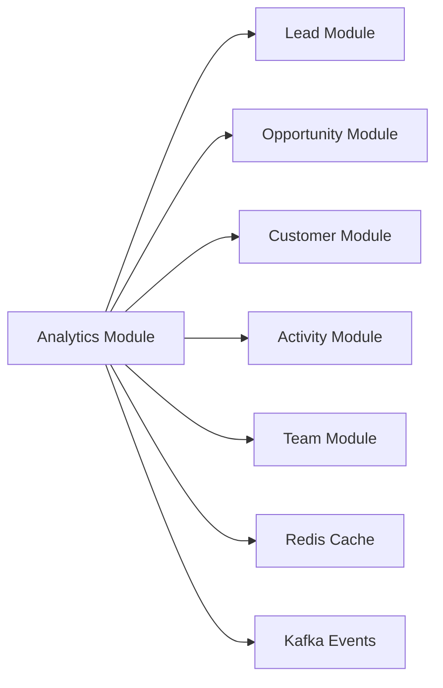
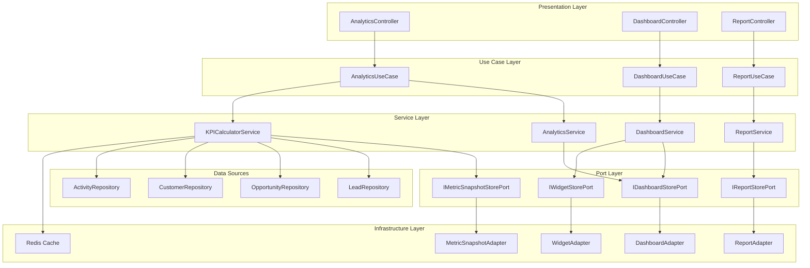

# Analytics Module - Thiết Kế Chi Tiết

**Module:** CRM Analytics & Dashboard  
**Phiên bản:** 1.0  
**Ngày tạo:** 2025-12-06  
**Tác giả:** AI Assistant

---

## Mục Lục

1. [Tổng Quan](#1-tổng-quan)
2. [Kiến Trúc Module](#2-kiến-trúc-module)
3. [Domain Entities](#3-domain-entities)
4. [Service Layer](#4-service-layer)
5. [API Endpoints](#5-api-endpoints)
6. [Database Schema](#6-database-schema)
7. [KPIs & Metrics](#7-kpis--metrics)
8. [Implementation Guide](#8-implementation-guide)

---

## 1. Tổng Quan

### 1.1. Mục Tiêu

Analytics Module cung cấp khả năng:
- **Real-time KPIs:** Hiển thị các chỉ số quan trọng về sales performance
- **Interactive Dashboards:** Tùy chỉnh dashboard với widgets
- **Custom Reports:** Tạo và export reports theo yêu cầu
- **Historical Trends:** Phân tích xu hướng theo thời gian
- **Data Visualization:** Charts, tables, funnels cho dữ liệu CRM

### 1.2. Phạm Vi

| In Scope | Out of Scope |
|----------|--------------|
| Pipeline Analytics | External BI Integration |
| Lead/Opportunity Metrics | Real-time Streaming |
| Team Performance Reports | Machine Learning Predictions (Phase 3) |
| Custom Dashboard Builder | Multi-tenant Comparison |
| Report Export (CSV, PDF) | Third-party Visualization Tools |

### 1.3. Dependencies



---

## 2. Kiến Trúc Module

### 2.1. Package Structure

```
crm/src/main/java/serp/project/crm/
├── core/
│   ├── domain/
│   │   ├── entity/
│   │   │   ├── DashboardEntity.java
│   │   │   ├── DashboardWidgetEntity.java
│   │   │   ├── ReportEntity.java
│   │   │   ├── ReportScheduleEntity.java
│   │   │   └── MetricSnapshotEntity.java
│   │   ├── dto/
│   │   │   ├── request/
│   │   │   │   ├── CreateDashboardRequest.java
│   │   │   │   ├── UpdateDashboardRequest.java
│   │   │   │   ├── CreateWidgetRequest.java
│   │   │   │   ├── CreateReportRequest.java
│   │   │   │   └── AnalyticsQueryRequest.java
│   │   │   └── response/
│   │   │       ├── DashboardResponse.java
│   │   │       ├── WidgetDataResponse.java
│   │   │       ├── AnalyticsSummaryResponse.java
│   │   │       ├── PipelineAnalyticsResponse.java
│   │   │       ├── ConversionAnalyticsResponse.java
│   │   │       └── PerformanceAnalyticsResponse.java
│   │   └── enums/
│   │       ├── WidgetType.java
│   │       ├── ChartType.java
│   │       ├── MetricType.java
│   │       ├── DateRangeType.java
│   │       └── ReportFormat.java
│   ├── service/
│   │   ├── IAnalyticsService.java
│   │   ├── IDashboardService.java
│   │   ├── IReportService.java
│   │   ├── IKPICalculatorService.java
│   │   └── impl/
│   │       ├── AnalyticsService.java
│   │       ├── DashboardService.java
│   │       ├── ReportService.java
│   │       └── KPICalculatorService.java
│   ├── usecase/
│   │   ├── AnalyticsUseCase.java
│   │   ├── DashboardUseCase.java
│   │   └── ReportUseCase.java
│   └── port/
│       └── store/
│           ├── IDashboardStorePort.java
│           ├── IWidgetStorePort.java
│           ├── IReportStorePort.java
│           └── IMetricSnapshotStorePort.java
├── infrastructure/
│   └── store/
│       ├── adapter/
│       │   ├── DashboardAdapter.java
│       │   ├── WidgetAdapter.java
│       │   ├── ReportAdapter.java
│       │   └── MetricSnapshotAdapter.java
│       ├── model/
│       │   ├── DashboardModel.java
│       │   ├── DashboardWidgetModel.java
│       │   ├── ReportModel.java
│       │   └── MetricSnapshotModel.java
│       └── repository/
│           ├── DashboardRepository.java
│           ├── DashboardWidgetRepository.java
│           ├── ReportRepository.java
│           └── MetricSnapshotRepository.java
└── ui/
    └── controller/
        ├── AnalyticsController.java
        ├── DashboardController.java
        └── ReportController.java
```

### 2.2. Component Diagram



---

## 3. Domain Entities

### 3.1. DashboardEntity

```java
package serp.project.crm.core.domain.entity;

import lombok.*;
import lombok.experimental.SuperBuilder;
import java.util.List;

@NoArgsConstructor
@AllArgsConstructor
@Getter
@Setter
@SuperBuilder
public class DashboardEntity extends BaseEntity {
    private String name;
    private String description;
    private Boolean isDefault;
    private Boolean isPublic;
    private Integer layoutColumns; // 1, 2, 3, or 4 columns
    private String theme; // light, dark, auto
    
    private List<DashboardWidgetEntity> widgets;
    
    public void setDefaults() {
        if (this.isDefault == null) {
            this.isDefault = false;
        }
        if (this.isPublic == null) {
            this.isPublic = false;
        }
        if (this.layoutColumns == null) {
            this.layoutColumns = 2;
        }
        if (this.theme == null) {
            this.theme = "light";
        }
    }
    
    public void updateFrom(DashboardEntity updates) {
        if (updates.getName() != null) this.name = updates.getName();
        if (updates.getDescription() != null) this.description = updates.getDescription();
        if (updates.getIsDefault() != null) this.isDefault = updates.getIsDefault();
        if (updates.getIsPublic() != null) this.isPublic = updates.getIsPublic();
        if (updates.getLayoutColumns() != null) this.layoutColumns = updates.getLayoutColumns();
        if (updates.getTheme() != null) this.theme = updates.getTheme();
    }
}
```

### 3.2. DashboardWidgetEntity

```java
package serp.project.crm.core.domain.entity;

import lombok.*;
import lombok.experimental.SuperBuilder;
import serp.project.crm.core.domain.enums.WidgetType;
import serp.project.crm.core.domain.enums.ChartType;

@NoArgsConstructor
@AllArgsConstructor
@Getter
@Setter
@SuperBuilder
public class DashboardWidgetEntity extends BaseEntity {
    private Long dashboardId;
    private String title;
    private WidgetType widgetType; // METRIC, CHART, TABLE, FUNNEL, LIST
    private ChartType chartType;   // LINE, BAR, PIE, DOUGHNUT, AREA (for CHART type)
    
    private String dataSource;     // LEAD, OPPORTUNITY, CUSTOMER, ACTIVITY
    private String metricName;     // pipeline_value, win_rate, conversion_rate, etc.
    
    private Integer positionX;     // Column position (0-based)
    private Integer positionY;     // Row position (0-based)
    private Integer width;         // Span columns (1-4)
    private Integer height;        // Span rows (1-4)
    
    private String filterConfig;   // JSON: date range, status filters, etc.
    private String displayConfig;  // JSON: colors, labels, formatting
    private Integer refreshInterval; // Seconds, 0 = manual only
    
    public void setDefaults() {
        if (this.positionX == null) this.positionX = 0;
        if (this.positionY == null) this.positionY = 0;
        if (this.width == null) this.width = 1;
        if (this.height == null) this.height = 1;
        if (this.refreshInterval == null) this.refreshInterval = 300; // 5 minutes
    }
    
    public void updateFrom(DashboardWidgetEntity updates) {
        if (updates.getTitle() != null) this.title = updates.getTitle();
        if (updates.getWidgetType() != null) this.widgetType = updates.getWidgetType();
        if (updates.getChartType() != null) this.chartType = updates.getChartType();
        if (updates.getDataSource() != null) this.dataSource = updates.getDataSource();
        if (updates.getMetricName() != null) this.metricName = updates.getMetricName();
        if (updates.getPositionX() != null) this.positionX = updates.getPositionX();
        if (updates.getPositionY() != null) this.positionY = updates.getPositionY();
        if (updates.getWidth() != null) this.width = updates.getWidth();
        if (updates.getHeight() != null) this.height = updates.getHeight();
        if (updates.getFilterConfig() != null) this.filterConfig = updates.getFilterConfig();
        if (updates.getDisplayConfig() != null) this.displayConfig = updates.getDisplayConfig();
        if (updates.getRefreshInterval() != null) this.refreshInterval = updates.getRefreshInterval();
    }
}
```

### 3.3. MetricSnapshotEntity

```java
package serp.project.crm.core.domain.entity;

import lombok.*;
import lombok.experimental.SuperBuilder;
import java.math.BigDecimal;
import java.time.LocalDate;

@NoArgsConstructor
@AllArgsConstructor
@Getter
@Setter
@SuperBuilder
public class MetricSnapshotEntity extends BaseEntity {
    private String metricName;
    private BigDecimal metricValue;
    private String dimensions;      // JSON: {"stage": "PROPOSAL", "source": "WEBSITE"}
    private LocalDate snapshotDate;
    private String periodType;      // DAILY, WEEKLY, MONTHLY
    
    // Aggregation helpers
    private BigDecimal previousValue;
    private BigDecimal changePercent;
}
```

### 3.4. ReportEntity

```java
package serp.project.crm.core.domain.entity;

import lombok.*;
import lombok.experimental.SuperBuilder;
import serp.project.crm.core.domain.enums.ReportFormat;
import java.time.LocalDateTime;

@NoArgsConstructor
@AllArgsConstructor
@Getter
@Setter
@SuperBuilder
public class ReportEntity extends BaseEntity {
    private String name;
    private String description;
    private String reportType;       // PIPELINE, CONVERSION, ACTIVITY, PERFORMANCE, CUSTOM
    
    private String queryConfig;      // JSON: filters, grouping, sorting
    private String columnConfig;     // JSON: visible columns, order
    
    private Boolean isScheduled;
    private String cronExpression;   // For scheduled reports
    private String recipientEmails;  // Comma-separated emails
    private ReportFormat format;     // CSV, EXCEL, PDF
    
    private LocalDateTime lastRunAt;
    private String lastRunStatus;    // SUCCESS, FAILED
    
    public void setDefaults() {
        if (this.isScheduled == null) this.isScheduled = false;
        if (this.format == null) this.format = ReportFormat.CSV;
    }
}
```

### 3.5. Enums

```java
// WidgetType.java
public enum WidgetType {
    METRIC("Single Value Metric"),
    CHART("Chart Visualization"),
    TABLE("Data Table"),
    FUNNEL("Sales Funnel"),
    LIST("Item List"),
    PROGRESS("Progress Bar");
    
    private final String description;
    WidgetType(String description) { this.description = description; }
}

// ChartType.java
public enum ChartType {
    LINE("Line Chart"),
    BAR("Bar Chart"),
    HORIZONTAL_BAR("Horizontal Bar"),
    PIE("Pie Chart"),
    DOUGHNUT("Doughnut Chart"),
    AREA("Area Chart"),
    STACKED_BAR("Stacked Bar Chart");
    
    private final String description;
    ChartType(String description) { this.description = description; }
}

// MetricType.java
public enum MetricType {
    // Pipeline Metrics
    PIPELINE_VALUE("Total Pipeline Value"),
    PIPELINE_COUNT("Number of Opportunities"),
    PIPELINE_BY_STAGE("Pipeline by Stage"),
    
    // Conversion Metrics
    WIN_RATE("Win Rate"),
    LEAD_CONVERSION_RATE("Lead to Opportunity Conversion"),
    OPPORTUNITY_CONVERSION_RATE("Opportunity to Customer Conversion"),
    
    // Activity Metrics
    ACTIVITIES_COMPLETED("Activities Completed"),
    ACTIVITIES_OVERDUE("Overdue Activities"),
    CALLS_MADE("Calls Made"),
    MEETINGS_HELD("Meetings Held"),
    
    // Performance Metrics
    REVENUE_WON("Revenue Won"),
    AVERAGE_DEAL_SIZE("Average Deal Size"),
    SALES_CYCLE_LENGTH("Average Sales Cycle Length"),
    DEALS_CLOSED("Deals Closed"),
    
    // Lead Metrics
    NEW_LEADS("New Leads"),
    LEADS_BY_SOURCE("Leads by Source"),
    LEADS_BY_STATUS("Leads by Status"),
    QUALIFIED_LEADS("Qualified Leads");
    
    private final String description;
    MetricType(String description) { this.description = description; }
}

// DateRangeType.java
public enum DateRangeType {
    TODAY,
    YESTERDAY,
    THIS_WEEK,
    LAST_WEEK,
    THIS_MONTH,
    LAST_MONTH,
    THIS_QUARTER,
    LAST_QUARTER,
    THIS_YEAR,
    LAST_YEAR,
    CUSTOM
}

// ReportFormat.java
public enum ReportFormat {
    CSV, EXCEL, PDF
}
```

---

## 4. Service Layer

### 4.1. IKPICalculatorService

```java
package serp.project.crm.core.service;

import serp.project.crm.core.domain.dto.response.*;
import serp.project.crm.core.domain.enums.DateRangeType;
import java.time.LocalDate;
import java.util.Map;

public interface IKPICalculatorService {
    
    // Summary KPIs
    AnalyticsSummaryResponse getSummary(Long tenantId, DateRangeType dateRange);
    
    // Pipeline Analytics
    PipelineAnalyticsResponse getPipelineAnalytics(Long tenantId, DateRangeType dateRange);
    Map<String, Object> getPipelineByStage(Long tenantId, LocalDate startDate, LocalDate endDate);
    Map<String, Object> getPipelineTrend(Long tenantId, LocalDate startDate, LocalDate endDate);
    
    // Conversion Analytics
    ConversionAnalyticsResponse getConversionAnalytics(Long tenantId, DateRangeType dateRange);
    Double calculateLeadConversionRate(Long tenantId, LocalDate startDate, LocalDate endDate);
    Double calculateOpportunityWinRate(Long tenantId, LocalDate startDate, LocalDate endDate);
    
    // Performance Analytics
    PerformanceAnalyticsResponse getPerformanceAnalytics(Long tenantId, DateRangeType dateRange);
    Map<Long, PerformanceMetrics> getPerformanceByRep(Long tenantId, LocalDate startDate, LocalDate endDate);
    Map<Long, PerformanceMetrics> getPerformanceByTeam(Long tenantId, LocalDate startDate, LocalDate endDate);
    
    // Activity Analytics
    ActivityAnalyticsResponse getActivityAnalytics(Long tenantId, DateRangeType dateRange);
    
    // Lead Analytics
    LeadAnalyticsResponse getLeadAnalytics(Long tenantId, DateRangeType dateRange);
    Map<String, Long> getLeadsBySource(Long tenantId, LocalDate startDate, LocalDate endDate);
    Map<String, Long> getLeadsByStatus(Long tenantId, LocalDate startDate, LocalDate endDate);
    
    // Snapshot Management
    void takeMetricSnapshot(Long tenantId, LocalDate date);
    void calculateDailySnapshots();
}
```

### 4.2. KPICalculatorService Implementation

```java
package serp.project.crm.core.service.impl;

import lombok.RequiredArgsConstructor;
import lombok.extern.slf4j.Slf4j;
import org.springframework.cache.annotation.Cacheable;
import org.springframework.scheduling.annotation.Scheduled;
import org.springframework.stereotype.Service;
import serp.project.crm.core.domain.dto.response.*;
import serp.project.crm.core.domain.enums.*;
import serp.project.crm.core.port.store.*;
import serp.project.crm.core.service.IKPICalculatorService;

import java.math.BigDecimal;
import java.math.RoundingMode;
import java.time.LocalDate;
import java.util.*;

@Service
@RequiredArgsConstructor
@Slf4j
public class KPICalculatorService implements IKPICalculatorService {
    
    private final ILeadStorePort leadStore;
    private final IOpportunityStorePort opportunityStore;
    private final ICustomerStorePort customerStore;
    private final IActivityStorePort activityStore;
    private final IMetricSnapshotStorePort metricSnapshotStore;
    
    @Override
    @Cacheable(value = "analytics-summary", key = "#tenantId + '-' + #dateRange")
    public AnalyticsSummaryResponse getSummary(Long tenantId, DateRangeType dateRange) {
        LocalDate[] dates = resolveDateRange(dateRange);
        LocalDate startDate = dates[0];
        LocalDate endDate = dates[1];
        
        // Calculate all summary metrics
        BigDecimal pipelineValue = opportunityStore.calculatePipelineValue(tenantId, startDate, endDate);
        Long opportunityCount = opportunityStore.countActiveOpportunities(tenantId);
        Double winRate = calculateOpportunityWinRate(tenantId, startDate, endDate);
        Double conversionRate = calculateLeadConversionRate(tenantId, startDate, endDate);
        BigDecimal revenueWon = opportunityStore.calculateRevenueWon(tenantId, startDate, endDate);
        Long newLeads = leadStore.countNewLeads(tenantId, startDate, endDate);
        Long activitiesCompleted = activityStore.countCompletedActivities(tenantId, startDate, endDate);
        
        // Calculate previous period for comparison
        LocalDate[] previousDates = getPreviousPeriod(dateRange, startDate, endDate);
        BigDecimal previousPipelineValue = opportunityStore.calculatePipelineValue(
            tenantId, previousDates[0], previousDates[1]);
        BigDecimal pipelineChange = calculatePercentChange(pipelineValue, previousPipelineValue);
        
        return AnalyticsSummaryResponse.builder()
            .pipelineValue(pipelineValue)
            .pipelineValueChange(pipelineChange)
            .opportunityCount(opportunityCount)
            .winRate(winRate)
            .conversionRate(conversionRate)
            .revenueWon(revenueWon)
            .newLeads(newLeads)
            .activitiesCompleted(activitiesCompleted)
            .dateRange(dateRange.name())
            .startDate(startDate)
            .endDate(endDate)
            .build();
    }
    
    @Override
    public PipelineAnalyticsResponse getPipelineAnalytics(Long tenantId, DateRangeType dateRange) {
        LocalDate[] dates = resolveDateRange(dateRange);
        
        Map<String, Object> byStage = getPipelineByStage(tenantId, dates[0], dates[1]);
        Map<String, Object> trend = getPipelineTrend(tenantId, dates[0], dates[1]);
        BigDecimal avgDealSize = opportunityStore.calculateAverageDealSize(tenantId, dates[0], dates[1]);
        Double avgSalesCycle = opportunityStore.calculateAverageSalesCycle(tenantId, dates[0], dates[1]);
        
        return PipelineAnalyticsResponse.builder()
            .byStage(byStage)
            .trend(trend)
            .averageDealSize(avgDealSize)
            .averageSalesCycleDays(avgSalesCycle)
            .build();
    }
    
    @Override
    public Map<String, Object> getPipelineByStage(Long tenantId, LocalDate startDate, LocalDate endDate) {
        Map<String, Object> result = new LinkedHashMap<>();
        
        for (OpportunityStage stage : OpportunityStage.values()) {
            if (!stage.isClosed()) {
                Long count = opportunityStore.countByStage(tenantId, stage, startDate, endDate);
                BigDecimal value = opportunityStore.calculateValueByStage(tenantId, stage, startDate, endDate);
                
                result.put(stage.name(), Map.of(
                    "count", count,
                    "value", value
                ));
            }
        }
        
        return result;
    }
    
    @Override
    public Double calculateOpportunityWinRate(Long tenantId, LocalDate startDate, LocalDate endDate) {
        Long wonCount = opportunityStore.countByStage(tenantId, OpportunityStage.CLOSED_WON, startDate, endDate);
        Long lostCount = opportunityStore.countByStage(tenantId, OpportunityStage.CLOSED_LOST, startDate, endDate);
        Long totalClosed = wonCount + lostCount;
        
        if (totalClosed == 0) return 0.0;
        
        return (wonCount.doubleValue() / totalClosed.doubleValue()) * 100;
    }
    
    @Override
    public Double calculateLeadConversionRate(Long tenantId, LocalDate startDate, LocalDate endDate) {
        Long totalLeads = leadStore.countTotalLeads(tenantId, startDate, endDate);
        Long convertedLeads = leadStore.countByStatus(tenantId, LeadStatus.CONVERTED, startDate, endDate);
        
        if (totalLeads == 0) return 0.0;
        
        return (convertedLeads.doubleValue() / totalLeads.doubleValue()) * 100;
    }
    
    @Override
    @Scheduled(cron = "0 0 1 * * ?") // Run daily at 1 AM
    public void calculateDailySnapshots() {
        log.info("Starting daily metric snapshot calculation");
        
        List<Long> tenantIds = getAllTenantIds();
        LocalDate yesterday = LocalDate.now().minusDays(1);
        
        for (Long tenantId : tenantIds) {
            try {
                takeMetricSnapshot(tenantId, yesterday);
            } catch (Exception e) {
                log.error("Failed to take snapshot for tenant {}: {}", tenantId, e.getMessage());
            }
        }
        
        log.info("Completed daily metric snapshot calculation for {} tenants", tenantIds.size());
    }
    
    // Helper methods
    private LocalDate[] resolveDateRange(DateRangeType dateRange) {
        LocalDate today = LocalDate.now();
        LocalDate startDate;
        LocalDate endDate = today;
        
        switch (dateRange) {
            case TODAY:
                startDate = today;
                break;
            case YESTERDAY:
                startDate = today.minusDays(1);
                endDate = today.minusDays(1);
                break;
            case THIS_WEEK:
                startDate = today.with(java.time.DayOfWeek.MONDAY);
                break;
            case LAST_WEEK:
                startDate = today.minusWeeks(1).with(java.time.DayOfWeek.MONDAY);
                endDate = startDate.plusDays(6);
                break;
            case THIS_MONTH:
                startDate = today.withDayOfMonth(1);
                break;
            case LAST_MONTH:
                startDate = today.minusMonths(1).withDayOfMonth(1);
                endDate = startDate.plusMonths(1).minusDays(1);
                break;
            case THIS_QUARTER:
                int currentQuarter = (today.getMonthValue() - 1) / 3;
                startDate = LocalDate.of(today.getYear(), currentQuarter * 3 + 1, 1);
                break;
            case THIS_YEAR:
                startDate = LocalDate.of(today.getYear(), 1, 1);
                break;
            default:
                startDate = today.minusMonths(1);
        }
        
        return new LocalDate[]{startDate, endDate};
    }
    
    private BigDecimal calculatePercentChange(BigDecimal current, BigDecimal previous) {
        if (previous == null || previous.compareTo(BigDecimal.ZERO) == 0) {
            return current.compareTo(BigDecimal.ZERO) > 0 ? new BigDecimal("100") : BigDecimal.ZERO;
        }
        return current.subtract(previous)
            .divide(previous, 2, RoundingMode.HALF_UP)
            .multiply(new BigDecimal("100"));
    }
}
```

### 4.3. IDashboardService

```java
package serp.project.crm.core.service;

import serp.project.crm.core.domain.entity.DashboardEntity;
import serp.project.crm.core.domain.entity.DashboardWidgetEntity;
import java.util.List;
import java.util.Optional;

public interface IDashboardService {
    
    // Dashboard CRUD
    DashboardEntity createDashboard(DashboardEntity dashboard, Long tenantId);
    DashboardEntity updateDashboard(Long id, DashboardEntity updates, Long tenantId);
    Optional<DashboardEntity> getDashboardById(Long id, Long tenantId);
    List<DashboardEntity> getAllDashboards(Long tenantId);
    List<DashboardEntity> getPublicDashboards(Long tenantId);
    void deleteDashboard(Long id, Long tenantId);
    void setDefaultDashboard(Long id, Long userId, Long tenantId);
    
    // Widget CRUD
    DashboardWidgetEntity addWidget(Long dashboardId, DashboardWidgetEntity widget, Long tenantId);
    DashboardWidgetEntity updateWidget(Long widgetId, DashboardWidgetEntity updates, Long tenantId);
    void removeWidget(Long widgetId, Long tenantId);
    void reorderWidgets(Long dashboardId, List<Long> widgetOrder, Long tenantId);
    
    // Widget Data
    Object getWidgetData(Long widgetId, Long tenantId);
    Object refreshWidgetData(Long widgetId, Long tenantId);
}
```

---

## 5. API Endpoints

### 5.1. AnalyticsController

```java
package serp.project.crm.ui.controller;

import jakarta.validation.Valid;
import lombok.RequiredArgsConstructor;
import lombok.extern.slf4j.Slf4j;
import org.springframework.http.ResponseEntity;
import org.springframework.web.bind.annotation.*;
import serp.project.crm.core.domain.dto.request.AnalyticsQueryRequest;
import serp.project.crm.core.domain.enums.DateRangeType;
import serp.project.crm.core.usecase.AnalyticsUseCase;
import serp.project.crm.kernel.utils.AuthUtils;

@RestController
@RequestMapping("/api/v1/analytics")
@RequiredArgsConstructor
@Slf4j
public class AnalyticsController {
    
    private final AnalyticsUseCase analyticsUseCase;
    private final AuthUtils authUtils;
    
    @GetMapping("/summary")
    public ResponseEntity<?> getSummary(
            @RequestParam(defaultValue = "THIS_MONTH") DateRangeType dateRange) {
        Long tenantId = authUtils.getCurrentTenantId()
            .orElseThrow(() -> new IllegalArgumentException("Tenant ID not found"));
        
        var response = analyticsUseCase.getSummary(tenantId, dateRange);
        return ResponseEntity.status(response.getCode()).body(response);
    }
    
    @GetMapping("/pipeline")
    public ResponseEntity<?> getPipelineAnalytics(
            @RequestParam(defaultValue = "THIS_MONTH") DateRangeType dateRange) {
        Long tenantId = authUtils.getCurrentTenantId()
            .orElseThrow(() -> new IllegalArgumentException("Tenant ID not found"));
        
        var response = analyticsUseCase.getPipelineAnalytics(tenantId, dateRange);
        return ResponseEntity.status(response.getCode()).body(response);
    }
    
    @GetMapping("/conversion")
    public ResponseEntity<?> getConversionAnalytics(
            @RequestParam(defaultValue = "THIS_MONTH") DateRangeType dateRange) {
        Long tenantId = authUtils.getCurrentTenantId()
            .orElseThrow(() -> new IllegalArgumentException("Tenant ID not found"));
        
        var response = analyticsUseCase.getConversionAnalytics(tenantId, dateRange);
        return ResponseEntity.status(response.getCode()).body(response);
    }
    
    @GetMapping("/performance")
    public ResponseEntity<?> getPerformanceAnalytics(
            @RequestParam(defaultValue = "THIS_MONTH") DateRangeType dateRange,
            @RequestParam(required = false) Long teamId,
            @RequestParam(required = false) Long userId) {
        Long tenantId = authUtils.getCurrentTenantId()
            .orElseThrow(() -> new IllegalArgumentException("Tenant ID not found"));
        
        var response = analyticsUseCase.getPerformanceAnalytics(tenantId, dateRange, teamId, userId);
        return ResponseEntity.status(response.getCode()).body(response);
    }
    
    @GetMapping("/leads")
    public ResponseEntity<?> getLeadAnalytics(
            @RequestParam(defaultValue = "THIS_MONTH") DateRangeType dateRange) {
        Long tenantId = authUtils.getCurrentTenantId()
            .orElseThrow(() -> new IllegalArgumentException("Tenant ID not found"));
        
        var response = analyticsUseCase.getLeadAnalytics(tenantId, dateRange);
        return ResponseEntity.status(response.getCode()).body(response);
    }
    
    @GetMapping("/activities")
    public ResponseEntity<?> getActivityAnalytics(
            @RequestParam(defaultValue = "THIS_MONTH") DateRangeType dateRange) {
        Long tenantId = authUtils.getCurrentTenantId()
            .orElseThrow(() -> new IllegalArgumentException("Tenant ID not found"));
        
        var response = analyticsUseCase.getActivityAnalytics(tenantId, dateRange);
        return ResponseEntity.status(response.getCode()).body(response);
    }
    
    @GetMapping("/trends")
    public ResponseEntity<?> getTrends(
            @RequestParam String metricName,
            @RequestParam(defaultValue = "THIS_QUARTER") DateRangeType dateRange,
            @RequestParam(defaultValue = "DAILY") String granularity) {
        Long tenantId = authUtils.getCurrentTenantId()
            .orElseThrow(() -> new IllegalArgumentException("Tenant ID not found"));
        
        var response = analyticsUseCase.getTrends(tenantId, metricName, dateRange, granularity);
        return ResponseEntity.status(response.getCode()).body(response);
    }
}
```

### 5.2. DashboardController

```java
package serp.project.crm.ui.controller;

import jakarta.validation.Valid;
import lombok.RequiredArgsConstructor;
import lombok.extern.slf4j.Slf4j;
import org.springframework.http.ResponseEntity;
import org.springframework.web.bind.annotation.*;
import serp.project.crm.core.domain.dto.request.*;
import serp.project.crm.core.usecase.DashboardUseCase;
import serp.project.crm.kernel.utils.AuthUtils;

import java.util.List;

@RestController
@RequestMapping("/api/v1/dashboards")
@RequiredArgsConstructor
@Slf4j
public class DashboardController {
    
    private final DashboardUseCase dashboardUseCase;
    private final AuthUtils authUtils;
    
    @PostMapping
    public ResponseEntity<?> createDashboard(@Valid @RequestBody CreateDashboardRequest request) {
        Long tenantId = authUtils.getCurrentTenantId()
            .orElseThrow(() -> new IllegalArgumentException("Tenant ID not found"));
        
        var response = dashboardUseCase.createDashboard(request, tenantId);
        return ResponseEntity.status(response.getCode()).body(response);
    }
    
    @GetMapping
    public ResponseEntity<?> getAllDashboards() {
        Long tenantId = authUtils.getCurrentTenantId()
            .orElseThrow(() -> new IllegalArgumentException("Tenant ID not found"));
        
        var response = dashboardUseCase.getAllDashboards(tenantId);
        return ResponseEntity.status(response.getCode()).body(response);
    }
    
    @GetMapping("/{id}")
    public ResponseEntity<?> getDashboardById(@PathVariable Long id) {
        Long tenantId = authUtils.getCurrentTenantId()
            .orElseThrow(() -> new IllegalArgumentException("Tenant ID not found"));
        
        var response = dashboardUseCase.getDashboardById(id, tenantId);
        return ResponseEntity.status(response.getCode()).body(response);
    }
    
    @PutMapping("/{id}")
    public ResponseEntity<?> updateDashboard(
            @PathVariable Long id,
            @Valid @RequestBody UpdateDashboardRequest request) {
        Long tenantId = authUtils.getCurrentTenantId()
            .orElseThrow(() -> new IllegalArgumentException("Tenant ID not found"));
        
        var response = dashboardUseCase.updateDashboard(id, request, tenantId);
        return ResponseEntity.status(response.getCode()).body(response);
    }
    
    @DeleteMapping("/{id}")
    public ResponseEntity<?> deleteDashboard(@PathVariable Long id) {
        Long tenantId = authUtils.getCurrentTenantId()
            .orElseThrow(() -> new IllegalArgumentException("Tenant ID not found"));
        
        var response = dashboardUseCase.deleteDashboard(id, tenantId);
        return ResponseEntity.status(response.getCode()).body(response);
    }
    
    @PostMapping("/{id}/set-default")
    public ResponseEntity<?> setDefaultDashboard(@PathVariable Long id) {
        Long tenantId = authUtils.getCurrentTenantId()
            .orElseThrow(() -> new IllegalArgumentException("Tenant ID not found"));
        Long userId = authUtils.getCurrentUserId()
            .orElseThrow(() -> new IllegalArgumentException("User ID not found"));
        
        var response = dashboardUseCase.setDefaultDashboard(id, userId, tenantId);
        return ResponseEntity.status(response.getCode()).body(response);
    }
    
    // Widget endpoints
    @PostMapping("/{dashboardId}/widgets")
    public ResponseEntity<?> addWidget(
            @PathVariable Long dashboardId,
            @Valid @RequestBody CreateWidgetRequest request) {
        Long tenantId = authUtils.getCurrentTenantId()
            .orElseThrow(() -> new IllegalArgumentException("Tenant ID not found"));
        
        var response = dashboardUseCase.addWidget(dashboardId, request, tenantId);
        return ResponseEntity.status(response.getCode()).body(response);
    }
    
    @PutMapping("/widgets/{widgetId}")
    public ResponseEntity<?> updateWidget(
            @PathVariable Long widgetId,
            @Valid @RequestBody UpdateWidgetRequest request) {
        Long tenantId = authUtils.getCurrentTenantId()
            .orElseThrow(() -> new IllegalArgumentException("Tenant ID not found"));
        
        var response = dashboardUseCase.updateWidget(widgetId, request, tenantId);
        return ResponseEntity.status(response.getCode()).body(response);
    }
    
    @DeleteMapping("/widgets/{widgetId}")
    public ResponseEntity<?> removeWidget(@PathVariable Long widgetId) {
        Long tenantId = authUtils.getCurrentTenantId()
            .orElseThrow(() -> new IllegalArgumentException("Tenant ID not found"));
        
        var response = dashboardUseCase.removeWidget(widgetId, tenantId);
        return ResponseEntity.status(response.getCode()).body(response);
    }
    
    @GetMapping("/widgets/{widgetId}/data")
    public ResponseEntity<?> getWidgetData(@PathVariable Long widgetId) {
        Long tenantId = authUtils.getCurrentTenantId()
            .orElseThrow(() -> new IllegalArgumentException("Tenant ID not found"));
        
        var response = dashboardUseCase.getWidgetData(widgetId, tenantId);
        return ResponseEntity.status(response.getCode()).body(response);
    }
    
    @PostMapping("/{dashboardId}/widgets/reorder")
    public ResponseEntity<?> reorderWidgets(
            @PathVariable Long dashboardId,
            @RequestBody List<Long> widgetOrder) {
        Long tenantId = authUtils.getCurrentTenantId()
            .orElseThrow(() -> new IllegalArgumentException("Tenant ID not found"));
        
        var response = dashboardUseCase.reorderWidgets(dashboardId, widgetOrder, tenantId);
        return ResponseEntity.status(response.getCode()).body(response);
    }
}
```

### 5.3. API Summary

| Method | Endpoint | Description |
|--------|----------|-------------|
| `GET` | `/api/v1/analytics/summary` | Tổng hợp KPIs |
| `GET` | `/api/v1/analytics/pipeline` | Phân tích pipeline |
| `GET` | `/api/v1/analytics/conversion` | Tỷ lệ chuyển đổi |
| `GET` | `/api/v1/analytics/performance` | Hiệu suất team/cá nhân |
| `GET` | `/api/v1/analytics/leads` | Phân tích leads |
| `GET` | `/api/v1/analytics/activities` | Phân tích hoạt động |
| `GET` | `/api/v1/analytics/trends` | Xu hướng theo thời gian |
| | | |
| `GET` | `/api/v1/dashboards` | Danh sách dashboards |
| `POST` | `/api/v1/dashboards` | Tạo dashboard mới |
| `GET` | `/api/v1/dashboards/{id}` | Chi tiết dashboard |
| `PUT` | `/api/v1/dashboards/{id}` | Cập nhật dashboard |
| `DELETE` | `/api/v1/dashboards/{id}` | Xóa dashboard |
| `POST` | `/api/v1/dashboards/{id}/set-default` | Đặt làm mặc định |
| | | |
| `POST` | `/api/v1/dashboards/{id}/widgets` | Thêm widget |
| `PUT` | `/api/v1/dashboards/widgets/{widgetId}` | Cập nhật widget |
| `DELETE` | `/api/v1/dashboards/widgets/{widgetId}` | Xóa widget |
| `GET` | `/api/v1/dashboards/widgets/{widgetId}/data` | Lấy dữ liệu widget |
| `POST` | `/api/v1/dashboards/{id}/widgets/reorder` | Sắp xếp lại widgets |

---

## 6. Database Schema

### 6.1. Tables

```sql
-- Dashboards table
CREATE TABLE dashboards (
    id BIGSERIAL PRIMARY KEY,
    name VARCHAR(255) NOT NULL,
    description TEXT,
    is_default BOOLEAN DEFAULT false,
    is_public BOOLEAN DEFAULT false,
    layout_columns INTEGER DEFAULT 2,
    theme VARCHAR(20) DEFAULT 'light',
    tenant_id BIGINT NOT NULL,
    created_by BIGINT,
    updated_by BIGINT,
    created_at TIMESTAMP DEFAULT CURRENT_TIMESTAMP,
    updated_at TIMESTAMP DEFAULT CURRENT_TIMESTAMP
);

CREATE INDEX idx_dashboards_tenant ON dashboards(tenant_id);
CREATE INDEX idx_dashboards_created_by ON dashboards(created_by);

-- Dashboard Widgets table
CREATE TABLE dashboard_widgets (
    id BIGSERIAL PRIMARY KEY,
    dashboard_id BIGINT NOT NULL REFERENCES dashboards(id) ON DELETE CASCADE,
    title VARCHAR(255) NOT NULL,
    widget_type VARCHAR(50) NOT NULL,
    chart_type VARCHAR(50),
    data_source VARCHAR(50),
    metric_name VARCHAR(100),
    position_x INTEGER DEFAULT 0,
    position_y INTEGER DEFAULT 0,
    width INTEGER DEFAULT 1,
    height INTEGER DEFAULT 1,
    filter_config JSONB,
    display_config JSONB,
    refresh_interval INTEGER DEFAULT 300,
    tenant_id BIGINT NOT NULL,
    created_at TIMESTAMP DEFAULT CURRENT_TIMESTAMP,
    updated_at TIMESTAMP DEFAULT CURRENT_TIMESTAMP
);

CREATE INDEX idx_widgets_dashboard ON dashboard_widgets(dashboard_id);
CREATE INDEX idx_widgets_tenant ON dashboard_widgets(tenant_id);

-- Metric Snapshots table
CREATE TABLE metric_snapshots (
    id BIGSERIAL PRIMARY KEY,
    metric_name VARCHAR(100) NOT NULL,
    metric_value DECIMAL(19,4),
    dimensions JSONB,
    snapshot_date DATE NOT NULL,
    period_type VARCHAR(20) DEFAULT 'DAILY',
    previous_value DECIMAL(19,4),
    change_percent DECIMAL(10,2),
    tenant_id BIGINT NOT NULL,
    created_at TIMESTAMP DEFAULT CURRENT_TIMESTAMP
);

CREATE INDEX idx_snapshots_tenant_date ON metric_snapshots(tenant_id, snapshot_date);
CREATE INDEX idx_snapshots_metric ON metric_snapshots(metric_name);
CREATE INDEX idx_snapshots_period ON metric_snapshots(period_type);

-- Reports table
CREATE TABLE reports (
    id BIGSERIAL PRIMARY KEY,
    name VARCHAR(255) NOT NULL,
    description TEXT,
    report_type VARCHAR(50) NOT NULL,
    query_config JSONB,
    column_config JSONB,
    is_scheduled BOOLEAN DEFAULT false,
    cron_expression VARCHAR(100),
    recipient_emails TEXT,
    format VARCHAR(20) DEFAULT 'CSV',
    last_run_at TIMESTAMP,
    last_run_status VARCHAR(20),
    tenant_id BIGINT NOT NULL,
    created_by BIGINT,
    created_at TIMESTAMP DEFAULT CURRENT_TIMESTAMP,
    updated_at TIMESTAMP DEFAULT CURRENT_TIMESTAMP
);

CREATE INDEX idx_reports_tenant ON reports(tenant_id);
CREATE INDEX idx_reports_scheduled ON reports(is_scheduled);

-- User Dashboard Preferences
CREATE TABLE user_dashboard_preferences (
    id BIGSERIAL PRIMARY KEY,
    user_id BIGINT NOT NULL,
    default_dashboard_id BIGINT REFERENCES dashboards(id),
    tenant_id BIGINT NOT NULL,
    created_at TIMESTAMP DEFAULT CURRENT_TIMESTAMP,
    updated_at TIMESTAMP DEFAULT CURRENT_TIMESTAMP,
    UNIQUE(user_id, tenant_id)
);
```

### 6.2. Sample Data

```sql
-- Sample Dashboard
INSERT INTO dashboards (name, description, is_default, is_public, layout_columns, tenant_id, created_by)
VALUES ('Sales Overview', 'Main sales dashboard with key metrics', true, true, 2, 1, 1);

-- Sample Widgets
INSERT INTO dashboard_widgets (dashboard_id, title, widget_type, chart_type, data_source, metric_name, 
                                position_x, position_y, width, height, tenant_id)
VALUES 
    (1, 'Pipeline Value', 'METRIC', NULL, 'OPPORTUNITY', 'PIPELINE_VALUE', 0, 0, 1, 1, 1),
    (1, 'Win Rate', 'METRIC', NULL, 'OPPORTUNITY', 'WIN_RATE', 1, 0, 1, 1, 1),
    (1, 'New Leads', 'METRIC', NULL, 'LEAD', 'NEW_LEADS', 0, 1, 1, 1, 1),
    (1, 'Conversion Rate', 'METRIC', NULL, 'LEAD', 'LEAD_CONVERSION_RATE', 1, 1, 1, 1, 1),
    (1, 'Pipeline by Stage', 'CHART', 'BAR', 'OPPORTUNITY', 'PIPELINE_BY_STAGE', 0, 2, 2, 2, 1),
    (1, 'Leads by Source', 'CHART', 'PIE', 'LEAD', 'LEADS_BY_SOURCE', 0, 4, 1, 2, 1),
    (1, 'Revenue Trend', 'CHART', 'LINE', 'OPPORTUNITY', 'REVENUE_WON', 1, 4, 1, 2, 1);
```

---

## 7. KPIs & Metrics

### 7.1. Predefined Metrics

| Metric Name | Category | Calculation | Data Source |
|-------------|----------|-------------|-------------|
| `PIPELINE_VALUE` | Pipeline | SUM(estimatedValue) WHERE stage NOT IN (CLOSED_*) | Opportunity |
| `PIPELINE_COUNT` | Pipeline | COUNT(*) WHERE stage NOT IN (CLOSED_*) | Opportunity |
| `WIN_RATE` | Conversion | CLOSED_WON / (CLOSED_WON + CLOSED_LOST) * 100 | Opportunity |
| `LEAD_CONVERSION_RATE` | Conversion | CONVERTED / TOTAL_LEADS * 100 | Lead |
| `AVERAGE_DEAL_SIZE` | Performance | AVG(estimatedValue) WHERE stage = CLOSED_WON | Opportunity |
| `SALES_CYCLE_LENGTH` | Performance | AVG(actualCloseDate - createdAt) | Opportunity |
| `REVENUE_WON` | Performance | SUM(estimatedValue) WHERE stage = CLOSED_WON | Opportunity |
| `NEW_LEADS` | Lead | COUNT(*) WHERE createdAt IN dateRange | Lead |
| `LEADS_BY_SOURCE` | Lead | COUNT(*) GROUP BY leadSource | Lead |
| `LEADS_BY_STATUS` | Lead | COUNT(*) GROUP BY leadStatus | Lead |
| `QUALIFIED_LEADS` | Lead | COUNT(*) WHERE status IN (QUALIFIED, CONVERTED) | Lead |
| `ACTIVITIES_COMPLETED` | Activity | COUNT(*) WHERE status = COMPLETED | Activity |
| `ACTIVITIES_OVERDUE` | Activity | COUNT(*) WHERE dueDate < NOW AND status != COMPLETED | Activity |
| `CALLS_MADE` | Activity | COUNT(*) WHERE activityType = CALL | Activity |
| `MEETINGS_HELD` | Activity | COUNT(*) WHERE activityType = MEETING | Activity |

### 7.2. Widget Configuration Examples

```json
// Metric Widget
{
    "title": "Pipeline Value",
    "widgetType": "METRIC",
    "dataSource": "OPPORTUNITY",
    "metricName": "PIPELINE_VALUE",
    "filterConfig": {
        "dateRange": "THIS_MONTH",
        "stages": ["PROSPECTING", "QUALIFICATION", "PROPOSAL", "NEGOTIATION"]
    },
    "displayConfig": {
        "format": "currency",
        "currency": "USD",
        "showChange": true,
        "changeCompare": "PREVIOUS_PERIOD"
    }
}

// Chart Widget
{
    "title": "Pipeline by Stage",
    "widgetType": "CHART",
    "chartType": "BAR",
    "dataSource": "OPPORTUNITY",
    "metricName": "PIPELINE_BY_STAGE",
    "filterConfig": {
        "dateRange": "THIS_QUARTER"
    },
    "displayConfig": {
        "colors": ["#3B82F6", "#10B981", "#F59E0B", "#EF4444"],
        "showValues": true,
        "showLegend": false,
        "orientation": "horizontal"
    }
}

// Funnel Widget
{
    "title": "Sales Funnel",
    "widgetType": "FUNNEL",
    "dataSource": "OPPORTUNITY",
    "metricName": "PIPELINE_BY_STAGE",
    "filterConfig": {
        "dateRange": "THIS_MONTH"
    },
    "displayConfig": {
        "showPercentages": true,
        "showDropoff": true
    }
}
```

---

## 8. Implementation Guide

### 8.1. Sprint Breakdown

| Sprint | Duration | Tasks |
|--------|----------|-------|
| Sprint 1 | 2 tuần | Database schema, Entities, Repositories |
| Sprint 2 | 2 tuần | KPI Calculator Service, Basic metrics |
| Sprint 3 | 1 tuần | Analytics API endpoints |
| Sprint 4 | 2 tuần | Dashboard & Widget CRUD |
| Sprint 5 | 1 tuần | Widget data rendering, Caching |

### 8.2. Testing Strategy

```java
// Unit Test Example
@Test
void shouldCalculateWinRateCorrectly() {
    // Given
    when(opportunityStore.countByStage(tenantId, CLOSED_WON, start, end)).thenReturn(30L);
    when(opportunityStore.countByStage(tenantId, CLOSED_LOST, start, end)).thenReturn(70L);
    
    // When
    Double winRate = kpiCalculatorService.calculateOpportunityWinRate(tenantId, start, end);
    
    // Then
    assertThat(winRate).isEqualTo(30.0);
}
```

### 8.3. Caching Strategy

```java
// Redis Cache Configuration
@Configuration
@EnableCaching
public class CacheConfig {
    
    @Bean
    public CacheManager cacheManager(RedisConnectionFactory connectionFactory) {
        RedisCacheConfiguration config = RedisCacheConfiguration.defaultCacheConfig()
            .entryTtl(Duration.ofMinutes(5))
            .serializeValuesWith(SerializationPair.fromSerializer(new GenericJackson2JsonRedisSerializer()));
        
        return RedisCacheManager.builder(connectionFactory)
            .cacheDefaults(config)
            .withCacheConfiguration("analytics-summary", 
                RedisCacheConfiguration.defaultCacheConfig().entryTtl(Duration.ofMinutes(5)))
            .withCacheConfiguration("widget-data",
                RedisCacheConfiguration.defaultCacheConfig().entryTtl(Duration.ofMinutes(2)))
            .build();
    }
}
```

### 8.4. Performance Considerations

1. **Indexed Queries:** Ensure proper indexes on date fields and foreign keys
2. **Snapshot Pre-calculation:** Daily scheduled job to pre-calculate metrics
3. **Redis Caching:** Cache expensive queries with appropriate TTL
4. **Pagination:** Limit data returned in trend analyses
5. **Async Processing:** Use Kafka for heavy report generation

---

**Document Version:** 1.0  
**Last Updated:** 2025-12-06
