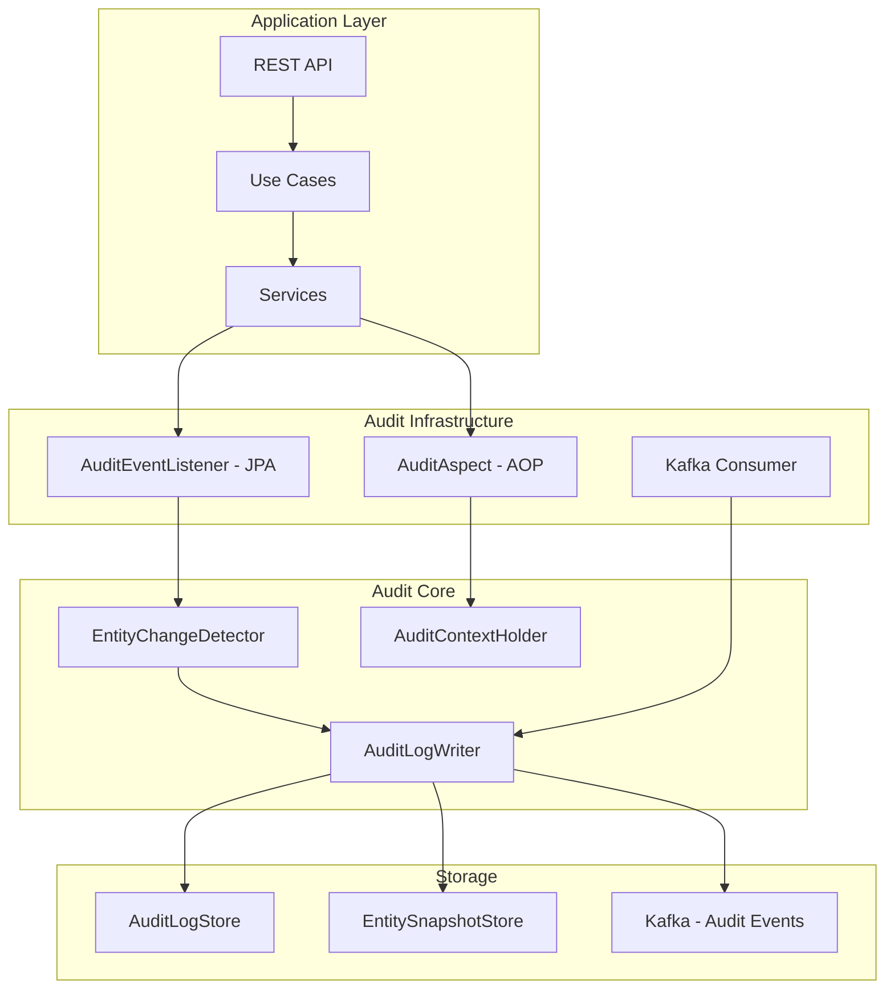
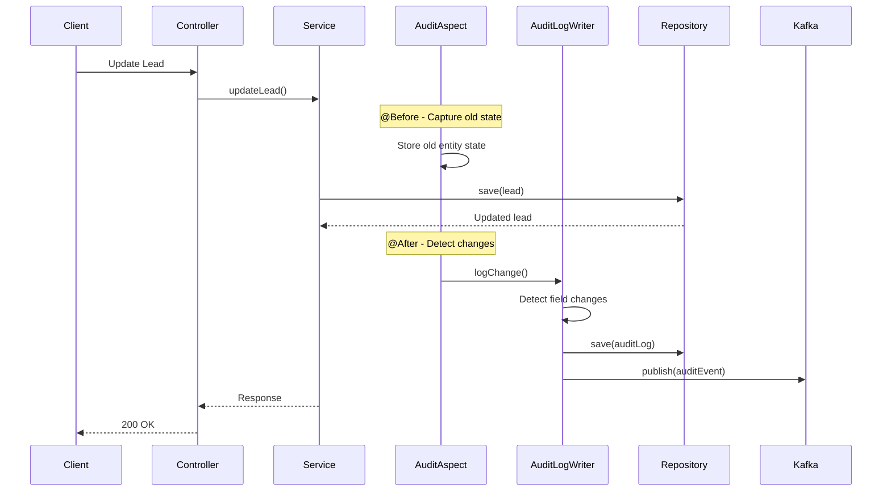

# Audit Trail Module - Thiết Kế Chi Tiết

**Module:** CRM Audit Trail & History Tracking  
**Phiên bản:** 1.0  
**Ngày tạo:** 2025-12-06  
**Tác giả:** AI Assistant

---

## Mục Lục

1. [Tổng Quan](#1-tổng-quan)
2. [Kiến Trúc Module](#2-kiến-trúc-module)
3. [Domain Entities](#3-domain-entities)
4. [Service Layer](#4-service-layer)
5. [API Endpoints](#5-api-endpoints)
6. [Database Schema](#6-database-schema)
7. [Implementation Approaches](#7-implementation-approaches)
8. [Event Integration](#8-event-integration)
9. [Data Retention](#9-data-retention)
10. [Implementation Guide](#10-implementation-guide)

---

## 1. Tổng Quan

### 1.1. Mục Tiêu

Audit Trail Module cung cấp khả năng:
- **Complete History Tracking:** Ghi lại mọi thay đổi trên tất cả entities
- **Field-level Tracking:** Track thay đổi từng field với old/new values
- **User Attribution:** Biết ai đã thay đổi, khi nào, từ nguồn nào
- **Data Recovery:** Khả năng xem và rollback về trạng thái trước đó
- **Compliance Support:** Đáp ứng yêu cầu audit cho compliance (GDPR, SOC2)
- **Activity Timeline:** Hiển thị timeline hoạt động cho từng entity

### 1.2. Phạm Vi

| In Scope | Out of Scope |
|----------|--------------|
| All CRM entities (Lead, Opportunity, Customer, Contact, Activity, Team) | System configuration changes |
| Field-level change tracking | File/attachment content versioning |
| User and timestamp tracking | Real-time streaming audit |
| View history API | Third-party integration audits |
| Data export for compliance | Cross-service distributed tracing |

### 1.3. Tracked Events

| Event Type | Description | Example |
|------------|-------------|---------|
| `CREATE` | Entity được tạo mới | Lead mới được tạo |
| `UPDATE` | Entity được cập nhật | Opportunity stage thay đổi |
| `DELETE` | Entity bị xóa | Contact bị xóa |
| `RESTORE` | Entity được khôi phục | Lead được restore từ deleted |
| `ASSIGN` | Entity được assign cho user khác | Lead assign cho sales rep |
| `STAGE_CHANGE` | Stage/Status thay đổi | Opportunity → PROPOSAL |
| `BULK_UPDATE` | Cập nhật hàng loạt | Bulk assign 50 leads |
| `IMPORT` | Import từ file | CSV import leads |
| `EXPORT` | Export data | Export customers to Excel |

---

## 2. Kiến Trúc Module

### 2.1. Package Structure

```
crm/src/main/java/serp/project/crm/
├── core/
│   ├── domain/
│   │   ├── entity/
│   │   │   ├── AuditLogEntity.java
│   │   │   ├── EntitySnapshotEntity.java
│   │   │   └── AuditConfigEntity.java
│   │   ├── dto/
│   │   │   ├── request/
│   │   │   │   ├── GetAuditLogsRequest.java
│   │   │   │   └── CompareVersionsRequest.java
│   │   │   └── response/
│   │   │       ├── AuditLogResponse.java
│   │   │       ├── EntityHistoryResponse.java
│   │   │       ├── FieldChangeResponse.java
│   │   │       └── EntityTimelineResponse.java
│   │   └── enums/
│   │       ├── ChangeType.java
│   │       ├── ChangeSource.java
│   │       └── AuditedField.java
│   ├── service/
│   │   ├── IAuditService.java
│   │   ├── IAuditLogWriter.java
│   │   └── impl/
│   │       ├── AuditService.java
│   │       └── AuditLogWriter.java
│   ├── usecase/
│   │   └── AuditUseCase.java
│   ├── port/
│   │   └── store/
│   │       ├── IAuditLogStorePort.java
│   │       └── IEntitySnapshotStorePort.java
│   └── audit/
│       ├── AuditAspect.java
│       ├── AuditEventListener.java
│       ├── EntityChangeDetector.java
│       └── AuditContextHolder.java
├── infrastructure/
│   └── store/
│       ├── adapter/
│       │   ├── AuditLogAdapter.java
│       │   └── EntitySnapshotAdapter.java
│       ├── model/
│       │   ├── AuditLogModel.java
│       │   └── EntitySnapshotModel.java
│       └── repository/
│           ├── AuditLogRepository.java
│           └── EntitySnapshotRepository.java
└── ui/
    └── controller/
        └── AuditController.java
```

### 2.2. Architecture Diagram



### 2.3. Data Flow



---

## 3. Domain Entities

### 3.1. AuditLogEntity

```java
package serp.project.crm.core.domain.entity;

import lombok.*;
import lombok.experimental.SuperBuilder;
import serp.project.crm.core.domain.enums.ChangeSource;
import serp.project.crm.core.domain.enums.ChangeType;
import java.time.LocalDateTime;
import java.util.List;

@NoArgsConstructor
@AllArgsConstructor
@Getter
@Setter
@SuperBuilder
public class AuditLogEntity extends BaseEntity {
    private String entityType;           // LEAD, OPPORTUNITY, CUSTOMER, etc.
    private Long entityId;
    private String entityName;           // Denormalized for display
    
    private ChangeType changeType;       // CREATE, UPDATE, DELETE, etc.
    private ChangeSource changeSource;   // API, WORKFLOW, IMPORT, SYSTEM
    
    private Long changedBy;              // User ID
    private String changedByName;        // Denormalized user name
    private String changedByEmail;       // Denormalized email
    private LocalDateTime changedAt;
    
    private String ipAddress;            // Client IP
    private String userAgent;            // Browser/client info
    private String requestId;            // For request correlation
    
    private String transactionId;        // Group related changes
    
    // Field changes (for UPDATE events)
    private List<FieldChangeEntity> fieldChanges;
    
    // Summary
    private String changeSummary;        // Human-readable summary
    private Integer fieldsChanged;       // Count of changed fields
}
```

### 3.2. FieldChangeEntity

```java
package serp.project.crm.core.domain.entity;

import lombok.*;
import lombok.experimental.SuperBuilder;

@NoArgsConstructor
@AllArgsConstructor
@Getter
@Setter
@SuperBuilder
public class FieldChangeEntity {
    private Long id;
    private Long auditLogId;
    
    private String fieldName;            // e.g., "estimatedValue"
    private String fieldDisplayName;     // e.g., "Estimated Value"
    private String fieldType;            // STRING, NUMBER, DATE, ENUM, REFERENCE
    
    private String oldValue;             // JSON serialized old value
    private String newValue;             // JSON serialized new value
    private String oldDisplayValue;      // Human-readable old value
    private String newDisplayValue;      // Human-readable new value
    
    private Boolean isSensitive;         // Mask in UI (e.g., password)
}
```

### 3.3. EntitySnapshotEntity

```java
package serp.project.crm.core.domain.entity;

import lombok.*;
import lombok.experimental.SuperBuilder;
import java.time.LocalDateTime;

@NoArgsConstructor
@AllArgsConstructor
@Getter
@Setter
@SuperBuilder
public class EntitySnapshotEntity extends BaseEntity {
    private String entityType;
    private Long entityId;
    private Long version;                // Auto-incrementing version number
    
    private String snapshotData;         // Full JSON snapshot of entity
    private String changeReason;         // Why this snapshot was taken
    
    private Long snapshotBy;
    private LocalDateTime snapshotAt;
    
    private Long auditLogId;             // Link to audit log entry
    
    private Boolean isActive;            // Current version flag
}
```

### 3.4. Enums

```java
// ChangeType.java
public enum ChangeType {
    CREATE("Entity created"),
    UPDATE("Entity updated"),
    DELETE("Entity deleted"),
    SOFT_DELETE("Entity soft-deleted"),
    RESTORE("Entity restored"),
    ASSIGN("Entity assigned"),
    UNASSIGN("Entity unassigned"),
    STAGE_CHANGE("Stage/Status changed"),
    CONVERT("Entity converted"),
    MERGE("Entities merged"),
    BULK_UPDATE("Bulk update"),
    IMPORT("Data imported"),
    EXPORT("Data exported");
    
    private final String description;
    ChangeType(String description) { this.description = description; }
}

// ChangeSource.java
public enum ChangeSource {
    API("REST API"),
    UI("Web Interface"),
    WORKFLOW("Workflow Automation"),
    IMPORT("Data Import"),
    INTEGRATION("Third-party Integration"),
    SYSTEM("System Process"),
    MIGRATION("Data Migration"),
    SCHEDULER("Scheduled Job");
    
    private final String description;
    ChangeSource(String description) { this.description = description; }
}
```

---

## 4. Service Layer

### 4.1. IAuditService

```java
package serp.project.crm.core.service;

import serp.project.crm.core.domain.entity.AuditLogEntity;
import serp.project.crm.core.domain.entity.EntitySnapshotEntity;
import serp.project.crm.core.domain.dto.PageRequest;
import serp.project.crm.core.domain.dto.response.*;
import org.springframework.data.util.Pair;

import java.time.LocalDateTime;
import java.util.List;
import java.util.Optional;

public interface IAuditService {
    
    // Query audit logs
    Pair<List<AuditLogEntity>, Long> getAuditLogs(
        String entityType, 
        Long tenantId, 
        PageRequest pageRequest
    );
    
    Pair<List<AuditLogEntity>, Long> getEntityHistory(
        String entityType, 
        Long entityId, 
        Long tenantId, 
        PageRequest pageRequest
    );
    
    List<AuditLogEntity> getAuditLogsByUser(
        Long userId, 
        Long tenantId, 
        LocalDateTime from, 
        LocalDateTime to
    );
    
    List<AuditLogEntity> getAuditLogsByDateRange(
        String entityType, 
        Long tenantId, 
        LocalDateTime from, 
        LocalDateTime to
    );
    
    Optional<AuditLogEntity> getAuditLogById(Long id, Long tenantId);
    
    // Timeline view
    EntityTimelineResponse getEntityTimeline(
        String entityType, 
        Long entityId, 
        Long tenantId
    );
    
    // Snapshots
    List<EntitySnapshotEntity> getEntitySnapshots(
        String entityType, 
        Long entityId, 
        Long tenantId
    );
    
    Optional<EntitySnapshotEntity> getSnapshotById(Long snapshotId, Long tenantId);
    
    Optional<EntitySnapshotEntity> getSnapshotAtVersion(
        String entityType, 
        Long entityId, 
        Long version, 
        Long tenantId
    );
    
    Optional<EntitySnapshotEntity> getSnapshotAtTime(
        String entityType, 
        Long entityId, 
        LocalDateTime timestamp, 
        Long tenantId
    );
    
    // Comparison
    VersionComparisonResponse compareVersions(
        String entityType, 
        Long entityId, 
        Long version1, 
        Long version2, 
        Long tenantId
    );
    
    // Export
    byte[] exportAuditLogs(
        String entityType, 
        Long tenantId, 
        LocalDateTime from, 
        LocalDateTime to, 
        String format
    );
}
```

### 4.2. IAuditLogWriter

```java
package serp.project.crm.core.service;

import serp.project.crm.core.domain.entity.AuditLogEntity;
import serp.project.crm.core.domain.enums.ChangeSource;
import serp.project.crm.core.domain.enums.ChangeType;

import java.util.Map;

public interface IAuditLogWriter {
    
    // Log entity changes
    AuditLogEntity logCreate(
        String entityType, 
        Long entityId, 
        Object entity, 
        Long userId, 
        Long tenantId, 
        ChangeSource source
    );
    
    AuditLogEntity logUpdate(
        String entityType, 
        Long entityId, 
        Object oldEntity, 
        Object newEntity, 
        Long userId, 
        Long tenantId, 
        ChangeSource source
    );
    
    AuditLogEntity logDelete(
        String entityType, 
        Long entityId, 
        Object entity, 
        Long userId, 
        Long tenantId, 
        ChangeSource source
    );
    
    AuditLogEntity logCustomEvent(
        String entityType, 
        Long entityId, 
        ChangeType changeType, 
        String description, 
        Map<String, Object> metadata, 
        Long userId, 
        Long tenantId, 
        ChangeSource source
    );
    
    // Bulk operations
    void logBulkUpdate(
        String entityType, 
        List<Long> entityIds, 
        String fieldName, 
        Object newValue, 
        Long userId, 
        Long tenantId, 
        ChangeSource source
    );
    
    // Snapshot management
    void takeSnapshot(String entityType, Long entityId, Object entity, Long tenantId);
}
```

### 4.3. AuditLogWriter Implementation

```java
package serp.project.crm.core.service.impl;

import com.fasterxml.jackson.databind.ObjectMapper;
import lombok.RequiredArgsConstructor;
import lombok.extern.slf4j.Slf4j;
import org.springframework.kafka.core.KafkaTemplate;
import org.springframework.stereotype.Service;
import org.springframework.transaction.annotation.Propagation;
import org.springframework.transaction.annotation.Transactional;
import serp.project.crm.core.audit.AuditContextHolder;
import serp.project.crm.core.audit.EntityChangeDetector;
import serp.project.crm.core.domain.entity.*;
import serp.project.crm.core.domain.enums.*;
import serp.project.crm.core.port.store.*;
import serp.project.crm.core.service.IAuditLogWriter;

import java.time.LocalDateTime;
import java.util.*;

@Service
@RequiredArgsConstructor
@Slf4j
public class AuditLogWriter implements IAuditLogWriter {
    
    private final IAuditLogStorePort auditLogStore;
    private final IEntitySnapshotStorePort snapshotStore;
    private final EntityChangeDetector changeDetector;
    private final ObjectMapper objectMapper;
    private final KafkaTemplate<String, Object> kafkaTemplate;
    
    @Override
    @Transactional(propagation = Propagation.REQUIRES_NEW)
    public AuditLogEntity logCreate(
            String entityType, 
            Long entityId, 
            Object entity, 
            Long userId, 
            Long tenantId, 
            ChangeSource source) {
        
        AuditLogEntity auditLog = AuditLogEntity.builder()
            .entityType(entityType)
            .entityId(entityId)
            .entityName(extractEntityName(entity))
            .changeType(ChangeType.CREATE)
            .changeSource(source)
            .changedBy(userId)
            .changedByName(AuditContextHolder.getCurrentUserName())
            .changedByEmail(AuditContextHolder.getCurrentUserEmail())
            .changedAt(LocalDateTime.now())
            .ipAddress(AuditContextHolder.getClientIp())
            .userAgent(AuditContextHolder.getUserAgent())
            .requestId(AuditContextHolder.getRequestId())
            .transactionId(AuditContextHolder.getTransactionId())
            .changeSummary(String.format("%s created", entityType))
            .fieldsChanged(0)
            .tenantId(tenantId)
            .build();
        
        auditLog = auditLogStore.save(auditLog);
        
        // Take initial snapshot
        takeSnapshot(entityType, entityId, entity, tenantId);
        
        // Publish event
        publishAuditEvent(auditLog);
        
        return auditLog;
    }
    
    @Override
    @Transactional(propagation = Propagation.REQUIRES_NEW)
    public AuditLogEntity logUpdate(
            String entityType, 
            Long entityId, 
            Object oldEntity, 
            Object newEntity, 
            Long userId, 
            Long tenantId, 
            ChangeSource source) {
        
        // Detect changes
        List<FieldChangeEntity> changes = changeDetector.detectChanges(oldEntity, newEntity);
        
        if (changes.isEmpty()) {
            log.debug("No changes detected for {} {}", entityType, entityId);
            return null;
        }
        
        // Build summary
        String summary = buildChangeSummary(entityType, changes);
        
        AuditLogEntity auditLog = AuditLogEntity.builder()
            .entityType(entityType)
            .entityId(entityId)
            .entityName(extractEntityName(newEntity))
            .changeType(ChangeType.UPDATE)
            .changeSource(source)
            .changedBy(userId)
            .changedByName(AuditContextHolder.getCurrentUserName())
            .changedByEmail(AuditContextHolder.getCurrentUserEmail())
            .changedAt(LocalDateTime.now())
            .ipAddress(AuditContextHolder.getClientIp())
            .userAgent(AuditContextHolder.getUserAgent())
            .requestId(AuditContextHolder.getRequestId())
            .transactionId(AuditContextHolder.getTransactionId())
            .changeSummary(summary)
            .fieldsChanged(changes.size())
            .fieldChanges(changes)
            .tenantId(tenantId)
            .build();
        
        auditLog = auditLogStore.save(auditLog);
        
        // Save field changes
        for (FieldChangeEntity change : changes) {
            change.setAuditLogId(auditLog.getId());
        }
        auditLogStore.saveFieldChanges(changes);
        
        // Take snapshot
        takeSnapshot(entityType, entityId, newEntity, tenantId);
        
        // Publish event
        publishAuditEvent(auditLog);
        
        return auditLog;
    }
    
    @Override
    @Transactional(propagation = Propagation.REQUIRES_NEW)
    public AuditLogEntity logDelete(
            String entityType, 
            Long entityId, 
            Object entity, 
            Long userId, 
            Long tenantId, 
            ChangeSource source) {
        
        AuditLogEntity auditLog = AuditLogEntity.builder()
            .entityType(entityType)
            .entityId(entityId)
            .entityName(extractEntityName(entity))
            .changeType(ChangeType.DELETE)
            .changeSource(source)
            .changedBy(userId)
            .changedByName(AuditContextHolder.getCurrentUserName())
            .changedByEmail(AuditContextHolder.getCurrentUserEmail())
            .changedAt(LocalDateTime.now())
            .ipAddress(AuditContextHolder.getClientIp())
            .userAgent(AuditContextHolder.getUserAgent())
            .requestId(AuditContextHolder.getRequestId())
            .transactionId(AuditContextHolder.getTransactionId())
            .changeSummary(String.format("%s deleted", entityType))
            .fieldsChanged(0)
            .tenantId(tenantId)
            .build();
        
        auditLog = auditLogStore.save(auditLog);
        
        // Mark existing snapshots as inactive
        snapshotStore.deactivateSnapshots(entityType, entityId, tenantId);
        
        // Take final snapshot (for potential restore)
        EntitySnapshotEntity finalSnapshot = takeDeletionSnapshot(entityType, entityId, entity, tenantId);
        
        // Publish event
        publishAuditEvent(auditLog);
        
        return auditLog;
    }
    
    @Override
    public void takeSnapshot(String entityType, Long entityId, Object entity, Long tenantId) {
        try {
            Long currentVersion = snapshotStore.getLatestVersion(entityType, entityId, tenantId)
                .orElse(0L);
            
            EntitySnapshotEntity snapshot = EntitySnapshotEntity.builder()
                .entityType(entityType)
                .entityId(entityId)
                .version(currentVersion + 1)
                .snapshotData(objectMapper.writeValueAsString(entity))
                .snapshotBy(AuditContextHolder.getCurrentUserId())
                .snapshotAt(LocalDateTime.now())
                .isActive(true)
                .tenantId(tenantId)
                .build();
            
            // Deactivate previous active snapshot
            snapshotStore.deactivateCurrentSnapshot(entityType, entityId, tenantId);
            
            snapshotStore.save(snapshot);
            
        } catch (Exception e) {
            log.error("Failed to take snapshot for {} {}: {}", entityType, entityId, e.getMessage());
        }
    }
    
    private String buildChangeSummary(String entityType, List<FieldChangeEntity> changes) {
        if (changes.size() == 1) {
            FieldChangeEntity change = changes.get(0);
            return String.format("%s changed from '%s' to '%s'", 
                change.getFieldDisplayName(), 
                change.getOldDisplayValue(), 
                change.getNewDisplayValue()
            );
        }
        return String.format("%d fields changed in %s", changes.size(), entityType);
    }
    
    private String extractEntityName(Object entity) {
        try {
            // Use reflection or interface to get name/title
            var method = entity.getClass().getMethod("getName");
            return (String) method.invoke(entity);
        } catch (Exception e) {
            return entity.getClass().getSimpleName();
        }
    }
    
    private void publishAuditEvent(AuditLogEntity auditLog) {
        try {
            kafkaTemplate.send("crm.audit.events", auditLog);
        } catch (Exception e) {
            log.error("Failed to publish audit event: {}", e.getMessage());
        }
    }
}
```

### 4.4. EntityChangeDetector

```java
package serp.project.crm.core.audit;

import com.fasterxml.jackson.databind.ObjectMapper;
import lombok.RequiredArgsConstructor;
import lombok.extern.slf4j.Slf4j;
import org.springframework.stereotype.Component;
import serp.project.crm.core.domain.entity.FieldChangeEntity;

import java.lang.reflect.Field;
import java.math.BigDecimal;
import java.time.LocalDate;
import java.time.LocalDateTime;
import java.util.*;

@Component
@RequiredArgsConstructor
@Slf4j
public class EntityChangeDetector {
    
    private final ObjectMapper objectMapper;
    
    // Fields to skip
    private static final Set<String> SKIP_FIELDS = Set.of(
        "id", "createdAt", "updatedAt", "createdBy", "updatedBy", "tenantId", "version"
    );
    
    // Sensitive fields (mask in logs)
    private static final Set<String> SENSITIVE_FIELDS = Set.of(
        "password", "apiKey", "secretKey", "token"
    );
    
    public List<FieldChangeEntity> detectChanges(Object oldEntity, Object newEntity) {
        List<FieldChangeEntity> changes = new ArrayList<>();
        
        if (oldEntity == null || newEntity == null) {
            return changes;
        }
        
        Class<?> clazz = oldEntity.getClass();
        
        for (Field field : getAllFields(clazz)) {
            field.setAccessible(true);
            String fieldName = field.getName();
            
            if (SKIP_FIELDS.contains(fieldName)) {
                continue;
            }
            
            try {
                Object oldValue = field.get(oldEntity);
                Object newValue = field.get(newEntity);
                
                if (!Objects.equals(oldValue, newValue)) {
                    FieldChangeEntity change = FieldChangeEntity.builder()
                        .fieldName(fieldName)
                        .fieldDisplayName(formatFieldName(fieldName))
                        .fieldType(getFieldType(field))
                        .oldValue(serializeValue(oldValue))
                        .newValue(serializeValue(newValue))
                        .oldDisplayValue(formatDisplayValue(oldValue, SENSITIVE_FIELDS.contains(fieldName)))
                        .newDisplayValue(formatDisplayValue(newValue, SENSITIVE_FIELDS.contains(fieldName)))
                        .isSensitive(SENSITIVE_FIELDS.contains(fieldName))
                        .build();
                    
                    changes.add(change);
                }
                
            } catch (IllegalAccessException e) {
                log.warn("Cannot access field {}: {}", fieldName, e.getMessage());
            }
        }
        
        return changes;
    }
    
    private List<Field> getAllFields(Class<?> clazz) {
        List<Field> fields = new ArrayList<>();
        Class<?> current = clazz;
        
        while (current != null && current != Object.class) {
            fields.addAll(Arrays.asList(current.getDeclaredFields()));
            current = current.getSuperclass();
        }
        
        return fields;
    }
    
    private String getFieldType(Field field) {
        Class<?> type = field.getType();
        
        if (type == String.class) return "STRING";
        if (type == Integer.class || type == Long.class || type == int.class || type == long.class) return "NUMBER";
        if (type == BigDecimal.class || type == Double.class || type == Float.class) return "DECIMAL";
        if (type == Boolean.class || type == boolean.class) return "BOOLEAN";
        if (type == LocalDate.class) return "DATE";
        if (type == LocalDateTime.class) return "DATETIME";
        if (type.isEnum()) return "ENUM";
        if (Collection.class.isAssignableFrom(type)) return "LIST";
        
        return "OBJECT";
    }
    
    private String formatFieldName(String fieldName) {
        // Convert camelCase to Title Case with spaces
        StringBuilder result = new StringBuilder();
        
        for (int i = 0; i < fieldName.length(); i++) {
            char c = fieldName.charAt(i);
            if (i == 0) {
                result.append(Character.toUpperCase(c));
            } else if (Character.isUpperCase(c)) {
                result.append(' ').append(c);
            } else {
                result.append(c);
            }
        }
        
        return result.toString();
    }
    
    private String serializeValue(Object value) {
        if (value == null) return null;
        
        try {
            return objectMapper.writeValueAsString(value);
        } catch (Exception e) {
            return value.toString();
        }
    }
    
    private String formatDisplayValue(Object value, boolean isSensitive) {
        if (value == null) return "(empty)";
        if (isSensitive) return "******";
        
        if (value instanceof Enum<?>) {
            return ((Enum<?>) value).name();
        }
        if (value instanceof BigDecimal) {
            return ((BigDecimal) value).toPlainString();
        }
        if (value instanceof Collection<?>) {
            return ((Collection<?>) value).size() + " items";
        }
        
        String str = value.toString();
        if (str.length() > 100) {
            return str.substring(0, 100) + "...";
        }
        return str;
    }
}
```

---

## 5. API Endpoints

### 5.1. AuditController

```java
package serp.project.crm.ui.controller;

import lombok.RequiredArgsConstructor;
import lombok.extern.slf4j.Slf4j;
import org.springframework.format.annotation.DateTimeFormat;
import org.springframework.http.ResponseEntity;
import org.springframework.web.bind.annotation.*;
import serp.project.crm.core.domain.dto.PageRequest;
import serp.project.crm.core.usecase.AuditUseCase;
import serp.project.crm.kernel.utils.AuthUtils;

import java.time.LocalDateTime;

@RestController
@RequestMapping("/api/v1/audit")
@RequiredArgsConstructor
@Slf4j
public class AuditController {
    
    private final AuditUseCase auditUseCase;
    private final AuthUtils authUtils;
    
    @GetMapping("/logs")
    public ResponseEntity<?> getAuditLogs(
            @RequestParam(required = false) String entityType,
            @RequestParam(required = false) Long entityId,
            @RequestParam(required = false) Long userId,
            @RequestParam(required = false) @DateTimeFormat(iso = DateTimeFormat.ISO.DATE_TIME) LocalDateTime from,
            @RequestParam(required = false) @DateTimeFormat(iso = DateTimeFormat.ISO.DATE_TIME) LocalDateTime to,
            @RequestParam(defaultValue = "1") Integer page,
            @RequestParam(defaultValue = "50") Integer size) {
        
        Long tenantId = authUtils.getCurrentTenantId()
            .orElseThrow(() -> new IllegalArgumentException("Tenant ID not found"));
        
        PageRequest pageRequest = PageRequest.builder().page(page).size(size).build();
        var response = auditUseCase.getAuditLogs(entityType, entityId, userId, from, to, tenantId, pageRequest);
        return ResponseEntity.status(response.getCode()).body(response);
    }
    
    @GetMapping("/logs/{id}")
    public ResponseEntity<?> getAuditLogById(@PathVariable Long id) {
        Long tenantId = authUtils.getCurrentTenantId()
            .orElseThrow(() -> new IllegalArgumentException("Tenant ID not found"));
        
        var response = auditUseCase.getAuditLogById(id, tenantId);
        return ResponseEntity.status(response.getCode()).body(response);
    }
    
    @GetMapping("/{entityType}/{entityId}/history")
    public ResponseEntity<?> getEntityHistory(
            @PathVariable String entityType,
            @PathVariable Long entityId,
            @RequestParam(defaultValue = "1") Integer page,
            @RequestParam(defaultValue = "50") Integer size) {
        
        Long tenantId = authUtils.getCurrentTenantId()
            .orElseThrow(() -> new IllegalArgumentException("Tenant ID not found"));
        
        PageRequest pageRequest = PageRequest.builder().page(page).size(size).build();
        var response = auditUseCase.getEntityHistory(entityType, entityId, tenantId, pageRequest);
        return ResponseEntity.status(response.getCode()).body(response);
    }
    
    @GetMapping("/{entityType}/{entityId}/timeline")
    public ResponseEntity<?> getEntityTimeline(
            @PathVariable String entityType,
            @PathVariable Long entityId) {
        
        Long tenantId = authUtils.getCurrentTenantId()
            .orElseThrow(() -> new IllegalArgumentException("Tenant ID not found"));
        
        var response = auditUseCase.getEntityTimeline(entityType, entityId, tenantId);
        return ResponseEntity.status(response.getCode()).body(response);
    }
    
    @GetMapping("/{entityType}/{entityId}/snapshots")
    public ResponseEntity<?> getEntitySnapshots(
            @PathVariable String entityType,
            @PathVariable Long entityId) {
        
        Long tenantId = authUtils.getCurrentTenantId()
            .orElseThrow(() -> new IllegalArgumentException("Tenant ID not found"));
        
        var response = auditUseCase.getEntitySnapshots(entityType, entityId, tenantId);
        return ResponseEntity.status(response.getCode()).body(response);
    }
    
    @GetMapping("/{entityType}/{entityId}/snapshots/{snapshotId}")
    public ResponseEntity<?> getSnapshot(
            @PathVariable String entityType,
            @PathVariable Long entityId,
            @PathVariable Long snapshotId) {
        
        Long tenantId = authUtils.getCurrentTenantId()
            .orElseThrow(() -> new IllegalArgumentException("Tenant ID not found"));
        
        var response = auditUseCase.getSnapshot(snapshotId, tenantId);
        return ResponseEntity.status(response.getCode()).body(response);
    }
    
    @GetMapping("/{entityType}/{entityId}/compare")
    public ResponseEntity<?> compareVersions(
            @PathVariable String entityType,
            @PathVariable Long entityId,
            @RequestParam Long version1,
            @RequestParam Long version2) {
        
        Long tenantId = authUtils.getCurrentTenantId()
            .orElseThrow(() -> new IllegalArgumentException("Tenant ID not found"));
        
        var response = auditUseCase.compareVersions(entityType, entityId, version1, version2, tenantId);
        return ResponseEntity.status(response.getCode()).body(response);
    }
    
    @GetMapping("/export")
    public ResponseEntity<?> exportAuditLogs(
            @RequestParam String entityType,
            @RequestParam @DateTimeFormat(iso = DateTimeFormat.ISO.DATE_TIME) LocalDateTime from,
            @RequestParam @DateTimeFormat(iso = DateTimeFormat.ISO.DATE_TIME) LocalDateTime to,
            @RequestParam(defaultValue = "CSV") String format) {
        
        Long tenantId = authUtils.getCurrentTenantId()
            .orElseThrow(() -> new IllegalArgumentException("Tenant ID not found"));
        
        byte[] data = auditUseCase.exportAuditLogs(entityType, tenantId, from, to, format);
        
        return ResponseEntity.ok()
            .header("Content-Disposition", "attachment; filename=audit_logs." + format.toLowerCase())
            .body(data);
    }
}
```

### 5.2. API Summary

| Method | Endpoint | Description |
|--------|----------|-------------|
| `GET` | `/api/v1/audit/logs` | Danh sách audit logs với filters |
| `GET` | `/api/v1/audit/logs/{id}` | Chi tiết audit log |
| `GET` | `/api/v1/audit/{entityType}/{entityId}/history` | Lịch sử thay đổi của entity |
| `GET` | `/api/v1/audit/{entityType}/{entityId}/timeline` | Timeline hoạt động |
| `GET` | `/api/v1/audit/{entityType}/{entityId}/snapshots` | Danh sách snapshots |
| `GET` | `/api/v1/audit/{entityType}/{entityId}/snapshots/{id}` | Chi tiết snapshot |
| `GET` | `/api/v1/audit/{entityType}/{entityId}/compare` | So sánh 2 versions |
| `GET` | `/api/v1/audit/export` | Export audit logs |

---

## 6. Database Schema

```sql
-- Audit Logs
CREATE TABLE audit_logs (
    id BIGSERIAL PRIMARY KEY,
    entity_type VARCHAR(50) NOT NULL,
    entity_id BIGINT NOT NULL,
    entity_name VARCHAR(255),
    change_type VARCHAR(30) NOT NULL,
    change_source VARCHAR(30) NOT NULL,
    changed_by BIGINT,
    changed_by_name VARCHAR(255),
    changed_by_email VARCHAR(255),
    changed_at TIMESTAMP NOT NULL,
    ip_address VARCHAR(50),
    user_agent TEXT,
    request_id VARCHAR(100),
    transaction_id VARCHAR(100),
    change_summary TEXT,
    fields_changed INTEGER DEFAULT 0,
    tenant_id BIGINT NOT NULL,
    created_at TIMESTAMP DEFAULT CURRENT_TIMESTAMP
);

CREATE INDEX idx_audit_logs_entity ON audit_logs(entity_type, entity_id);
CREATE INDEX idx_audit_logs_tenant_date ON audit_logs(tenant_id, changed_at);
CREATE INDEX idx_audit_logs_user ON audit_logs(changed_by);
CREATE INDEX idx_audit_logs_type ON audit_logs(change_type);
CREATE INDEX idx_audit_logs_transaction ON audit_logs(transaction_id);

-- Field Changes
CREATE TABLE audit_field_changes (
    id BIGSERIAL PRIMARY KEY,
    audit_log_id BIGINT NOT NULL REFERENCES audit_logs(id) ON DELETE CASCADE,
    field_name VARCHAR(100) NOT NULL,
    field_display_name VARCHAR(255),
    field_type VARCHAR(30),
    old_value TEXT,
    new_value TEXT,
    old_display_value TEXT,
    new_display_value TEXT,
    is_sensitive BOOLEAN DEFAULT false,
    created_at TIMESTAMP DEFAULT CURRENT_TIMESTAMP
);

CREATE INDEX idx_field_changes_log ON audit_field_changes(audit_log_id);
CREATE INDEX idx_field_changes_field ON audit_field_changes(field_name);

-- Entity Snapshots
CREATE TABLE entity_snapshots (
    id BIGSERIAL PRIMARY KEY,
    entity_type VARCHAR(50) NOT NULL,
    entity_id BIGINT NOT NULL,
    version BIGINT NOT NULL,
    snapshot_data JSONB NOT NULL,
    change_reason TEXT,
    snapshot_by BIGINT,
    snapshot_at TIMESTAMP NOT NULL,
    audit_log_id BIGINT REFERENCES audit_logs(id),
    is_active BOOLEAN DEFAULT false,
    tenant_id BIGINT NOT NULL,
    created_at TIMESTAMP DEFAULT CURRENT_TIMESTAMP
);

CREATE INDEX idx_snapshots_entity ON entity_snapshots(entity_type, entity_id);
CREATE INDEX idx_snapshots_version ON entity_snapshots(entity_type, entity_id, version);
CREATE INDEX idx_snapshots_active ON entity_snapshots(entity_type, entity_id, is_active);
CREATE INDEX idx_snapshots_tenant ON entity_snapshots(tenant_id);

-- Audit Configuration (optional)
CREATE TABLE audit_config (
    id BIGSERIAL PRIMARY KEY,
    entity_type VARCHAR(50) NOT NULL,
    tracking_enabled BOOLEAN DEFAULT true,
    snapshot_enabled BOOLEAN DEFAULT true,
    excluded_fields TEXT, -- JSON array of field names to exclude
    retention_days INTEGER DEFAULT 365,
    tenant_id BIGINT NOT NULL,
    created_at TIMESTAMP DEFAULT CURRENT_TIMESTAMP,
    updated_at TIMESTAMP DEFAULT CURRENT_TIMESTAMP,
    UNIQUE(entity_type, tenant_id)
);
```

---

## 7. Implementation Approaches

### 7.1. Approach 1: AOP-based (Recommended)

```java
package serp.project.crm.core.audit;

import lombok.RequiredArgsConstructor;
import lombok.extern.slf4j.Slf4j;
import org.aspectj.lang.ProceedingJoinPoint;
import org.aspectj.lang.annotation.Around;
import org.aspectj.lang.annotation.Aspect;
import org.springframework.stereotype.Component;
import serp.project.crm.core.domain.enums.ChangeSource;
import serp.project.crm.core.service.IAuditLogWriter;

@Aspect
@Component
@RequiredArgsConstructor
@Slf4j
public class AuditAspect {
    
    private final IAuditLogWriter auditLogWriter;
    
    @Around("@annotation(Audited)")
    public Object auditMethod(ProceedingJoinPoint joinPoint) throws Throwable {
        // Get method annotation
        Audited audited = getAuditedAnnotation(joinPoint);
        
        // Capture old state for updates
        Object oldEntity = null;
        if (audited.type() == AuditType.UPDATE || audited.type() == AuditType.DELETE) {
            oldEntity = captureOldState(joinPoint, audited);
        }
        
        // Execute method
        Object result = joinPoint.proceed();
        
        // Log the change
        switch (audited.type()) {
            case CREATE:
                auditLogWriter.logCreate(
                    audited.entityType(),
                    extractEntityId(result),
                    result,
                    AuditContextHolder.getCurrentUserId(),
                    AuditContextHolder.getCurrentTenantId(),
                    ChangeSource.API
                );
                break;
                
            case UPDATE:
                auditLogWriter.logUpdate(
                    audited.entityType(),
                    extractEntityId(result),
                    oldEntity,
                    result,
                    AuditContextHolder.getCurrentUserId(),
                    AuditContextHolder.getCurrentTenantId(),
                    ChangeSource.API
                );
                break;
                
            case DELETE:
                auditLogWriter.logDelete(
                    audited.entityType(),
                    extractEntityId(oldEntity),
                    oldEntity,
                    AuditContextHolder.getCurrentUserId(),
                    AuditContextHolder.getCurrentTenantId(),
                    ChangeSource.API
                );
                break;
        }
        
        return result;
    }
}

// Annotation
@Target(ElementType.METHOD)
@Retention(RetentionPolicy.RUNTIME)
public @interface Audited {
    String entityType();
    AuditType type();
}

// Usage in Service
@Service
public class LeadService {
    
    @Audited(entityType = "LEAD", type = AuditType.CREATE)
    public LeadEntity createLead(LeadEntity lead, Long tenantId) {
        // Implementation
    }
    
    @Audited(entityType = "LEAD", type = AuditType.UPDATE)
    public LeadEntity updateLead(Long id, LeadEntity updates, Long tenantId) {
        // Implementation
    }
}
```

### 7.2. Approach 2: JPA Event Listener

```java
package serp.project.crm.core.audit;

import jakarta.persistence.*;
import lombok.RequiredArgsConstructor;
import org.springframework.stereotype.Component;
import serp.project.crm.core.domain.entity.BaseEntity;
import serp.project.crm.core.service.IAuditLogWriter;

@Component
@RequiredArgsConstructor
public class AuditEventListener {
    
    private static IAuditLogWriter auditLogWriter;
    
    @PostLoad
    public void onPostLoad(Object entity) {
        // Store original state for later comparison
        AuditContextHolder.storeOriginalState(entity);
    }
    
    @PostPersist
    public void onPostPersist(Object entity) {
        if (entity instanceof BaseEntity base) {
            auditLogWriter.logCreate(
                entity.getClass().getSimpleName().replace("Entity", "").toUpperCase(),
                base.getId(),
                entity,
                base.getCreatedBy(),
                base.getTenantId(),
                AuditContextHolder.getChangeSource()
            );
        }
    }
    
    @PostUpdate
    public void onPostUpdate(Object entity) {
        Object oldState = AuditContextHolder.getOriginalState(entity);
        
        if (entity instanceof BaseEntity base && oldState != null) {
            auditLogWriter.logUpdate(
                entity.getClass().getSimpleName().replace("Entity", "").toUpperCase(),
                base.getId(),
                oldState,
                entity,
                base.getUpdatedBy(),
                base.getTenantId(),
                AuditContextHolder.getChangeSource()
            );
        }
    }
    
    @PreRemove
    public void onPreRemove(Object entity) {
        if (entity instanceof BaseEntity base) {
            auditLogWriter.logDelete(
                entity.getClass().getSimpleName().replace("Entity", "").toUpperCase(),
                base.getId(),
                entity,
                AuditContextHolder.getCurrentUserId(),
                base.getTenantId(),
                AuditContextHolder.getChangeSource()
            );
        }
    }
}
```

---

## 8. Event Integration

### 8.1. Audit Event

```java
package serp.project.crm.core.domain.dto.event;

import lombok.*;
import java.time.LocalDateTime;
import java.util.List;
import java.util.Map;

@Data
@Builder
@NoArgsConstructor
@AllArgsConstructor
public class AuditEvent {
    private String eventId;
    private String entityType;
    private Long entityId;
    private String changeType;
    private String changeSource;
    
    private Long changedBy;
    private String changedByName;
    private LocalDateTime changedAt;
    
    private List<FieldChange> changes;
    private Map<String, Object> metadata;
    
    private Long tenantId;
    
    @Data
    @Builder
    public static class FieldChange {
        private String fieldName;
        private String oldValue;
        private String newValue;
    }
}
```

### 8.2. Kafka Topics

```java
public class AuditTopics {
    public static final String AUDIT_EVENTS = "crm.audit.events";
    public static final String AUDIT_SNAPSHOTS = "crm.audit.snapshots";
}
```

---

## 9. Data Retention

### 9.1. Retention Policy

```java
package serp.project.crm.core.service.impl;

import lombok.RequiredArgsConstructor;
import lombok.extern.slf4j.Slf4j;
import org.springframework.scheduling.annotation.Scheduled;
import org.springframework.stereotype.Service;
import org.springframework.transaction.annotation.Transactional;

import java.time.LocalDateTime;

@Service
@RequiredArgsConstructor
@Slf4j
public class AuditRetentionService {
    
    private final IAuditLogStorePort auditLogStore;
    private final IEntitySnapshotStorePort snapshotStore;
    
    @Scheduled(cron = "0 0 2 * * ?") // Daily at 2 AM
    @Transactional
    public void cleanupOldAuditLogs() {
        log.info("Starting audit log retention cleanup");
        
        // Default retention: 1 year for logs, 2 years for snapshots
        LocalDateTime logCutoff = LocalDateTime.now().minusYears(1);
        LocalDateTime snapshotCutoff = LocalDateTime.now().minusYears(2);
        
        // Get tenant-specific retention settings
        // ...
        
        int logsDeleted = auditLogStore.deleteLogsOlderThan(logCutoff);
        int snapshotsDeleted = snapshotStore.deleteSnapshotsOlderThan(snapshotCutoff);
        
        log.info("Cleanup complete: {} logs and {} snapshots deleted", logsDeleted, snapshotsDeleted);
    }
    
    @Scheduled(cron = "0 0 3 1 * ?") // Monthly on the 1st at 3 AM
    @Transactional
    public void archiveOldAuditLogs() {
        log.info("Starting monthly audit archive");
        
        LocalDateTime archiveCutoff = LocalDateTime.now().minusMonths(6);
        
        // Move to archive table or cold storage
        int archived = auditLogStore.archiveLogsOlderThan(archiveCutoff);
        
        log.info("Archived {} audit logs", archived);
    }
}
```

---

## 10. Implementation Guide

### 10.1. Sprint Breakdown

| Sprint | Duration | Tasks |
|--------|----------|-------|
| Sprint 1 | 1 tuần | Database schema, Core entities |
| Sprint 2 | 1 tuần | AuditLogWriter, EntityChangeDetector |
| Sprint 3 | 1 tuần | AOP/Event Listener integration |
| Sprint 4 | 1 tuần | API endpoints, Testing |

### 10.2. Integration Steps

1. **Add AuditContextHolder filter** to capture request metadata
2. **Register EntityListeners** on all audited entities
3. **Add @Audited annotation** to service methods
4. **Configure Kafka** for async audit event publishing
5. **Set up retention jobs** for cleanup

### 10.3. Testing

```java
@Test
void shouldTrackFieldChanges() {
    // Given
    LeadEntity oldLead = LeadEntity.builder()
        .id(1L)
        .name("Old Name")
        .leadStatus(LeadStatus.NEW)
        .build();
    
    LeadEntity newLead = LeadEntity.builder()
        .id(1L)
        .name("New Name")
        .leadStatus(LeadStatus.CONTACTED)
        .build();
    
    // When
    List<FieldChangeEntity> changes = changeDetector.detectChanges(oldLead, newLead);
    
    // Then
    assertThat(changes).hasSize(2);
    assertThat(changes).extracting("fieldName").containsExactlyInAnyOrder("name", "leadStatus");
}
```

---

**Document Version:** 1.0  
**Last Updated:** 2025-12-06
