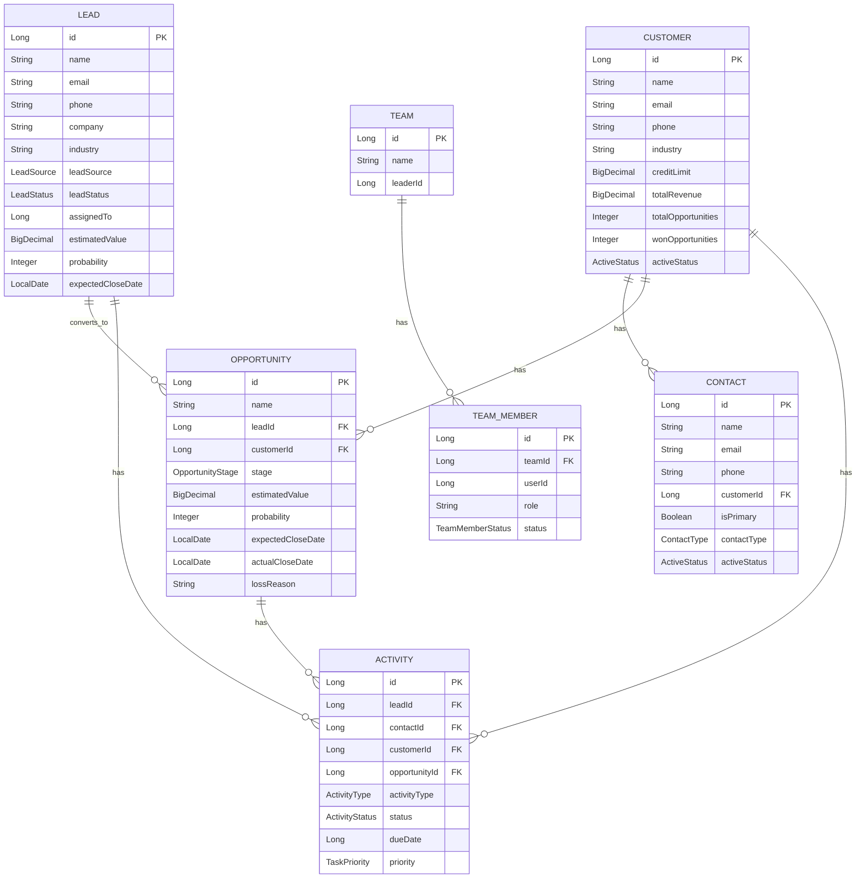
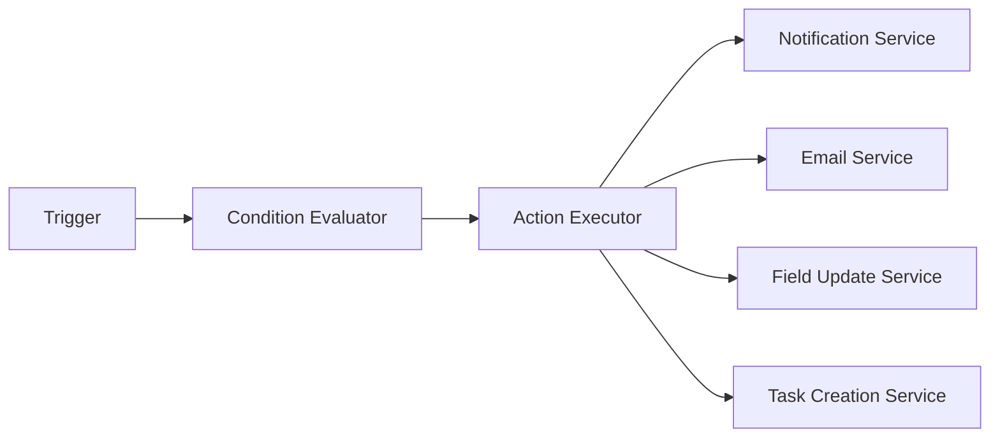
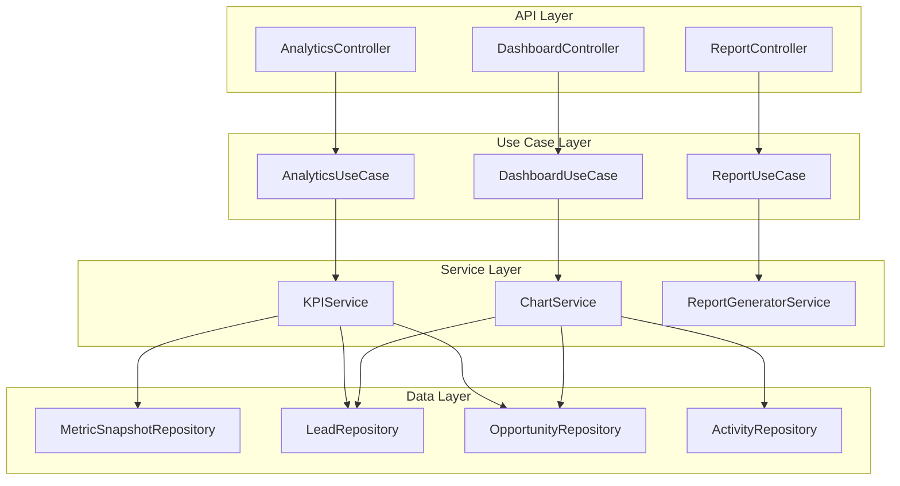
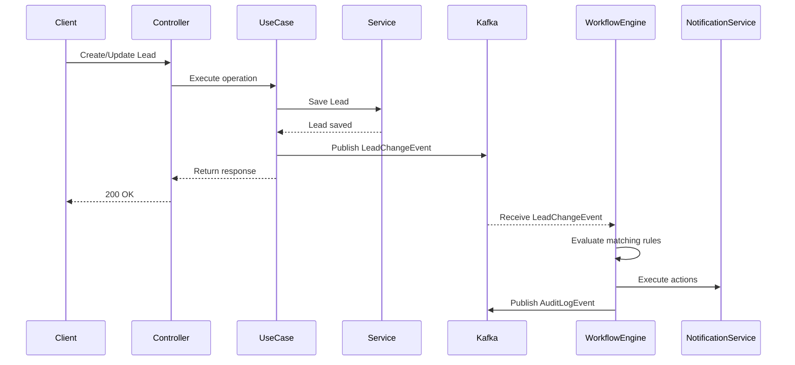
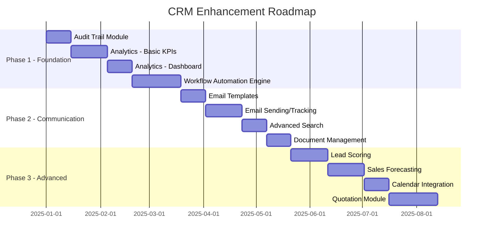

# Tài Liệu Thiết Kế Cải Thiện Hệ Thống CRM

**Tác giả:** AI Assistant  
**Ngày tạo:** 2025-12-06  
**Phiên bản:** 1.0  
**Dự án:** SERP CRM Module

---

## Mục Lục

1. [Tổng Quan Hệ Thống Hiện Tại](#1-tổng-quan-hệ-thống-hiện-tại)
2. [Phân Tích GAP (Khoảng Cách)](#2-phân-tích-gap-khoảng-cách)
3. [Đề Xuất Cải Thiện](#3-đề-xuất-cải-thiện)
4. [Thiết Kế Chi Tiết](#4-thiết-kế-chi-tiết)
5. [Lộ Trình Triển Khai](#5-lộ-trình-triển-khai)
6. [Kết Luận](#6-kết-luận)

---

## 1. Tổng Quan Hệ Thống Hiện Tại

### 1.1. Kiến Trúc Tổng Thể

Hệ thống CRM hiện tại được xây dựng theo **Clean Architecture (Hexagonal Architecture)** với cấu trúc phân tầng rõ ràng:

```
crm/
├── core/                    # Business Logic Layer
│   ├── domain/
│   │   ├── entity/         # Domain Entities
│   │   ├── dto/            # Data Transfer Objects
│   │   ├── enums/          # Enumerations
│   │   └── constant/       # Constants
│   ├── port/               # Port Interfaces
│   ├── service/            # Service Interfaces & Implementations
│   ├── usecase/            # Use Case Implementations
│   ├── mapper/             # Entity-DTO Mappers
│   └── exception/          # Custom Exceptions
├── infrastructure/          # Infrastructure Layer
│   ├── store/              # Database Adapters
│   │   ├── adapter/        # Port Implementations
│   │   ├── model/          # JPA Models
│   │   ├── mapper/         # Entity-Model Mappers
│   │   └── repository/     # JPA Repositories
│   └── client/             # External Service Clients
├── kernel/                  # Cross-cutting Concerns
│   ├── config/             # Configuration
│   ├── property/           # Application Properties
│   └── utils/              # Utility Classes
└── ui/                      # Presentation Layer
    └── controller/         # REST Controllers
```

### 1.2. Tech Stack

| Thành Phần | Công Nghệ |
|------------|-----------|
| Framework | Spring Boot 3.5.6 |
| Language | Java 21 (Virtual Threads) |
| Database | PostgreSQL |
| Cache | Redis |
| Message Queue | Kafka |
| Authentication | Keycloak (OAuth2) |
| ORM | Spring Data JPA + Hibernate |

### 1.3. Domain Entities Hiện Tại



### 1.4. Tính Năng Hiện Có

| Module | Tính Năng |
|--------|-----------|
| **Lead Management** | CRUD, Qualify, Convert to Opportunity/Customer, Assignment |
| **Opportunity Management** | CRUD, Stage Management (Pipeline), Close Won/Lost |
| **Customer Management** | CRUD, Status Management, Revenue Tracking |
| **Contact Management** | CRUD, Primary Contact, Multiple Contacts per Customer |
| **Activity Management** | CRUD, Task Scheduling, Status Tracking |
| **Team Management** | CRUD, Member Management, Role Assignment |

### 1.5. Business Logic Highlights

- **Lead Qualification Flow:** NEW → CONTACTED → NURTURING → QUALIFIED → CONVERTED
- **Opportunity Pipeline:** PROSPECTING → QUALIFICATION → PROPOSAL → NEGOTIATION → CLOSED_WON/CLOSED_LOST
- **Activity Types:** CALL, MEETING, EMAIL, TASK
- **Multi-tenant Support:** Dựa trên tenantId từ JWT token

---

## 2. Phân Tích GAP (Khoảng Cách)

### 2.1. So Sánh Với CRM Hiện Đại

| Tính Năng | Hiện Tại | CRM Hiện Đại | Mức Độ Ưu Tiên |
|-----------|----------|--------------|----------------|
| **AI/Predictive Analytics** | ❌ Không có | ✅ Lead Scoring, Sales Forecasting | 🔴 Cao |
| **Workflow Automation** | ❌ Cơ bản | ✅ Rule-based Triggers, Email Automation | 🔴 Cao |
| **Dashboard & Reporting** | ❌ Không có | ✅ Real-time KPIs, Custom Reports | 🔴 Cao |
| **Email Integration** | ❌ Không có | ✅ Email Tracking, Templates | 🟡 Trung Bình |
| **Advanced Search** | ❌ Cơ bản | ✅ Full-text, Saved Filters | 🟡 Trung Bình |
| **Omnichannel Communication** | ❌ Không có | ✅ SMS, Chat, Social Media | 🟢 Thấp |
| **Mobile API** | ✅ REST API | ✅ Optimized Mobile API | 🟢 Thấp |
| **Document Management** | ❌ Không có | ✅ Attachments, Templates | 🟡 Trung Bình |
| **Calendar Integration** | ❌ Không có | ✅ Google/Outlook Sync | 🟡 Trung Bình |
| **Audit Trail** | ❌ Không có | ✅ Complete History Tracking | 🔴 Cao |
| **Customizable Fields** | ❌ Không có | ✅ Custom Fields, Field Sets | 🟡 Trung Bình |
| **Data Import/Export** | ❌ Không có | ✅ CSV, Excel, API | 🟡 Trung Bình |
| **Duplicate Detection** | ❌ Không có | ✅ Auto-merge, Suggestions | 🟡 Trung Bình |
| **Quotation/Invoice** | ❌ Không có | ✅ Quote Generation, PDF Export | 🟢 Thấp |

### 2.2. Điểm Mạnh Hiện Tại

1. **Kiến trúc sạch:** Clean Architecture giúp dễ dàng mở rộng
2. **Multi-tenancy:** Đã hỗ trợ sẵn
3. **Event-driven ready:** Kafka integration đã có
4. **Modern tech stack:** Java 21, Spring Boot 3.5.6

### 2.3. Điểm Yếu Cần Cải Thiện

1. **Thiếu Analytics:** Không có dashboard, KPIs, reports
2. **Thiếu Automation:** Không có workflow automation
3. **Thiếu Audit Trail:** Không tracking history thay đổi
4. **Limited Search:** Chỉ có basic search
5. **No Email Integration:** Không gửi/nhận email từ CRM

---

## 3. Đề Xuất Cải Thiện

### 3.1. Phase 1: Foundation Enhancement (Ưu Tiên Cao)

#### 3.1.1. Analytics & Dashboard Module

**Mục tiêu:** Cung cấp insights về sales performance và customer data.

**Tính năng đề xuất:**

| KPI | Mô Tả | Entity Nguồn |
|-----|-------|--------------|
| **Pipeline Value** | Tổng giá trị opportunities theo stage | Opportunity |
| **Win Rate** | Tỷ lệ thắng = Won / (Won + Lost) | Opportunity |
| **Conversion Rate** | Lead → Opportunity, Opportunity → Customer | Lead, Opportunity |
| **Average Deal Size** | Giá trị trung bình mỗi deal | Opportunity |
| **Sales Cycle Length** | Thời gian từ Lead đến Close | Lead, Opportunity |
| **Activity Metrics** | Tasks completed, calls made, meetings held | Activity |
| **Lead Sources Performance** | Leads by source, conversion by source | Lead |
| **Team Performance** | Revenue by team member | Team, Opportunity |

**Entities mới:**

```java
@Entity
public class DashboardWidgetEntity {
    private Long id;
    private String name;
    private WidgetType type; // CHART, TABLE, METRIC, FUNNEL
    private String configuration; // JSON config
    private Integer position;
    private Long tenantId;
}

@Entity
public class ReportEntity {
    private Long id;
    private String name;
    private ReportType type;
    private String query; // Saved query configuration
    private String schedule; // CRON expression for scheduled reports
    private Long tenantId;
}

@Entity
public class MetricSnapshotEntity {
    private Long id;
    private String metricName;
    private BigDecimal value;
    private LocalDate snapshotDate;
    private Long tenantId;
}
```

#### 3.1.2. Workflow Automation Engine

**Mục tiêu:** Tự động hóa các tác vụ lặp đi lặp lại.

**Components:**



**Entities mới:**

```java
@Entity
public class WorkflowRuleEntity {
    private Long id;
    private String name;
    private String description;
    private TriggerType triggerType; // ON_CREATE, ON_UPDATE, ON_DELETE, SCHEDULED
    private String entityType; // LEAD, OPPORTUNITY, CUSTOMER
    private String conditions; // JSON conditions
    private Boolean isActive;
    private Integer priority;
    private Long tenantId;
}

@Entity
public class WorkflowActionEntity {
    private Long id;
    private Long ruleId;
    private ActionType actionType; // SEND_EMAIL, UPDATE_FIELD, CREATE_TASK, NOTIFY
    private String configuration; // JSON action config
    private Integer executionOrder;
}

@Entity
public class WorkflowExecutionLogEntity {
    private Long id;
    private Long ruleId;
    private String entityType;
    private Long entityId;
    private ExecutionStatus status; // SUCCESS, FAILED, SKIPPED
    private String errorMessage;
    private LocalDateTime executedAt;
}
```

**Trigger Types:**

| Trigger | Mô Tả | Use Case Example |
|---------|-------|------------------|
| `ON_CREATE` | Khi entity mới được tạo | Gửi welcome email khi tạo lead mới |
| `ON_UPDATE` | Khi field thay đổi | Notify manager khi opportunity > $10k |
| `ON_STAGE_CHANGE` | Khi stage thay đổi | Send proposal when opportunity moves to PROPOSAL |
| `ON_DELETE` | Khi entity bị xóa | Archive related activities |
| `SCHEDULED` | Theo lịch (CRON) | Daily follow-up reminder for stale leads |
| `ON_DATE_FIELD` | Dựa trên date field | Reminder 7 days before close date |

#### 3.1.3. Audit Trail & History Tracking

**Mục tiêu:** Track every change for compliance và debugging.

**Entity mới:**

```java
@Entity
public class AuditLogEntity {
    private Long id;
    private String entityType;
    private Long entityId;
    private ChangeType changeType; // CREATE, UPDATE, DELETE
    private String fieldName;
    private String oldValue;
    private String newValue;
    private Long changedBy;
    private LocalDateTime changedAt;
    private String changeSource; // API, WORKFLOW, IMPORT
    private Long tenantId;
}
```

**Implementation approach:**
- Sử dụng Hibernate Envers hoặc custom EventListener
- Store JSON snapshot for complex objects
- Support rollback functionality

### 3.2. Phase 2: Communication Enhancement (Ưu Tiên Trung Bình)

#### 3.2.1. Email Integration Module

**Tính năng:**

| Feature | Description |
|---------|-------------|
| **Email Templates** | Reusable templates với merge fields |
| **Email Tracking** | Track opens, clicks |
| **Email Sync** | Sync với Gmail/Outlook (OAuth2) |
| **Bulk Email** | Mass email campaigns |
| **Email History** | Store all email communications |

**Entities mới:**

```java
@Entity
public class EmailTemplateEntity {
    private Long id;
    private String name;
    private String subject;
    private String body; // HTML with placeholders
    private String category;
    private Boolean isActive;
    private Long tenantId;
}

@Entity
public class EmailLogEntity {
    private Long id;
    private String entityType; // LEAD, CUSTOMER, CONTACT
    private Long entityId;
    private String toEmail;
    private String subject;
    private String body;
    private EmailStatus status; // SENT, DELIVERED, OPENED, CLICKED, BOUNCED
    private LocalDateTime sentAt;
    private LocalDateTime openedAt;
    private Integer openCount;
    private Integer clickCount;
    private Long tenantId;
}
```

#### 3.2.2. Advanced Search & Filtering

**Tính năng:**

```java
// Enhanced SearchRequest với nhiều criteria
public class AdvancedSearchRequest {
    private String entityType;
    private List<FilterCriteria> filters;
    private List<SortCriteria> sorts;
    private Boolean saveAsView;
    private String viewName;
}

public class FilterCriteria {
    private String field;
    private Operator operator; // EQUALS, NOT_EQUALS, CONTAINS, GREATER_THAN, LESS_THAN, IN, BETWEEN, IS_NULL, IS_NOT_NULL
    private Object value;
    private LogicalOperator logicalOperator; // AND, OR
}
```

**Entities mới:**

```java
@Entity
public class SavedFilterEntity {
    private Long id;
    private String name;
    private String entityType;
    private String filterConfig; // JSON
    private Boolean isPublic;
    private Long createdBy;
    private Long tenantId;
}
```

#### 3.2.3. Document & Attachment Management

**Entities mới:**

```java
@Entity
public class DocumentEntity {
    private Long id;
    private String name;
    private String fileType;
    private Long fileSize;
    private String storageUrl;
    private String entityType;
    private Long entityId;
    private DocumentCategory category; // CONTRACT, PROPOSAL, INVOICE, OTHER
    private Long uploadedBy;
    private LocalDateTime uploadedAt;
    private Long tenantId;
}
```

### 3.3. Phase 3: Advanced Features (Ưu Tiên Thấp)

#### 3.3.1. AI-Powered Features

| Feature | Description | Implementation |
|---------|-------------|----------------|
| **Lead Scoring** | Auto-score leads based on engagement | ML model + Rule engine |
| **Sales Forecasting** | Predict revenue by quarter | Time series analysis |
| **Next Best Action** | Suggest next action for sales rep | Rule-based + ML |
| **Sentiment Analysis** | Analyze email/notes sentiment | NLP integration |
| **Duplicate Detection** | Find potential duplicate records | Fuzzy matching algorithm |

#### 3.3.2. Calendar & Scheduling

```java
@Entity
public class CalendarEventEntity {
    private Long id;
    private String title;
    private LocalDateTime startTime;
    private LocalDateTime endTime;
    private String location;
    private EventType eventType; // MEETING, CALL, TASK
    private String entityType;
    private Long entityId;
    private List<Long> attendees;
    private String externalCalendarId; // Google/Outlook event ID
    private Long tenantId;
}
```

#### 3.3.3. Quotation & Proposal Module

```java
@Entity
public class QuotationEntity {
    private Long id;
    private String quotationNumber;
    private Long opportunityId;
    private Long customerId;
    private LocalDate validUntil;
    private BigDecimal totalAmount;
    private BigDecimal discount;
    private QuotationStatus status; // DRAFT, SENT, ACCEPTED, REJECTED
    private Long tenantId;
}

@Entity
public class QuotationLineItemEntity {
    private Long id;
    private Long quotationId;
    private String productName;
    private Integer quantity;
    private BigDecimal unitPrice;
    private BigDecimal lineTotal;
}
```

---

## 4. Thiết Kế Chi Tiết

### 4.1. Analytics Module Architecture



### 4.2. API Endpoints Mới

#### Analytics Endpoints

```
GET    /api/v1/analytics/summary              # Overall dashboard summary
GET    /api/v1/analytics/pipeline             # Pipeline analysis
GET    /api/v1/analytics/conversion           # Conversion rates
GET    /api/v1/analytics/performance          # Team/rep performance
GET    /api/v1/analytics/forecast             # Sales forecast
GET    /api/v1/analytics/trends               # Historical trends

GET    /api/v1/dashboards                     # List user dashboards
POST   /api/v1/dashboards                     # Create dashboard
PUT    /api/v1/dashboards/{id}                # Update dashboard
DELETE /api/v1/dashboards/{id}                # Delete dashboard

GET    /api/v1/reports                        # List reports
POST   /api/v1/reports                        # Create report
POST   /api/v1/reports/{id}/execute           # Run report
GET    /api/v1/reports/{id}/export            # Export report (CSV, PDF)
```

#### Workflow Endpoints

```
GET    /api/v1/workflows                      # List workflow rules
POST   /api/v1/workflows                      # Create workflow rule
PUT    /api/v1/workflows/{id}                 # Update workflow rule
DELETE /api/v1/workflows/{id}                 # Delete workflow rule
POST   /api/v1/workflows/{id}/activate        # Activate workflow
POST   /api/v1/workflows/{id}/deactivate      # Deactivate workflow
GET    /api/v1/workflows/{id}/logs            # View execution logs
POST   /api/v1/workflows/test                 # Test workflow with sample data
```

#### Email Endpoints

```
GET    /api/v1/email-templates                # List templates
POST   /api/v1/email-templates                # Create template
PUT    /api/v1/email-templates/{id}           # Update template
DELETE /api/v1/email-templates/{id}           # Delete template
POST   /api/v1/emails/send                    # Send email
GET    /api/v1/emails/{entityType}/{entityId} # Get email history for entity
```

### 4.3. Database Schema Additions

```sql
-- Analytics Tables
CREATE TABLE dashboard_widgets (
    id BIGSERIAL PRIMARY KEY,
    name VARCHAR(255) NOT NULL,
    type VARCHAR(50) NOT NULL,
    configuration JSONB,
    position INTEGER,
    tenant_id BIGINT NOT NULL,
    created_at TIMESTAMP DEFAULT CURRENT_TIMESTAMP,
    updated_at TIMESTAMP DEFAULT CURRENT_TIMESTAMP
);

CREATE TABLE metric_snapshots (
    id BIGSERIAL PRIMARY KEY,
    metric_name VARCHAR(100) NOT NULL,
    metric_value DECIMAL(19,4),
    dimensions JSONB,
    snapshot_date DATE NOT NULL,
    tenant_id BIGINT NOT NULL,
    created_at TIMESTAMP DEFAULT CURRENT_TIMESTAMP
);

CREATE INDEX idx_metric_snapshots_tenant_date ON metric_snapshots(tenant_id, snapshot_date);
CREATE INDEX idx_metric_snapshots_name ON metric_snapshots(metric_name);

-- Workflow Tables
CREATE TABLE workflow_rules (
    id BIGSERIAL PRIMARY KEY,
    name VARCHAR(255) NOT NULL,
    description TEXT,
    trigger_type VARCHAR(50) NOT NULL,
    entity_type VARCHAR(50) NOT NULL,
    conditions JSONB,
    is_active BOOLEAN DEFAULT true,
    priority INTEGER DEFAULT 0,
    tenant_id BIGINT NOT NULL,
    created_by BIGINT,
    created_at TIMESTAMP DEFAULT CURRENT_TIMESTAMP,
    updated_at TIMESTAMP DEFAULT CURRENT_TIMESTAMP
);

CREATE TABLE workflow_actions (
    id BIGSERIAL PRIMARY KEY,
    rule_id BIGINT NOT NULL REFERENCES workflow_rules(id),
    action_type VARCHAR(50) NOT NULL,
    configuration JSONB,
    execution_order INTEGER DEFAULT 0
);

CREATE TABLE workflow_execution_logs (
    id BIGSERIAL PRIMARY KEY,
    rule_id BIGINT NOT NULL,
    entity_type VARCHAR(50),
    entity_id BIGINT,
    status VARCHAR(20) NOT NULL,
    error_message TEXT,
    executed_at TIMESTAMP DEFAULT CURRENT_TIMESTAMP,
    execution_time_ms INTEGER
);

CREATE INDEX idx_workflow_logs_rule ON workflow_execution_logs(rule_id);
CREATE INDEX idx_workflow_logs_entity ON workflow_execution_logs(entity_type, entity_id);

-- Audit Trail
CREATE TABLE audit_logs (
    id BIGSERIAL PRIMARY KEY,
    entity_type VARCHAR(50) NOT NULL,
    entity_id BIGINT NOT NULL,
    change_type VARCHAR(20) NOT NULL,
    field_name VARCHAR(100),
    old_value TEXT,
    new_value TEXT,
    changed_by BIGINT,
    changed_at TIMESTAMP DEFAULT CURRENT_TIMESTAMP,
    change_source VARCHAR(50),
    tenant_id BIGINT NOT NULL
);

CREATE INDEX idx_audit_entity ON audit_logs(entity_type, entity_id);
CREATE INDEX idx_audit_changed_at ON audit_logs(changed_at);
CREATE INDEX idx_audit_tenant ON audit_logs(tenant_id);

-- Email Tables
CREATE TABLE email_templates (
    id BIGSERIAL PRIMARY KEY,
    name VARCHAR(255) NOT NULL,
    subject VARCHAR(500),
    body TEXT,
    category VARCHAR(100),
    is_active BOOLEAN DEFAULT true,
    tenant_id BIGINT NOT NULL,
    created_by BIGINT,
    created_at TIMESTAMP DEFAULT CURRENT_TIMESTAMP
);

CREATE TABLE email_logs (
    id BIGSERIAL PRIMARY KEY,
    entity_type VARCHAR(50),
    entity_id BIGINT,
    to_email VARCHAR(255) NOT NULL,
    cc_emails TEXT,
    subject VARCHAR(500),
    body TEXT,
    status VARCHAR(20) NOT NULL,
    sent_at TIMESTAMP,
    opened_at TIMESTAMP,
    open_count INTEGER DEFAULT 0,
    click_count INTEGER DEFAULT 0,
    tenant_id BIGINT NOT NULL
);

CREATE INDEX idx_email_logs_entity ON email_logs(entity_type, entity_id);

-- Saved Filters
CREATE TABLE saved_filters (
    id BIGSERIAL PRIMARY KEY,
    name VARCHAR(255) NOT NULL,
    entity_type VARCHAR(50) NOT NULL,
    filter_config JSONB,
    is_public BOOLEAN DEFAULT false,
    created_by BIGINT,
    tenant_id BIGINT NOT NULL,
    created_at TIMESTAMP DEFAULT CURRENT_TIMESTAMP
);

-- Documents
CREATE TABLE documents (
    id BIGSERIAL PRIMARY KEY,
    name VARCHAR(255) NOT NULL,
    file_type VARCHAR(50),
    file_size BIGINT,
    storage_url TEXT,
    entity_type VARCHAR(50),
    entity_id BIGINT,
    category VARCHAR(50),
    uploaded_by BIGINT,
    uploaded_at TIMESTAMP DEFAULT CURRENT_TIMESTAMP,
    tenant_id BIGINT NOT NULL
);

CREATE INDEX idx_documents_entity ON documents(entity_type, entity_id);
```

### 4.4. Event-Driven Architecture Enhancement

Sử dụng Kafka cho asynchronous processing:

```java
// Event Topics
public class CrmTopics {
    public static final String LEAD_EVENTS = "crm.lead.events";
    public static final String OPPORTUNITY_EVENTS = "crm.opportunity.events";
    public static final String WORKFLOW_TRIGGERS = "crm.workflow.triggers";
    public static final String EMAIL_SEND_REQUESTS = "crm.email.send";
    public static final String AUDIT_LOG_EVENTS = "crm.audit.logs";
    public static final String METRIC_CALCULATIONS = "crm.metrics.calculate";
}

// Events
@Data
public class EntityChangeEvent {
    private String entityType;
    private Long entityId;
    private ChangeType changeType;
    private Map<String, Object> oldValues;
    private Map<String, Object> newValues;
    private Long changedBy;
    private Long tenantId;
    private LocalDateTime timestamp;
}

@Data
public class WorkflowTriggerEvent {
    private Long ruleId;
    private String entityType;
    private Long entityId;
    private Map<String, Object> context;
    private Long tenantId;
}
```

### 4.5. Integration Patterns



---

## 5. Lộ Trình Triển Khai

### 5.1. Timeline



### 5.2. Phase 1 Breakdown (12 tuần)

| Sprint | Duration | Deliverables |
|--------|----------|--------------|
| Sprint 1 | 2 tuần | Audit Trail infrastructure, Event listeners |
| Sprint 2 | 2 tuần | Basic KPIs: Pipeline Value, Win Rate, Conversion |
| Sprint 3 | 1 tuần | Analytics API endpoints |
| Sprint 4 | 2 tuần | Dashboard widgets, Chart generation |
| Sprint 5 | 2 tuần | Workflow Rules CRUD, Trigger detection |
| Sprint 6 | 2 tuần | Action executors, Logging, Testing |
| Sprint 7 | 1 tuần | Integration testing, Documentation |

### 5.3. Technical Debt & Prerequisites

| Item | Description | Priority |
|------|-------------|----------|
| **Unit Tests** | Increase test coverage to > 80% | High |
| **API Documentation** | OpenAPI/Swagger documentation | High |
| **Performance Testing** | Load testing cho reports/analytics | Medium |
| **Security Review** | OWASP compliance check | High |
| **Database Indexing** | Optimize queries for new tables | Medium |

---

## 6. Kết Luận

### 6.1. Tóm Tắt Đề Xuất

Hệ thống CRM hiện tại có nền tảng kiến trúc tốt nhưng thiếu nhiều tính năng quan trọng của CRM hiện đại. Đề xuất cải thiện tập trung vào 3 phase:

1. **Phase 1 (Ưu tiên cao):** Analytics, Workflow Automation, Audit Trail
2. **Phase 2 (Ưu tiên trung bình):** Email Integration, Advanced Search, Documents
3. **Phase 3 (Ưu tiên thấp):** AI Features, Calendar, Quotation

### 6.2. Expected Benefits

| Benefit | Impact |
|---------|--------|
| **Increased Productivity** | 30-40% reduction in manual tasks via automation |
| **Better Decision Making** | Real-time insights via dashboards |
| **Improved Compliance** | Complete audit trail for all changes |
| **Enhanced Customer Engagement** | Automated follow-ups và personalized emails |
| **Scalability** | Event-driven architecture supports growth |

### 6.3. Next Steps

1. **Review & Approve:** Xem xét tài liệu này và phê duyệt roadmap
2. **Resource Planning:** Xác định team và resources cần thiết
3. **Technical Spike:** Prototype cho Workflow Engine
4. **Sprint Planning:** Detailed sprint planning cho Phase 1

---

> **Note:** Tài liệu này là bản thiết kế sơ bộ. Chi tiết implementation sẽ được bổ sung trong các sprint planning sessions.

---

**Document History:**

| Version | Date | Author | Changes |
|---------|------|--------|---------|
| 1.0 | 2025-12-06 | AI Assistant | Initial design document |
