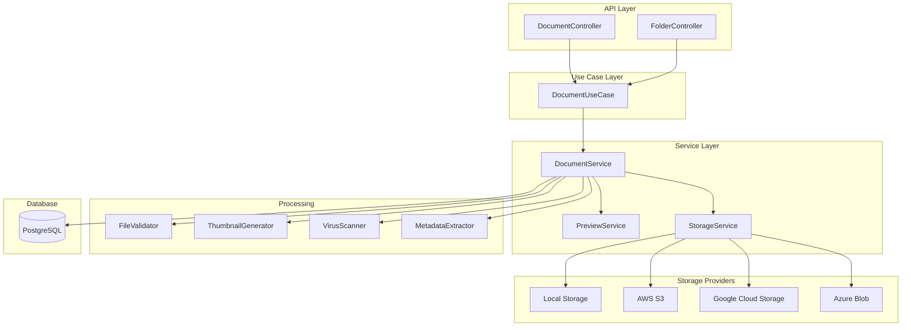

# Document Management Module - Thiết Kế Chi Tiết

**Module:** CRM Document & Attachment Management  
**Phiên bản:** 1.0  
**Ngày tạo:** 2025-12-07  
**Tác giả:** AI Assistant

---

## Mục Lục

1. [Tổng Quan](#1-tổng-quan)
2. [Kiến Trúc Module](#2-kiến-trúc-module)
3. [Domain Entities](#3-domain-entities)
4. [Service Layer](#4-service-layer)
5. [API Endpoints](#5-api-endpoints)
6. [Database Schema](#6-database-schema)
7. [Storage Providers](#7-storage-providers)
8. [File Processing](#8-file-processing)
9. [Implementation Guide](#9-implementation-guide)

---

## 1. Tổng Quan

### 1.1. Mục Tiêu

Document Management Module cung cấp khả năng:
- **File Upload/Download:** Upload và download files cho entities
- **Document Organization:** Folders, categories, tags
- **Version Control:** Track multiple versions của documents
- **Preview Support:** Preview documents trong browser
- **Sharing:** Share documents với team members
- **Templates:** Document templates cho quotes, proposals

### 1.2. Features Overview

| Feature | Description | Priority |
|---------|-------------|----------|
| **File Upload** | Upload files đính kèm entity | High |
| **Download** | Download single/multiple files | High |
| **File Preview** | Preview PDF, images trong browser | High |
| **Categories** | Phân loại documents (Contract, Proposal, etc.) | High |
| **Version History** | Track document versions | Medium |
| **Folders** | Organize với folder structure | Medium |
| **Tags** | Tag documents cho search | Medium |
| **Bulk Upload** | Upload nhiều files cùng lúc | Medium |
| **Sharing** | Share với team/external users | Low |
| **Document Templates** | Generate documents từ templates | Low |

### 1.3. Supported File Types

| Category | Extensions | Max Size |
|----------|------------|----------|
| **Documents** | PDF, DOC, DOCX, XLS, XLSX, PPT, PPTX | 50MB |
| **Images** | JPG, JPEG, PNG, GIF, SVG, WEBP | 20MB |
| **Archives** | ZIP, RAR, 7Z | 100MB |
| **Text** | TXT, CSV, JSON, XML | 10MB |
| **Other** | Custom configurable | Custom |

---

## 2. Kiến Trúc Module

### 2.1. Package Structure

```
crm/src/main/java/serp/project/crm/
├── core/
│   ├── domain/
│   │   ├── entity/
│   │   │   ├── DocumentEntity.java
│   │   │   ├── DocumentVersionEntity.java
│   │   │   ├── DocumentFolderEntity.java
│   │   │   ├── DocumentShareEntity.java
│   │   │   └── DocumentTemplateEntity.java
│   │   ├── dto/
│   │   │   ├── request/
│   │   │   │   ├── UploadDocumentRequest.java
│   │   │   │   ├── UpdateDocumentRequest.java
│   │   │   │   ├── CreateFolderRequest.java
│   │   │   │   ├── MoveDocumentRequest.java
│   │   │   │   └── ShareDocumentRequest.java
│   │   │   └── response/
│   │   │       ├── DocumentResponse.java
│   │   │       ├── DocumentListResponse.java
│   │   │       ├── UploadResponse.java
│   │   │       ├── PreviewResponse.java
│   │   │       └── FolderResponse.java
│   │   └── enums/
│   │       ├── DocumentCategory.java
│   │       ├── DocumentStatus.java
│   │       ├── StorageProvider.java
│   │       └── SharePermission.java
│   ├── service/
│   │   ├── IDocumentService.java
│   │   ├── IStorageService.java
│   │   ├── IDocumentPreviewService.java
│   │   └── impl/
│   │       ├── DocumentService.java
│   │       ├── DocumentPreviewService.java
│   │       └── storage/
│   │           ├── LocalStorageService.java
│   │           ├── S3StorageService.java
│   │           └── GcsStorageService.java
│   ├── usecase/
│   │   └── DocumentUseCase.java
│   ├── port/
│   │   └── store/
│   │       ├── IDocumentStorePort.java
│   │       ├── IFolderStorePort.java
│   │       └── IDocumentVersionStorePort.java
│   └── document/
│       ├── FileValidator.java
│       ├── ThumbnailGenerator.java
│       ├── VirusScanner.java
│       └── FileMetadataExtractor.java
├── infrastructure/
│   └── store/
│       ├── adapter/
│       │   └── DocumentAdapter.java
│       ├── model/
│       │   ├── DocumentModel.java
│       │   ├── DocumentVersionModel.java
│       │   ├── DocumentFolderModel.java
│       │   └── DocumentShareModel.java
│       └── repository/
│           ├── DocumentRepository.java
│           ├── DocumentFolderRepository.java
│           └── DocumentVersionRepository.java
└── ui/
    └── controller/
        ├── DocumentController.java
        └── FolderController.java
```

### 2.2. Architecture Diagram



---

## 3. Domain Entities

### 3.1. DocumentEntity

```java
package serp.project.crm.core.domain.entity;

import lombok.*;
import lombok.experimental.SuperBuilder;
import serp.project.crm.core.domain.enums.DocumentCategory;
import serp.project.crm.core.domain.enums.DocumentStatus;
import java.util.List;

@NoArgsConstructor
@AllArgsConstructor
@Getter
@Setter
@SuperBuilder
public class DocumentEntity extends BaseEntity {
    private String name;                  // Display name
    private String fileName;              // Original filename
    private String description;
    
    // Storage
    private String storageKey;            // Unique key in storage
    private String storagePath;           // Full path including folders
    private String storageProvider;       // LOCAL, S3, GCS, AZURE
    private String publicUrl;             // Public access URL (if enabled)
    
    // File info
    private String mimeType;              // e.g., "application/pdf"
    private String extension;             // e.g., "pdf"
    private Long fileSize;                // In bytes
    private String checksum;              // MD5 or SHA256 hash
    
    // Organization
    private Long folderId;                // Parent folder
    private DocumentCategory category;    // CONTRACT, PROPOSAL, INVOICE, etc.
    private List<String> tags;
    private DocumentStatus status;        // ACTIVE, ARCHIVED, DELETED
    
    // Linked entity
    private String entityType;            // LEAD, OPPORTUNITY, CUSTOMER
    private Long entityId;
    
    // Versioning
    private Integer currentVersion;
    private Long latestVersionId;
    
    // Preview
    private String thumbnailUrl;
    private Boolean hasPreview;
    
    // Metadata
    private String metadata;              // JSON: page count, dimensions, etc.
    
    // Access statistics
    private Long viewCount;
    private Long downloadCount;
    
    public void setDefaults() {
        if (this.status == null) this.status = DocumentStatus.ACTIVE;
        if (this.currentVersion == null) this.currentVersion = 1;
        if (this.viewCount == null) this.viewCount = 0L;
        if (this.downloadCount == null) this.downloadCount = 0L;
        if (this.hasPreview == null) this.hasPreview = false;
    }
    
    public String getFormattedSize() {
        if (fileSize == null) return "0 B";
        
        if (fileSize < 1024) return fileSize + " B";
        if (fileSize < 1024 * 1024) return String.format("%.1f KB", fileSize / 1024.0);
        if (fileSize < 1024 * 1024 * 1024) return String.format("%.1f MB", fileSize / (1024.0 * 1024));
        return String.format("%.1f GB", fileSize / (1024.0 * 1024 * 1024));
    }
    
    public void incrementViewCount() {
        this.viewCount++;
    }
    
    public void incrementDownloadCount() {
        this.downloadCount++;
    }
}
```

### 3.2. DocumentVersionEntity

```java
package serp.project.crm.core.domain.entity;

import lombok.*;
import lombok.experimental.SuperBuilder;
import java.time.LocalDateTime;

@NoArgsConstructor
@AllArgsConstructor
@Getter
@Setter
@SuperBuilder
public class DocumentVersionEntity extends BaseEntity {
    private Long documentId;
    private Integer versionNumber;
    
    private String storageKey;
    private String fileName;
    private Long fileSize;
    private String checksum;
    
    private String changeNote;            // Version description
    private Long uploadedBy;
    private LocalDateTime uploadedAt;
    
    private Boolean isCurrent;            // Is this the current version
}
```

### 3.3. DocumentFolderEntity

```java
package serp.project.crm.core.domain.entity;

import lombok.*;
import lombok.experimental.SuperBuilder;
import java.util.List;

@NoArgsConstructor
@AllArgsConstructor
@Getter
@Setter
@SuperBuilder
public class DocumentFolderEntity extends BaseEntity {
    private String name;
    private String description;
    private Long parentFolderId;          // For nested folders
    private String path;                  // Full path: /contracts/2024/
    
    private String entityType;            // Folder for specific entity type
    private Long entityId;                // Folder for specific entity
    
    private String color;                 // UI color
    private String icon;                  // UI icon
    
    private Integer documentCount;        // Number of documents
    private Integer subfolderCount;       // Number of subfolders
    
    private List<DocumentFolderEntity> subfolders;
    private List<DocumentEntity> documents;
    
    public void setDefaults() {
        if (this.documentCount == null) this.documentCount = 0;
        if (this.subfolderCount == null) this.subfolderCount = 0;
    }
}
```

### 3.4. DocumentShareEntity

```java
package serp.project.crm.core.domain.entity;

import lombok.*;
import lombok.experimental.SuperBuilder;
import serp.project.crm.core.domain.enums.SharePermission;
import java.time.LocalDateTime;

@NoArgsConstructor
@AllArgsConstructor
@Getter
@Setter
@SuperBuilder
public class DocumentShareEntity extends BaseEntity {
    private Long documentId;
    
    // Share target
    private Long sharedWithUserId;        // Internal user
    private Long sharedWithTeamId;        // Team
    private String sharedWithEmail;       // External email
    
    private SharePermission permission;   // VIEW, DOWNLOAD, EDIT
    
    // Link sharing
    private String shareToken;            // Unique token for public link
    private Boolean isPublic;             // Public link enabled
    private LocalDateTime expiresAt;      // Optional expiration
    
    private Boolean isActive;
    private Long sharedBy;
    private LocalDateTime sharedAt;
}
```

### 3.5. Enums

```java
// DocumentCategory.java
public enum DocumentCategory {
    CONTRACT("Contracts"),
    PROPOSAL("Proposals"),
    QUOTATION("Quotations"),
    INVOICE("Invoices"),
    RECEIPT("Receipts"),
    AGREEMENT("Agreements"),
    PRESENTATION("Presentations"),
    REPORT("Reports"),
    SPECIFICATION("Specifications"),
    MANUAL("Manuals"),
    IMAGE("Images"),
    OTHER("Other");
    
    private final String displayName;
    DocumentCategory(String displayName) { this.displayName = displayName; }
}

// DocumentStatus.java
public enum DocumentStatus {
    ACTIVE, ARCHIVED, DELETED, PROCESSING
}

// StorageProvider.java
public enum StorageProvider {
    LOCAL("Local Storage"),
    S3("Amazon S3"),
    GCS("Google Cloud Storage"),
    AZURE("Azure Blob Storage"),
    MINIO("MinIO");
    
    private final String displayName;
    StorageProvider(String displayName) { this.displayName = displayName; }
}

// SharePermission.java
public enum SharePermission {
    VIEW("Can view"),
    DOWNLOAD("Can download"),
    EDIT("Can edit"),
    FULL("Full access");
    
    private final String displayName;
    SharePermission(String displayName) { this.displayName = displayName; }
}
```

---

## 4. Service Layer

### 4.1. IDocumentService

```java
package serp.project.crm.core.service;

import serp.project.crm.core.domain.entity.*;
import serp.project.crm.core.domain.dto.PageRequest;
import serp.project.crm.core.domain.dto.request.*;
import serp.project.crm.core.domain.dto.response.*;
import org.springframework.data.util.Pair;
import org.springframework.web.multipart.MultipartFile;

import java.util.List;
import java.util.Optional;

public interface IDocumentService {
    
    // Upload
    UploadResponse uploadDocument(MultipartFile file, UploadDocumentRequest request, Long tenantId);
    List<UploadResponse> uploadMultipleDocuments(List<MultipartFile> files, UploadDocumentRequest request, Long tenantId);
    UploadResponse uploadNewVersion(Long documentId, MultipartFile file, String changeNote, Long tenantId);
    
    // Download
    byte[] downloadDocument(Long documentId, Long tenantId);
    byte[] downloadVersion(Long documentId, Integer versionNumber, Long tenantId);
    byte[] downloadAsZip(List<Long> documentIds, Long tenantId);
    
    // CRUD
    Optional<DocumentEntity> getDocumentById(Long id, Long tenantId);
    Pair<List<DocumentEntity>, Long> getDocuments(Long tenantId, PageRequest pageRequest);
    Pair<List<DocumentEntity>, Long> getEntityDocuments(String entityType, Long entityId, Long tenantId, PageRequest pageRequest);
    Pair<List<DocumentEntity>, Long> getFolderDocuments(Long folderId, Long tenantId, PageRequest pageRequest);
    DocumentEntity updateDocument(Long id, UpdateDocumentRequest request, Long tenantId);
    void deleteDocument(Long id, Long tenantId);
    void deleteMultipleDocuments(List<Long> ids, Long tenantId);
    
    // Organization
    void moveDocument(Long documentId, Long targetFolderId, Long tenantId);
    void moveMultipleDocuments(List<Long> documentIds, Long targetFolderId, Long tenantId);
    void archiveDocument(Long id, Long tenantId);
    void restoreDocument(Long id, Long tenantId);
    
    // Version management
    List<DocumentVersionEntity> getVersions(Long documentId, Long tenantId);
    void revertToVersion(Long documentId, Integer versionNumber, Long tenantId);
    
    // Preview
    PreviewResponse getPreview(Long documentId, Long tenantId);
    String getThumbnailUrl(Long documentId, Long tenantId);
    
    // Sharing
    DocumentShareEntity shareDocument(Long documentId, ShareDocumentRequest request, Long tenantId);
    void revokeShare(Long shareId, Long tenantId);
    String generatePublicLink(Long documentId, Long expirationHours, Long tenantId);
    Optional<DocumentEntity> getDocumentByShareToken(String token);
    
    // Stats
    DocumentStatsResponse getStats(Long tenantId);
    DocumentStatsResponse getEntityStats(String entityType, Long entityId, Long tenantId);
}
```

### 4.2. DocumentService Implementation

```java
package serp.project.crm.core.service.impl;

import lombok.RequiredArgsConstructor;
import lombok.extern.slf4j.Slf4j;
import org.springframework.stereotype.Service;
import org.springframework.transaction.annotation.Transactional;
import org.springframework.web.multipart.MultipartFile;
import serp.project.crm.core.document.*;
import serp.project.crm.core.domain.dto.request.*;
import serp.project.crm.core.domain.dto.response.*;
import serp.project.crm.core.domain.entity.*;
import serp.project.crm.core.domain.enums.*;
import serp.project.crm.core.port.store.*;
import serp.project.crm.core.service.*;

import java.util.*;

@Service
@RequiredArgsConstructor
@Slf4j
public class DocumentService implements IDocumentService {
    
    private final IDocumentStorePort documentStore;
    private final IDocumentVersionStorePort versionStore;
    private final IStorageService storageService;
    private final FileValidator fileValidator;
    private final ThumbnailGenerator thumbnailGenerator;
    private final FileMetadataExtractor metadataExtractor;
    
    @Override
    @Transactional
    public UploadResponse uploadDocument(MultipartFile file, UploadDocumentRequest request, Long tenantId) {
        // Validate file
        fileValidator.validate(file);
        
        // Generate storage key
        String storageKey = generateStorageKey(file.getOriginalFilename(), tenantId);
        
        // Upload to storage
        String storageUrl = storageService.upload(file, storageKey);
        
        // Extract metadata
        Map<String, Object> metadata = metadataExtractor.extract(file);
        
        // Create document entity
        DocumentEntity document = DocumentEntity.builder()
            .name(request.getName() != null ? request.getName() : file.getOriginalFilename())
            .fileName(file.getOriginalFilename())
            .description(request.getDescription())
            .storageKey(storageKey)
            .storagePath(buildStoragePath(request.getFolderId(), tenantId))
            .storageProvider(storageService.getProviderType().name())
            .mimeType(file.getContentType())
            .extension(getFileExtension(file.getOriginalFilename()))
            .fileSize(file.getSize())
            .checksum(calculateChecksum(file))
            .folderId(request.getFolderId())
            .category(request.getCategory())
            .tags(request.getTags())
            .entityType(request.getEntityType())
            .entityId(request.getEntityId())
            .metadata(serializeMetadata(metadata))
            .tenantId(tenantId)
            .build();
        
        document.setDefaults();
        document = documentStore.save(document);
        
        // Create initial version
        DocumentVersionEntity version = createVersion(document, file, "Initial upload", tenantId);
        document.setLatestVersionId(version.getId());
        documentStore.save(document);
        
        // Generate thumbnail async
        generateThumbnailAsync(document);
        
        log.info("Document uploaded: {} ({})", document.getName(), document.getFormattedSize());
        
        return UploadResponse.builder()
            .documentId(document.getId())
            .name(document.getName())
            .size(document.getFormattedSize())
            .mimeType(document.getMimeType())
            .storageUrl(storageUrl)
            .build();
    }
    
    @Override
    @Transactional
    public UploadResponse uploadNewVersion(Long documentId, MultipartFile file, String changeNote, Long tenantId) {
        DocumentEntity document = documentStore.findById(documentId, tenantId)
            .orElseThrow(() -> new IllegalArgumentException("Document not found"));
        
        // Validate file
        fileValidator.validate(file);
        
        // Upload to storage with version suffix
        String storageKey = generateVersionStorageKey(document.getStorageKey(), document.getCurrentVersion() + 1);
        storageService.upload(file, storageKey);
        
        // Create new version
        DocumentVersionEntity version = createVersion(document, storageKey, file, changeNote, tenantId);
        
        // Update document
        document.setCurrentVersion(document.getCurrentVersion() + 1);
        document.setLatestVersionId(version.getId());
        document.setFileSize(file.getSize());
        document.setChecksum(calculateChecksum(file));
        documentStore.save(document);
        
        // Generate new thumbnail
        generateThumbnailAsync(document);
        
        return UploadResponse.builder()
            .documentId(document.getId())
            .versionNumber(document.getCurrentVersion())
            .name(document.getName())
            .size(document.getFormattedSize())
            .build();
    }
    
    @Override
    public byte[] downloadDocument(Long documentId, Long tenantId) {
        DocumentEntity document = documentStore.findById(documentId, tenantId)
            .orElseThrow(() -> new IllegalArgumentException("Document not found"));
        
        // Increment download count
        document.incrementDownloadCount();
        documentStore.save(document);
        
        return storageService.download(document.getStorageKey());
    }
    
    @Override
    public PreviewResponse getPreview(Long documentId, Long tenantId) {
        DocumentEntity document = documentStore.findById(documentId, tenantId)
            .orElseThrow(() -> new IllegalArgumentException("Document not found"));
        
        // Increment view count
        document.incrementViewCount();
        documentStore.save(document);
        
        // Check if previewable
        if (!isPreviewable(document.getMimeType())) {
            return PreviewResponse.builder()
                .documentId(documentId)
                .previewable(false)
                .message("Preview not available for this file type")
                .build();
        }
        
        // Generate preview URL
        String previewUrl = storageService.generatePresignedUrl(document.getStorageKey(), 3600); // 1 hour
        
        return PreviewResponse.builder()
            .documentId(documentId)
            .previewable(true)
            .previewUrl(previewUrl)
            .mimeType(document.getMimeType())
            .thumbnailUrl(document.getThumbnailUrl())
            .build();
    }
    
    private boolean isPreviewable(String mimeType) {
        return mimeType != null && (
            mimeType.startsWith("image/") ||
            mimeType.equals("application/pdf") ||
            mimeType.startsWith("text/") ||
            mimeType.equals("application/json")
        );
    }
    
    private String generateStorageKey(String filename, Long tenantId) {
        String uuid = UUID.randomUUID().toString();
        String extension = getFileExtension(filename);
        return String.format("tenant-%d/%s/%s.%s", 
            tenantId, 
            java.time.LocalDate.now().toString(), 
            uuid, 
            extension
        );
    }
    
    private DocumentVersionEntity createVersion(DocumentEntity document, MultipartFile file, String changeNote, Long tenantId) {
        DocumentVersionEntity version = DocumentVersionEntity.builder()
            .documentId(document.getId())
            .versionNumber(document.getCurrentVersion())
            .storageKey(document.getStorageKey())
            .fileName(file.getOriginalFilename())
            .fileSize(file.getSize())
            .checksum(document.getChecksum())
            .changeNote(changeNote)
            .uploadedBy(AuditContextHolder.getCurrentUserId())
            .uploadedAt(java.time.LocalDateTime.now())
            .isCurrent(true)
            .tenantId(tenantId)
            .build();
        
        // Mark previous versions as not current
        versionStore.markAllAsNotCurrent(document.getId(), tenantId);
        
        return versionStore.save(version);
    }
}
```

### 4.3. IStorageService

```java
package serp.project.crm.core.service;

import serp.project.crm.core.domain.enums.StorageProvider;
import org.springframework.web.multipart.MultipartFile;
import java.io.InputStream;

public interface IStorageService {
    
    StorageProvider getProviderType();
    
    // Upload
    String upload(MultipartFile file, String key);
    String upload(InputStream inputStream, String key, String contentType, long size);
    
    // Download
    byte[] download(String key);
    InputStream downloadAsStream(String key);
    
    // Delete
    void delete(String key);
    void deleteMultiple(List<String> keys);
    
    // URL generation
    String getPublicUrl(String key);
    String generatePresignedUrl(String key, int expirationSeconds);
    
    // Metadata
    boolean exists(String key);
    long getFileSize(String key);
    String getContentType(String key);
    
    // Copy/Move
    void copy(String sourceKey, String destinationKey);
    void move(String sourceKey, String destinationKey);
}
```

---

## 5. API Endpoints

### 5.1. DocumentController

```java
package serp.project.crm.ui.controller;

import jakarta.validation.Valid;
import lombok.RequiredArgsConstructor;
import lombok.extern.slf4j.Slf4j;
import org.springframework.http.*;
import org.springframework.web.bind.annotation.*;
import org.springframework.web.multipart.MultipartFile;
import serp.project.crm.core.domain.dto.PageRequest;
import serp.project.crm.core.domain.dto.request.*;
import serp.project.crm.core.usecase.DocumentUseCase;
import serp.project.crm.kernel.utils.AuthUtils;

import java.util.List;

@RestController
@RequestMapping("/api/v1/documents")
@RequiredArgsConstructor
@Slf4j
public class DocumentController {
    
    private final DocumentUseCase documentUseCase;
    private final AuthUtils authUtils;
    
    @PostMapping(consumes = MediaType.MULTIPART_FORM_DATA_VALUE)
    public ResponseEntity<?> uploadDocument(
            @RequestParam("file") MultipartFile file,
            @RequestParam(required = false) String name,
            @RequestParam(required = false) String description,
            @RequestParam(required = false) Long folderId,
            @RequestParam(required = false) String category,
            @RequestParam(required = false) String entityType,
            @RequestParam(required = false) Long entityId,
            @RequestParam(required = false) List<String> tags) {
        
        Long tenantId = authUtils.getCurrentTenantId()
            .orElseThrow(() -> new IllegalArgumentException("Tenant ID not found"));
        
        UploadDocumentRequest request = UploadDocumentRequest.builder()
            .name(name)
            .description(description)
            .folderId(folderId)
            .category(category != null ? DocumentCategory.valueOf(category) : null)
            .entityType(entityType)
            .entityId(entityId)
            .tags(tags)
            .build();
        
        var response = documentUseCase.uploadDocument(file, request, tenantId);
        return ResponseEntity.status(response.getCode()).body(response);
    }
    
    @PostMapping(value = "/bulk", consumes = MediaType.MULTIPART_FORM_DATA_VALUE)
    public ResponseEntity<?> uploadMultipleDocuments(
            @RequestParam("files") List<MultipartFile> files,
            @RequestParam(required = false) Long folderId,
            @RequestParam(required = false) String entityType,
            @RequestParam(required = false) Long entityId) {
        
        Long tenantId = authUtils.getCurrentTenantId()
            .orElseThrow(() -> new IllegalArgumentException("Tenant ID not found"));
        
        UploadDocumentRequest request = UploadDocumentRequest.builder()
            .folderId(folderId)
            .entityType(entityType)
            .entityId(entityId)
            .build();
        
        var response = documentUseCase.uploadMultipleDocuments(files, request, tenantId);
        return ResponseEntity.status(response.getCode()).body(response);
    }
    
    @GetMapping("/{id}/download")
    public ResponseEntity<byte[]> downloadDocument(@PathVariable Long id) {
        Long tenantId = authUtils.getCurrentTenantId()
            .orElseThrow(() -> new IllegalArgumentException("Tenant ID not found"));
        
        var result = documentUseCase.downloadDocument(id, tenantId);
        
        HttpHeaders headers = new HttpHeaders();
        headers.setContentType(MediaType.parseMediaType(result.getMimeType()));
        headers.setContentDisposition(ContentDisposition.attachment()
            .filename(result.getFileName())
            .build());
        headers.setContentLength(result.getData().length);
        
        return new ResponseEntity<>(result.getData(), headers, HttpStatus.OK);
    }
    
    @GetMapping("/{id}/preview")
    public ResponseEntity<?> getPreview(@PathVariable Long id) {
        Long tenantId = authUtils.getCurrentTenantId()
            .orElseThrow(() -> new IllegalArgumentException("Tenant ID not found"));
        
        var response = documentUseCase.getPreview(id, tenantId);
        return ResponseEntity.status(response.getCode()).body(response);
    }
    
    @GetMapping
    public ResponseEntity<?> getDocuments(
            @RequestParam(defaultValue = "1") Integer page,
            @RequestParam(defaultValue = "20") Integer size,
            @RequestParam(required = false) Long folderId,
            @RequestParam(required = false) String category,
            @RequestParam(required = false) String entityType,
            @RequestParam(required = false) Long entityId) {
        
        Long tenantId = authUtils.getCurrentTenantId()
            .orElseThrow(() -> new IllegalArgumentException("Tenant ID not found"));
        
        PageRequest pageRequest = PageRequest.builder().page(page).size(size).build();
        
        var response = documentUseCase.getDocuments(tenantId, pageRequest, folderId, category, entityType, entityId);
        return ResponseEntity.status(response.getCode()).body(response);
    }
    
    @GetMapping("/{id}")
    public ResponseEntity<?> getDocumentById(@PathVariable Long id) {
        Long tenantId = authUtils.getCurrentTenantId()
            .orElseThrow(() -> new IllegalArgumentException("Tenant ID not found"));
        
        var response = documentUseCase.getDocumentById(id, tenantId);
        return ResponseEntity.status(response.getCode()).body(response);
    }
    
    @PutMapping("/{id}")
    public ResponseEntity<?> updateDocument(
            @PathVariable Long id,
            @Valid @RequestBody UpdateDocumentRequest request) {
        Long tenantId = authUtils.getCurrentTenantId()
            .orElseThrow(() -> new IllegalArgumentException("Tenant ID not found"));
        
        var response = documentUseCase.updateDocument(id, request, tenantId);
        return ResponseEntity.status(response.getCode()).body(response);
    }
    
    @DeleteMapping("/{id}")
    public ResponseEntity<?> deleteDocument(@PathVariable Long id) {
        Long tenantId = authUtils.getCurrentTenantId()
            .orElseThrow(() -> new IllegalArgumentException("Tenant ID not found"));
        
        var response = documentUseCase.deleteDocument(id, tenantId);
        return ResponseEntity.status(response.getCode()).body(response);
    }
    
    // Versioning
    @PostMapping("/{id}/versions")
    public ResponseEntity<?> uploadNewVersion(
            @PathVariable Long id,
            @RequestParam("file") MultipartFile file,
            @RequestParam(required = false) String changeNote) {
        Long tenantId = authUtils.getCurrentTenantId()
            .orElseThrow(() -> new IllegalArgumentException("Tenant ID not found"));
        
        var response = documentUseCase.uploadNewVersion(id, file, changeNote, tenantId);
        return ResponseEntity.status(response.getCode()).body(response);
    }
    
    @GetMapping("/{id}/versions")
    public ResponseEntity<?> getVersions(@PathVariable Long id) {
        Long tenantId = authUtils.getCurrentTenantId()
            .orElseThrow(() -> new IllegalArgumentException("Tenant ID not found"));
        
        var response = documentUseCase.getVersions(id, tenantId);
        return ResponseEntity.status(response.getCode()).body(response);
    }
    
    @PostMapping("/{id}/versions/{versionNumber}/revert")
    public ResponseEntity<?> revertToVersion(
            @PathVariable Long id,
            @PathVariable Integer versionNumber) {
        Long tenantId = authUtils.getCurrentTenantId()
            .orElseThrow(() -> new IllegalArgumentException("Tenant ID not found"));
        
        var response = documentUseCase.revertToVersion(id, versionNumber, tenantId);
        return ResponseEntity.status(response.getCode()).body(response);
    }
    
    // Sharing
    @PostMapping("/{id}/share")
    public ResponseEntity<?> shareDocument(
            @PathVariable Long id,
            @Valid @RequestBody ShareDocumentRequest request) {
        Long tenantId = authUtils.getCurrentTenantId()
            .orElseThrow(() -> new IllegalArgumentException("Tenant ID not found"));
        
        var response = documentUseCase.shareDocument(id, request, tenantId);
        return ResponseEntity.status(response.getCode()).body(response);
    }
    
    @PostMapping("/{id}/public-link")
    public ResponseEntity<?> generatePublicLink(
            @PathVariable Long id,
            @RequestParam(defaultValue = "24") Long expirationHours) {
        Long tenantId = authUtils.getCurrentTenantId()
            .orElseThrow(() -> new IllegalArgumentException("Tenant ID not found"));
        
        var response = documentUseCase.generatePublicLink(id, expirationHours, tenantId);
        return ResponseEntity.status(response.getCode()).body(response);
    }
    
    // Move
    @PostMapping("/{id}/move")
    public ResponseEntity<?> moveDocument(
            @PathVariable Long id,
            @RequestParam Long targetFolderId) {
        Long tenantId = authUtils.getCurrentTenantId()
            .orElseThrow(() -> new IllegalArgumentException("Tenant ID not found"));
        
        var response = documentUseCase.moveDocument(id, targetFolderId, tenantId);
        return ResponseEntity.status(response.getCode()).body(response);
    }
}
```

### 5.2. API Summary

| Method | Endpoint | Description |
|--------|----------|-------------|
| **Documents** | | |
| `POST` | `/api/v1/documents` | Upload document |
| `POST` | `/api/v1/documents/bulk` | Bulk upload |
| `GET` | `/api/v1/documents` | List documents |
| `GET` | `/api/v1/documents/{id}` | Get document |
| `PUT` | `/api/v1/documents/{id}` | Update document |
| `DELETE` | `/api/v1/documents/{id}` | Delete document |
| `GET` | `/api/v1/documents/{id}/download` | Download document |
| `GET` | `/api/v1/documents/{id}/preview` | Get preview URL |
| `POST` | `/api/v1/documents/{id}/move` | Move to folder |
| **Versions** | | |
| `POST` | `/api/v1/documents/{id}/versions` | Upload new version |
| `GET` | `/api/v1/documents/{id}/versions` | List versions |
| `POST` | `/api/v1/documents/{id}/versions/{v}/revert` | Revert to version |
| **Sharing** | | |
| `POST` | `/api/v1/documents/{id}/share` | Share document |
| `POST` | `/api/v1/documents/{id}/public-link` | Generate public link |
| **Folders** | | |
| `POST` | `/api/v1/folders` | Create folder |
| `GET` | `/api/v1/folders` | List folders |
| `GET` | `/api/v1/folders/{id}` | Get folder |
| `PUT` | `/api/v1/folders/{id}` | Update folder |
| `DELETE` | `/api/v1/folders/{id}` | Delete folder |

---

## 6. Database Schema

```sql
-- Documents
CREATE TABLE documents (
    id BIGSERIAL PRIMARY KEY,
    name VARCHAR(255) NOT NULL,
    file_name VARCHAR(255) NOT NULL,
    description TEXT,
    storage_key VARCHAR(500) NOT NULL UNIQUE,
    storage_path VARCHAR(500),
    storage_provider VARCHAR(30) NOT NULL,
    public_url TEXT,
    mime_type VARCHAR(100),
    extension VARCHAR(20),
    file_size BIGINT,
    checksum VARCHAR(128),
    folder_id BIGINT REFERENCES document_folders(id),
    category VARCHAR(50),
    tags TEXT[], -- PostgreSQL array
    status VARCHAR(20) DEFAULT 'ACTIVE',
    entity_type VARCHAR(50),
    entity_id BIGINT,
    current_version INTEGER DEFAULT 1,
    latest_version_id BIGINT,
    thumbnail_url TEXT,
    has_preview BOOLEAN DEFAULT false,
    metadata JSONB,
    view_count BIGINT DEFAULT 0,
    download_count BIGINT DEFAULT 0,
    tenant_id BIGINT NOT NULL,
    created_by BIGINT,
    updated_by BIGINT,
    created_at TIMESTAMP DEFAULT CURRENT_TIMESTAMP,
    updated_at TIMESTAMP DEFAULT CURRENT_TIMESTAMP
);

CREATE INDEX idx_documents_tenant ON documents(tenant_id);
CREATE INDEX idx_documents_entity ON documents(entity_type, entity_id);
CREATE INDEX idx_documents_folder ON documents(folder_id);
CREATE INDEX idx_documents_category ON documents(category);
CREATE INDEX idx_documents_status ON documents(status);
CREATE INDEX idx_documents_storage_key ON documents(storage_key);

-- Document Versions
CREATE TABLE document_versions (
    id BIGSERIAL PRIMARY KEY,
    document_id BIGINT NOT NULL REFERENCES documents(id) ON DELETE CASCADE,
    version_number INTEGER NOT NULL,
    storage_key VARCHAR(500) NOT NULL,
    file_name VARCHAR(255),
    file_size BIGINT,
    checksum VARCHAR(128),
    change_note TEXT,
    uploaded_by BIGINT,
    uploaded_at TIMESTAMP NOT NULL,
    is_current BOOLEAN DEFAULT false,
    tenant_id BIGINT NOT NULL,
    created_at TIMESTAMP DEFAULT CURRENT_TIMESTAMP,
    UNIQUE(document_id, version_number)
);

CREATE INDEX idx_document_versions_doc ON document_versions(document_id);
CREATE INDEX idx_document_versions_current ON document_versions(document_id, is_current);

-- Document Folders
CREATE TABLE document_folders (
    id BIGSERIAL PRIMARY KEY,
    name VARCHAR(255) NOT NULL,
    description TEXT,
    parent_folder_id BIGINT REFERENCES document_folders(id),
    path VARCHAR(1000),
    entity_type VARCHAR(50),
    entity_id BIGINT,
    color VARCHAR(20),
    icon VARCHAR(50),
    document_count INTEGER DEFAULT 0,
    subfolder_count INTEGER DEFAULT 0,
    tenant_id BIGINT NOT NULL,
    created_by BIGINT,
    created_at TIMESTAMP DEFAULT CURRENT_TIMESTAMP,
    updated_at TIMESTAMP DEFAULT CURRENT_TIMESTAMP
);

CREATE INDEX idx_folders_tenant ON document_folders(tenant_id);
CREATE INDEX idx_folders_parent ON document_folders(parent_folder_id);
CREATE INDEX idx_folders_entity ON document_folders(entity_type, entity_id);

-- Document Shares
CREATE TABLE document_shares (
    id BIGSERIAL PRIMARY KEY,
    document_id BIGINT NOT NULL REFERENCES documents(id) ON DELETE CASCADE,
    shared_with_user_id BIGINT,
    shared_with_team_id BIGINT,
    shared_with_email VARCHAR(255),
    permission VARCHAR(20) NOT NULL,
    share_token VARCHAR(100) UNIQUE,
    is_public BOOLEAN DEFAULT false,
    expires_at TIMESTAMP,
    is_active BOOLEAN DEFAULT true,
    shared_by BIGINT,
    shared_at TIMESTAMP DEFAULT CURRENT_TIMESTAMP,
    tenant_id BIGINT NOT NULL
);

CREATE INDEX idx_shares_document ON document_shares(document_id);
CREATE INDEX idx_shares_token ON document_shares(share_token);
CREATE INDEX idx_shares_user ON document_shares(shared_with_user_id);
```

---

## 7. Storage Providers

### 7.1. AWS S3 Provider

```java
package serp.project.crm.core.service.impl.storage;

import lombok.RequiredArgsConstructor;
import lombok.extern.slf4j.Slf4j;
import org.springframework.beans.factory.annotation.Value;
import org.springframework.stereotype.Service;
import org.springframework.web.multipart.MultipartFile;
import serp.project.crm.core.domain.enums.StorageProvider;
import serp.project.crm.core.service.IStorageService;
import software.amazon.awssdk.core.sync.RequestBody;
import software.amazon.awssdk.services.s3.S3Client;
import software.amazon.awssdk.services.s3.model.*;
import software.amazon.awssdk.services.s3.presigner.S3Presigner;
import software.amazon.awssdk.services.s3.presigner.model.GetObjectPresignRequest;

import java.io.InputStream;
import java.time.Duration;
import java.util.List;

@Service
@RequiredArgsConstructor
@Slf4j
public class S3StorageService implements IStorageService {
    
    private final S3Client s3Client;
    private final S3Presigner s3Presigner;
    
    @Value("${aws.s3.bucket}")
    private String bucketName;
    
    @Value("${aws.s3.region}")
    private String region;
    
    @Override
    public StorageProvider getProviderType() {
        return StorageProvider.S3;
    }
    
    @Override
    public String upload(MultipartFile file, String key) {
        try {
            PutObjectRequest request = PutObjectRequest.builder()
                .bucket(bucketName)
                .key(key)
                .contentType(file.getContentType())
                .contentLength(file.getSize())
                .build();
            
            s3Client.putObject(request, RequestBody.fromInputStream(file.getInputStream(), file.getSize()));
            
            return getPublicUrl(key);
            
        } catch (Exception e) {
            log.error("Failed to upload to S3: {}", e.getMessage());
            throw new RuntimeException("Upload failed", e);
        }
    }
    
    @Override
    public byte[] download(String key) {
        try {
            GetObjectRequest request = GetObjectRequest.builder()
                .bucket(bucketName)
                .key(key)
                .build();
            
            return s3Client.getObjectAsBytes(request).asByteArray();
            
        } catch (Exception e) {
            log.error("Failed to download from S3: {}", e.getMessage());
            throw new RuntimeException("Download failed", e);
        }
    }
    
    @Override
    public void delete(String key) {
        try {
            DeleteObjectRequest request = DeleteObjectRequest.builder()
                .bucket(bucketName)
                .key(key)
                .build();
            
            s3Client.deleteObject(request);
            
        } catch (Exception e) {
            log.error("Failed to delete from S3: {}", e.getMessage());
        }
    }
    
    @Override
    public String generatePresignedUrl(String key, int expirationSeconds) {
        GetObjectRequest getObjectRequest = GetObjectRequest.builder()
            .bucket(bucketName)
            .key(key)
            .build();
        
        GetObjectPresignRequest presignRequest = GetObjectPresignRequest.builder()
            .signatureDuration(Duration.ofSeconds(expirationSeconds))
            .getObjectRequest(getObjectRequest)
            .build();
        
        return s3Presigner.presignGetObject(presignRequest).url().toString();
    }
    
    @Override
    public String getPublicUrl(String key) {
        return String.format("https://%s.s3.%s.amazonaws.com/%s", bucketName, region, key);
    }
    
    @Override
    public boolean exists(String key) {
        try {
            HeadObjectRequest request = HeadObjectRequest.builder()
                .bucket(bucketName)
                .key(key)
                .build();
            
            s3Client.headObject(request);
            return true;
            
        } catch (NoSuchKeyException e) {
            return false;
        }
    }
}
```

---

## 8. File Processing

### 8.1. FileValidator

```java
package serp.project.crm.core.document;

import lombok.extern.slf4j.Slf4j;
import org.springframework.beans.factory.annotation.Value;
import org.springframework.stereotype.Component;
import org.springframework.web.multipart.MultipartFile;

import java.util.List;

@Component
@Slf4j
public class FileValidator {
    
    @Value("${document.max-size-mb:50}")
    private int maxSizeMb;
    
    @Value("${document.allowed-extensions:pdf,doc,docx,xls,xlsx,ppt,pptx,jpg,jpeg,png,gif}")
    private List<String> allowedExtensions;
    
    @Value("${document.blocked-extensions:exe,bat,sh,cmd,msi,dll}")
    private List<String> blockedExtensions;
    
    public void validate(MultipartFile file) {
        validateNotEmpty(file);
        validateSize(file);
        validateExtension(file);
        validateContentType(file);
    }
    
    private void validateNotEmpty(MultipartFile file) {
        if (file == null || file.isEmpty()) {
            throw new IllegalArgumentException("File is empty");
        }
    }
    
    private void validateSize(MultipartFile file) {
        long maxBytes = maxSizeMb * 1024L * 1024L;
        if (file.getSize() > maxBytes) {
            throw new IllegalArgumentException(
                String.format("File size exceeds maximum allowed (%d MB)", maxSizeMb)
            );
        }
    }
    
    private void validateExtension(MultipartFile file) {
        String filename = file.getOriginalFilename();
        if (filename == null) {
            throw new IllegalArgumentException("Filename is required");
        }
        
        String extension = getExtension(filename).toLowerCase();
        
        if (blockedExtensions.contains(extension)) {
            throw new IllegalArgumentException("File type not allowed: " + extension);
        }
        
        if (!allowedExtensions.isEmpty() && !allowedExtensions.contains(extension)) {
            throw new IllegalArgumentException("File type not allowed: " + extension);
        }
    }
    
    private void validateContentType(MultipartFile file) {
        String contentType = file.getContentType();
        
        // Additional security: check for executable content
        if (contentType != null && (
            contentType.contains("executable") ||
            contentType.contains("x-msdownload") ||
            contentType.contains("x-msdos-program")
        )) {
            throw new IllegalArgumentException("Executable files are not allowed");
        }
    }
    
    private String getExtension(String filename) {
        int lastDot = filename.lastIndexOf('.');
        return lastDot > 0 ? filename.substring(lastDot + 1) : "";
    }
}
```

### 8.2. ThumbnailGenerator

```java
package serp.project.crm.core.document;

import lombok.RequiredArgsConstructor;
import lombok.extern.slf4j.Slf4j;
import org.springframework.scheduling.annotation.Async;
import org.springframework.stereotype.Component;
import serp.project.crm.core.domain.entity.DocumentEntity;
import serp.project.crm.core.service.IStorageService;

import javax.imageio.ImageIO;
import java.awt.*;
import java.awt.image.BufferedImage;
import java.io.*;

@Component
@RequiredArgsConstructor
@Slf4j
public class ThumbnailGenerator {
    
    private static final int THUMBNAIL_WIDTH = 200;
    private static final int THUMBNAIL_HEIGHT = 200;
    
    private final IStorageService storageService;
    
    @Async
    public void generateThumbnail(DocumentEntity document, byte[] fileData) {
        String mimeType = document.getMimeType();
        
        if (mimeType == null) return;
        
        try {
            byte[] thumbnailData = null;
            
            if (mimeType.startsWith("image/")) {
                thumbnailData = generateImageThumbnail(fileData);
            } else if (mimeType.equals("application/pdf")) {
                thumbnailData = generatePdfThumbnail(fileData);
            }
            
            if (thumbnailData != null) {
                String thumbnailKey = document.getStorageKey() + "_thumb.png";
                String thumbnailUrl = storageService.upload(
                    new ByteArrayInputStream(thumbnailData),
                    thumbnailKey,
                    "image/png",
                    thumbnailData.length
                );
                
                document.setThumbnailUrl(thumbnailUrl);
                document.setHasPreview(true);
            }
            
        } catch (Exception e) {
            log.warn("Failed to generate thumbnail for document {}: {}", document.getId(), e.getMessage());
        }
    }
    
    private byte[] generateImageThumbnail(byte[] imageData) throws IOException {
        BufferedImage originalImage = ImageIO.read(new ByteArrayInputStream(imageData));
        
        if (originalImage == null) return null;
        
        BufferedImage thumbnail = new BufferedImage(THUMBNAIL_WIDTH, THUMBNAIL_HEIGHT, BufferedImage.TYPE_INT_RGB);
        Graphics2D g2d = thumbnail.createGraphics();
        g2d.setRenderingHint(RenderingHints.KEY_INTERPOLATION, RenderingHints.VALUE_INTERPOLATION_BILINEAR);
        g2d.drawImage(originalImage, 0, 0, THUMBNAIL_WIDTH, THUMBNAIL_HEIGHT, null);
        g2d.dispose();
        
        ByteArrayOutputStream baos = new ByteArrayOutputStream();
        ImageIO.write(thumbnail, "png", baos);
        return baos.toByteArray();
    }
    
    private byte[] generatePdfThumbnail(byte[] pdfData) {
        // Use PDFBox or similar library to render first page
        // Implementation depends on library choice
        return null;
    }
}
```

---

## 9. Implementation Guide

### 9.1. Sprint Breakdown

| Sprint | Duration | Tasks |
|--------|----------|-------|
| Sprint 1 | 1 tuần | Database schema, Entities, Storage service interface |
| Sprint 2 | 1 tuần | Upload/Download, S3 integration |
| Sprint 3 | 1 tuần | Folders, Versioning |
| Sprint 4 | 1 tuần | Preview, Thumbnails, Sharing |

### 9.2. Configuration

```yaml
# application.yml
document:
  max-size-mb: 50
  allowed-extensions: pdf,doc,docx,xls,xlsx,ppt,pptx,jpg,jpeg,png,gif,svg,txt,csv
  blocked-extensions: exe,bat,sh,cmd,msi,dll,com,scr
  storage-provider: s3  # local, s3, gcs, azure
  
storage:
  local:
    base-path: /var/crm/documents
    
aws:
  s3:
    bucket: ${S3_BUCKET_NAME}
    region: ${AWS_REGION}
    access-key: ${AWS_ACCESS_KEY}
    secret-key: ${AWS_SECRET_KEY}
```

---

**Document Version:** 1.0  
**Last Updated:** 2025-12-07
