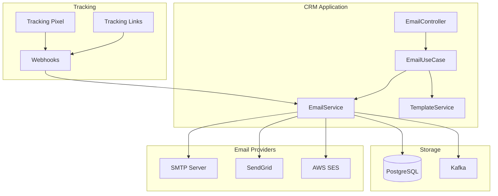

# Email Integration Module - Thiết Kế Chi Tiết

**Module:** CRM Email Integration  
**Phiên bản:** 1.0  
**Ngày tạo:** 2025-12-07  
**Tác giả:** AI Assistant

---

## Mục Lục

1. [Tổng Quan](#1-tổng-quan)
2. [Kiến Trúc Module](#2-kiến-trúc-module)
3. [Domain Entities](#3-domain-entities)
4. [Service Layer](#4-service-layer)
5. [API Endpoints](#5-api-endpoints)
6. [Database Schema](#6-database-schema)
7. [Email Template System](#7-email-template-system)
8. [Email Tracking](#8-email-tracking)
9. [External Provider Integration](#9-external-provider-integration)
10. [Implementation Guide](#10-implementation-guide)

---

## 1. Tổng Quan

### 1.1. Mục Tiêu

Email Integration Module cung cấp khả năng:
- **Email Templates:** Tạo và quản lý email templates với merge fields
- **Email Sending:** Gửi email từ CRM với tracking
- **Email Tracking:** Track opens, clicks, bounces
- **Email History:** Lưu trữ lịch sử email cho mỗi entity
- **Bulk Email:** Gửi email hàng loạt cho campaigns
- **Provider Integration:** Tích hợp với Gmail, Outlook, SendGrid

### 1.2. Features Overview

| Feature | Description | Priority |
|---------|-------------|----------|
| **Template Management** | CRUD templates với variables | High |
| **Send Email** | Gửi email đơn lẻ từ entity | High |
| **Email History** | Xem lịch sử email của Lead/Customer/Contact | High |
| **Open Tracking** | Track khi email được mở | High |
| **Click Tracking** | Track khi link được click | Medium |
| **Bulk Send** | Gửi email cho nhiều recipients | Medium |
| **Gmail/Outlook Sync** | Sync với personal email | Low |
| **Scheduled Send** | Lên lịch gửi email | Medium |

### 1.3. Architecture Overview



---

## 2. Kiến Trúc Module

### 2.1. Package Structure

```
crm/src/main/java/serp/project/crm/
├── core/
│   ├── domain/
│   │   ├── entity/
│   │   │   ├── EmailTemplateEntity.java
│   │   │   ├── EmailLogEntity.java
│   │   │   ├── EmailRecipientEntity.java
│   │   │   ├── EmailTrackingEventEntity.java
│   │   │   └── EmailAttachmentEntity.java
│   │   ├── dto/
│   │   │   ├── request/
│   │   │   │   ├── CreateEmailTemplateRequest.java
│   │   │   │   ├── UpdateEmailTemplateRequest.java
│   │   │   │   ├── SendEmailRequest.java
│   │   │   │   ├── SendBulkEmailRequest.java
│   │   │   │   └── ScheduleEmailRequest.java
│   │   │   └── response/
│   │   │       ├── EmailTemplateResponse.java
│   │   │       ├── EmailLogResponse.java
│   │   │       ├── EmailStatsResponse.java
│   │   │       └── SendEmailResponse.java
│   │   └── enums/
│   │       ├── EmailStatus.java
│   │       ├── EmailProvider.java
│   │       ├── TrackingEventType.java
│   │       └── TemplateCategory.java
│   ├── service/
│   │   ├── IEmailService.java
│   │   ├── IEmailTemplateService.java
│   │   ├── IEmailTrackingService.java
│   │   ├── IEmailProviderService.java
│   │   └── impl/
│   │       ├── EmailService.java
│   │       ├── EmailTemplateService.java
│   │       ├── EmailTrackingService.java
│   │       └── provider/
│   │           ├── SmtpEmailProvider.java
│   │           ├── SendGridEmailProvider.java
│   │           └── AwsSesEmailProvider.java
│   ├── usecase/
│   │   └── EmailUseCase.java
│   ├── port/
│   │   └── store/
│   │       ├── IEmailTemplateStorePort.java
│   │       ├── IEmailLogStorePort.java
│   │       └── IEmailTrackingStorePort.java
│   └── email/
│       ├── TemplateRenderer.java
│       ├── EmailBuilder.java
│       ├── TrackingPixelGenerator.java
│       └── LinkTracker.java
├── infrastructure/
│   └── store/
│       ├── adapter/
│       │   ├── EmailTemplateAdapter.java
│       │   ├── EmailLogAdapter.java
│       │   └── EmailTrackingAdapter.java
│       ├── model/
│       │   ├── EmailTemplateModel.java
│       │   ├── EmailLogModel.java
│       │   ├── EmailRecipientModel.java
│       │   ├── EmailTrackingEventModel.java
│       │   └── EmailAttachmentModel.java
│       └── repository/
│           ├── EmailTemplateRepository.java
│           ├── EmailLogRepository.java
│           └── EmailTrackingEventRepository.java
└── ui/
    └── controller/
        ├── EmailController.java
        ├── EmailTemplateController.java
        └── EmailTrackingController.java
```

---

## 3. Domain Entities

### 3.1. EmailTemplateEntity

```java
package serp.project.crm.core.domain.entity;

import lombok.*;
import lombok.experimental.SuperBuilder;
import serp.project.crm.core.domain.enums.TemplateCategory;
import java.util.List;

@NoArgsConstructor
@AllArgsConstructor
@Getter
@Setter
@SuperBuilder
public class EmailTemplateEntity extends BaseEntity {
    private String name;
    private String description;
    private TemplateCategory category;    // WELCOME, FOLLOW_UP, PROPOSAL, NEWSLETTER, CUSTOM
    
    private String subject;               // Subject with merge fields: "Hello {{name}}"
    private String bodyHtml;              // HTML body with merge fields
    private String bodyText;              // Plain text version
    
    private String fromName;              // Sender name override
    private String fromEmail;             // Sender email override
    private String replyTo;
    
    private Boolean isActive;
    private Boolean trackOpens;
    private Boolean trackClicks;
    
    private List<String> availableVariables; // List of supported merge fields
    private String previewText;           // Email preview text
    
    // Statistics
    private Long usageCount;
    private Long openCount;
    private Long clickCount;
    
    public void setDefaults() {
        if (this.isActive == null) this.isActive = true;
        if (this.trackOpens == null) this.trackOpens = true;
        if (this.trackClicks == null) this.trackClicks = true;
        if (this.usageCount == null) this.usageCount = 0L;
        if (this.openCount == null) this.openCount = 0L;
        if (this.clickCount == null) this.clickCount = 0L;
    }
    
    public Double getOpenRate() {
        if (usageCount == 0) return 0.0;
        return (openCount.doubleValue() / usageCount.doubleValue()) * 100;
    }
    
    public Double getClickRate() {
        if (openCount == 0) return 0.0;
        return (clickCount.doubleValue() / openCount.doubleValue()) * 100;
    }
}
```

### 3.2. EmailLogEntity

```java
package serp.project.crm.core.domain.entity;

import lombok.*;
import lombok.experimental.SuperBuilder;
import serp.project.crm.core.domain.enums.EmailStatus;
import serp.project.crm.core.domain.enums.EmailProvider;
import java.time.LocalDateTime;
import java.util.List;

@NoArgsConstructor
@AllArgsConstructor
@Getter
@Setter
@SuperBuilder
public class EmailLogEntity extends BaseEntity {
    // Linked entity
    private String entityType;            // LEAD, CUSTOMER, CONTACT, OPPORTUNITY
    private Long entityId;
    
    // Template
    private Long templateId;
    private String templateName;          // Denormalized
    
    // Email details
    private String subject;
    private String bodyHtml;
    private String bodyText;
    private String fromName;
    private String fromEmail;
    private String replyTo;
    
    // Recipients
    private String toEmail;
    private String toName;
    private String ccEmails;              // Comma-separated
    private String bccEmails;             // Comma-separated
    
    // Status
    private EmailStatus status;           // QUEUED, SENDING, SENT, DELIVERED, OPENED, CLICKED, BOUNCED, FAILED
    private String errorMessage;
    private String errorCode;
    
    // Provider
    private EmailProvider provider;       // SMTP, SENDGRID, AWS_SES
    private String providerMessageId;     // External message ID
    
    // Timestamps
    private LocalDateTime scheduledAt;
    private LocalDateTime sentAt;
    private LocalDateTime deliveredAt;
    private LocalDateTime firstOpenedAt;
    private LocalDateTime lastOpenedAt;
    private LocalDateTime firstClickedAt;
    private LocalDateTime bouncedAt;
    
    // Tracking stats
    private Integer openCount;
    private Integer clickCount;
    private Integer linkClickCount;
    
    // Attachments
    private List<EmailAttachmentEntity> attachments;
    
    // Tracking events
    private List<EmailTrackingEventEntity> trackingEvents;
    
    public void setDefaults() {
        if (this.status == null) this.status = EmailStatus.QUEUED;
        if (this.openCount == null) this.openCount = 0;
        if (this.clickCount == null) this.clickCount = 0;
        if (this.linkClickCount == null) this.linkClickCount = 0;
    }
    
    public void markAsSent(String providerMessageId) {
        this.status = EmailStatus.SENT;
        this.providerMessageId = providerMessageId;
        this.sentAt = LocalDateTime.now();
    }
    
    public void markAsDelivered() {
        this.status = EmailStatus.DELIVERED;
        this.deliveredAt = LocalDateTime.now();
    }
    
    public void recordOpen() {
        if (this.firstOpenedAt == null) {
            this.firstOpenedAt = LocalDateTime.now();
            this.status = EmailStatus.OPENED;
        }
        this.lastOpenedAt = LocalDateTime.now();
        this.openCount++;
    }
    
    public void recordClick(String linkUrl) {
        if (this.firstClickedAt == null) {
            this.firstClickedAt = LocalDateTime.now();
            this.status = EmailStatus.CLICKED;
        }
        this.clickCount++;
    }
    
    public void markAsBounced(String errorCode, String errorMessage) {
        this.status = EmailStatus.BOUNCED;
        this.errorCode = errorCode;
        this.errorMessage = errorMessage;
        this.bouncedAt = LocalDateTime.now();
    }
    
    public void markAsFailed(String errorMessage) {
        this.status = EmailStatus.FAILED;
        this.errorMessage = errorMessage;
    }
}
```

### 3.3. EmailTrackingEventEntity

```java
package serp.project.crm.core.domain.entity;

import lombok.*;
import lombok.experimental.SuperBuilder;
import serp.project.crm.core.domain.enums.TrackingEventType;
import java.time.LocalDateTime;

@NoArgsConstructor
@AllArgsConstructor
@Getter
@Setter
@SuperBuilder
public class EmailTrackingEventEntity extends BaseEntity {
    private Long emailLogId;
    private TrackingEventType eventType;  // SENT, DELIVERED, OPENED, CLICKED, BOUNCED, UNSUBSCRIBED
    
    private String linkUrl;               // For click events
    private String linkName;              // Link display text
    
    private String ipAddress;
    private String userAgent;
    private String deviceType;            // DESKTOP, MOBILE, TABLET
    private String location;              // City, Country
    
    private LocalDateTime eventAt;
    
    private String metadata;              // JSON for additional data
}
```

### 3.4. Enums

```java
// EmailStatus.java
public enum EmailStatus {
    DRAFT("Draft - not sent"),
    QUEUED("Queued for sending"),
    SENDING("Currently sending"),
    SENT("Sent to provider"),
    DELIVERED("Delivered to recipient"),
    OPENED("Opened by recipient"),
    CLICKED("Link clicked"),
    BOUNCED("Bounced - delivery failed"),
    FAILED("Failed to send"),
    CANCELLED("Cancelled before sending");
    
    private final String description;
    EmailStatus(String description) { this.description = description; }
}

// EmailProvider.java
public enum EmailProvider {
    SMTP("Standard SMTP"),
    SENDGRID("SendGrid API"),
    AWS_SES("Amazon SES"),
    MAILGUN("Mailgun API"),
    POSTMARK("Postmark API");
    
    private final String description;
    EmailProvider(String description) { this.description = description; }
}

// TrackingEventType.java
public enum TrackingEventType {
    SENT, DELIVERED, OPENED, CLICKED, BOUNCED, 
    UNSUBSCRIBED, COMPLAINED, DROPPED
}

// TemplateCategory.java
public enum TemplateCategory {
    WELCOME("Welcome emails"),
    FOLLOW_UP("Follow-up emails"),
    PROPOSAL("Proposal/Quote emails"),
    NEWSLETTER("Newsletter emails"),
    NOTIFICATION("System notifications"),
    REMINDER("Reminder emails"),
    THANK_YOU("Thank you emails"),
    CUSTOM("Custom templates");
    
    private final String description;
    TemplateCategory(String description) { this.description = description; }
}
```

---

## 4. Service Layer

### 4.1. IEmailService

```java
package serp.project.crm.core.service;

import serp.project.crm.core.domain.entity.EmailLogEntity;
import serp.project.crm.core.domain.dto.PageRequest;
import serp.project.crm.core.domain.dto.request.*;
import serp.project.crm.core.domain.dto.response.*;
import org.springframework.data.util.Pair;

import java.time.LocalDateTime;
import java.util.List;
import java.util.Optional;

public interface IEmailService {
    
    // Send emails
    SendEmailResponse sendEmail(SendEmailRequest request, Long tenantId);
    SendEmailResponse sendTemplateEmail(Long templateId, String toEmail, 
                                        Map<String, Object> variables, Long tenantId);
    List<SendEmailResponse> sendBulkEmail(SendBulkEmailRequest request, Long tenantId);
    
    // Schedule emails
    EmailLogEntity scheduleEmail(ScheduleEmailRequest request, Long tenantId);
    void cancelScheduledEmail(Long emailLogId, Long tenantId);
    
    // Query email logs
    Pair<List<EmailLogEntity>, Long> getEmailLogs(Long tenantId, PageRequest pageRequest);
    Pair<List<EmailLogEntity>, Long> getEntityEmails(String entityType, Long entityId, 
                                                      Long tenantId, PageRequest pageRequest);
    Optional<EmailLogEntity> getEmailLogById(Long id, Long tenantId);
    
    // Statistics
    EmailStatsResponse getEmailStats(Long tenantId, LocalDateTime from, LocalDateTime to);
    EmailStatsResponse getTemplateStats(Long templateId, Long tenantId);
    
    // Retry failed
    SendEmailResponse retryFailedEmail(Long emailLogId, Long tenantId);
}
```

### 4.2. EmailService Implementation

```java
package serp.project.crm.core.service.impl;

import lombok.RequiredArgsConstructor;
import lombok.extern.slf4j.Slf4j;
import org.springframework.scheduling.annotation.Async;
import org.springframework.stereotype.Service;
import org.springframework.transaction.annotation.Transactional;
import serp.project.crm.core.domain.dto.request.*;
import serp.project.crm.core.domain.dto.response.*;
import serp.project.crm.core.domain.entity.*;
import serp.project.crm.core.domain.enums.*;
import serp.project.crm.core.email.*;
import serp.project.crm.core.port.store.*;
import serp.project.crm.core.service.*;

import java.time.LocalDateTime;
import java.util.*;

@Service
@RequiredArgsConstructor
@Slf4j
public class EmailService implements IEmailService {
    
    private final IEmailLogStorePort emailLogStore;
    private final IEmailTemplateStorePort templateStore;
    private final IEmailTrackingStorePort trackingStore;
    private final TemplateRenderer templateRenderer;
    private final EmailBuilder emailBuilder;
    private final TrackingPixelGenerator pixelGenerator;
    private final LinkTracker linkTracker;
    private final Map<EmailProvider, IEmailProviderService> providers;
    
    @Override
    @Transactional
    public SendEmailResponse sendEmail(SendEmailRequest request, Long tenantId) {
        // Create email log
        EmailLogEntity emailLog = EmailLogEntity.builder()
            .entityType(request.getEntityType())
            .entityId(request.getEntityId())
            .templateId(request.getTemplateId())
            .subject(request.getSubject())
            .bodyHtml(request.getBodyHtml())
            .bodyText(request.getBodyText())
            .fromName(request.getFromName())
            .fromEmail(request.getFromEmail())
            .toEmail(request.getToEmail())
            .toName(request.getToName())
            .ccEmails(request.getCcEmails())
            .bccEmails(request.getBccEmails())
            .status(EmailStatus.QUEUED)
            .tenantId(tenantId)
            .build();
        
        emailLog.setDefaults();
        emailLog = emailLogStore.save(emailLog);
        
        // Send asynchronously
        sendEmailAsync(emailLog);
        
        return SendEmailResponse.builder()
            .emailLogId(emailLog.getId())
            .status(emailLog.getStatus())
            .message("Email queued for sending")
            .build();
    }
    
    @Override
    @Transactional
    public SendEmailResponse sendTemplateEmail(Long templateId, String toEmail,
                                               Map<String, Object> variables, Long tenantId) {
        // Get template
        EmailTemplateEntity template = templateStore.findById(templateId, tenantId)
            .orElseThrow(() -> new IllegalArgumentException("Template not found"));
        
        // Render template
        String renderedSubject = templateRenderer.render(template.getSubject(), variables);
        String renderedBody = templateRenderer.render(template.getBodyHtml(), variables);
        String renderedText = templateRenderer.render(template.getBodyText(), variables);
        
        // Build send request
        SendEmailRequest request = SendEmailRequest.builder()
            .templateId(templateId)
            .subject(renderedSubject)
            .bodyHtml(renderedBody)
            .bodyText(renderedText)
            .fromName(template.getFromName())
            .fromEmail(template.getFromEmail())
            .toEmail(toEmail)
            .build();
        
        return sendEmail(request, tenantId);
    }
    
    @Async
    protected void sendEmailAsync(EmailLogEntity emailLog) {
        try {
            // Add tracking
            String bodyWithTracking = addTracking(emailLog);
            emailLog.setBodyHtml(bodyWithTracking);
            
            // Get provider
            IEmailProviderService provider = getProvider();
            
            // Update status
            emailLog.setStatus(EmailStatus.SENDING);
            emailLog.setProvider(provider.getProviderType());
            emailLogStore.save(emailLog);
            
            // Send email
            String messageId = provider.send(emailLog);
            
            // Update as sent
            emailLog.markAsSent(messageId);
            emailLogStore.save(emailLog);
            
            // Update template stats
            if (emailLog.getTemplateId() != null) {
                templateStore.incrementUsageCount(emailLog.getTemplateId());
            }
            
            log.info("Email sent successfully: {}", emailLog.getId());
            
        } catch (Exception e) {
            log.error("Failed to send email {}: {}", emailLog.getId(), e.getMessage());
            emailLog.markAsFailed(e.getMessage());
            emailLogStore.save(emailLog);
        }
    }
    
    private String addTracking(EmailLogEntity emailLog) {
        String body = emailLog.getBodyHtml();
        
        // Add tracking pixel
        String trackingPixel = pixelGenerator.generate(emailLog.getId());
        body = body.replace("</body>", trackingPixel + "</body>");
        
        // Track links
        body = linkTracker.trackAllLinks(body, emailLog.getId());
        
        return body;
    }
    
    private IEmailProviderService getProvider() {
        // Get configured provider
        return providers.values().iterator().next();
    }
}
```

### 4.3. TemplateRenderer

```java
package serp.project.crm.core.email;

import lombok.extern.slf4j.Slf4j;
import org.springframework.stereotype.Component;
import java.util.Map;
import java.util.regex.Matcher;
import java.util.regex.Pattern;

@Component
@Slf4j
public class TemplateRenderer {
    
    private static final Pattern VARIABLE_PATTERN = Pattern.compile("\\{\\{\\s*([\\w.]+)\\s*\\}\\}");
    
    public String render(String template, Map<String, Object> variables) {
        if (template == null || variables == null) {
            return template;
        }
        
        StringBuffer result = new StringBuffer();
        Matcher matcher = VARIABLE_PATTERN.matcher(template);
        
        while (matcher.find()) {
            String variableName = matcher.group(1);
            Object value = getNestedValue(variables, variableName);
            String replacement = value != null ? value.toString() : "";
            matcher.appendReplacement(result, Matcher.quoteReplacement(replacement));
        }
        
        matcher.appendTail(result);
        return result.toString();
    }
    
    public List<String> extractVariables(String template) {
        List<String> variables = new ArrayList<>();
        Matcher matcher = VARIABLE_PATTERN.matcher(template);
        
        while (matcher.find()) {
            String variable = matcher.group(1);
            if (!variables.contains(variable)) {
                variables.add(variable);
            }
        }
        
        return variables;
    }
    
    private Object getNestedValue(Map<String, Object> map, String path) {
        String[] parts = path.split("\\.");
        Object current = map;
        
        for (String part : parts) {
            if (current instanceof Map) {
                current = ((Map<?, ?>) current).get(part);
            } else {
                return null;
            }
        }
        
        return current;
    }
}
```

---

## 5. API Endpoints

### 5.1. EmailController

```java
package serp.project.crm.ui.controller;

import jakarta.validation.Valid;
import lombok.RequiredArgsConstructor;
import lombok.extern.slf4j.Slf4j;
import org.springframework.http.ResponseEntity;
import org.springframework.web.bind.annotation.*;
import serp.project.crm.core.domain.dto.PageRequest;
import serp.project.crm.core.domain.dto.request.*;
import serp.project.crm.core.usecase.EmailUseCase;
import serp.project.crm.kernel.utils.AuthUtils;

@RestController
@RequestMapping("/api/v1/emails")
@RequiredArgsConstructor
@Slf4j
public class EmailController {
    
    private final EmailUseCase emailUseCase;
    private final AuthUtils authUtils;
    
    @PostMapping("/send")
    public ResponseEntity<?> sendEmail(@Valid @RequestBody SendEmailRequest request) {
        Long tenantId = authUtils.getCurrentTenantId()
            .orElseThrow(() -> new IllegalArgumentException("Tenant ID not found"));
        
        var response = emailUseCase.sendEmail(request, tenantId);
        return ResponseEntity.status(response.getCode()).body(response);
    }
    
    @PostMapping("/send-template")
    public ResponseEntity<?> sendTemplateEmail(@Valid @RequestBody SendTemplateEmailRequest request) {
        Long tenantId = authUtils.getCurrentTenantId()
            .orElseThrow(() -> new IllegalArgumentException("Tenant ID not found"));
        
        var response = emailUseCase.sendTemplateEmail(request, tenantId);
        return ResponseEntity.status(response.getCode()).body(response);
    }
    
    @PostMapping("/send-bulk")
    public ResponseEntity<?> sendBulkEmail(@Valid @RequestBody SendBulkEmailRequest request) {
        Long tenantId = authUtils.getCurrentTenantId()
            .orElseThrow(() -> new IllegalArgumentException("Tenant ID not found"));
        
        var response = emailUseCase.sendBulkEmail(request, tenantId);
        return ResponseEntity.status(response.getCode()).body(response);
    }
    
    @PostMapping("/schedule")
    public ResponseEntity<?> scheduleEmail(@Valid @RequestBody ScheduleEmailRequest request) {
        Long tenantId = authUtils.getCurrentTenantId()
            .orElseThrow(() -> new IllegalArgumentException("Tenant ID not found"));
        
        var response = emailUseCase.scheduleEmail(request, tenantId);
        return ResponseEntity.status(response.getCode()).body(response);
    }
    
    @GetMapping
    public ResponseEntity<?> getEmailLogs(
            @RequestParam(defaultValue = "1") Integer page,
            @RequestParam(defaultValue = "20") Integer size,
            @RequestParam(required = false) String status,
            @RequestParam(required = false) String entityType,
            @RequestParam(required = false) Long entityId) {
        Long tenantId = authUtils.getCurrentTenantId()
            .orElseThrow(() -> new IllegalArgumentException("Tenant ID not found"));
        
        PageRequest pageRequest = PageRequest.builder().page(page).size(size).build();
        var response = emailUseCase.getEmailLogs(tenantId, pageRequest, status, entityType, entityId);
        return ResponseEntity.status(response.getCode()).body(response);
    }
    
    @GetMapping("/{id}")
    public ResponseEntity<?> getEmailLogById(@PathVariable Long id) {
        Long tenantId = authUtils.getCurrentTenantId()
            .orElseThrow(() -> new IllegalArgumentException("Tenant ID not found"));
        
        var response = emailUseCase.getEmailLogById(id, tenantId);
        return ResponseEntity.status(response.getCode()).body(response);
    }
    
    @GetMapping("/{entityType}/{entityId}")
    public ResponseEntity<?> getEntityEmails(
            @PathVariable String entityType,
            @PathVariable Long entityId,
            @RequestParam(defaultValue = "1") Integer page,
            @RequestParam(defaultValue = "20") Integer size) {
        Long tenantId = authUtils.getCurrentTenantId()
            .orElseThrow(() -> new IllegalArgumentException("Tenant ID not found"));
        
        PageRequest pageRequest = PageRequest.builder().page(page).size(size).build();
        var response = emailUseCase.getEntityEmails(entityType, entityId, tenantId, pageRequest);
        return ResponseEntity.status(response.getCode()).body(response);
    }
    
    @PostMapping("/{id}/retry")
    public ResponseEntity<?> retryFailedEmail(@PathVariable Long id) {
        Long tenantId = authUtils.getCurrentTenantId()
            .orElseThrow(() -> new IllegalArgumentException("Tenant ID not found"));
        
        var response = emailUseCase.retryFailedEmail(id, tenantId);
        return ResponseEntity.status(response.getCode()).body(response);
    }
    
    @GetMapping("/stats")
    public ResponseEntity<?> getEmailStats(
            @RequestParam @DateTimeFormat(iso = DateTimeFormat.ISO.DATE_TIME) LocalDateTime from,
            @RequestParam @DateTimeFormat(iso = DateTimeFormat.ISO.DATE_TIME) LocalDateTime to) {
        Long tenantId = authUtils.getCurrentTenantId()
            .orElseThrow(() -> new IllegalArgumentException("Tenant ID not found"));
        
        var response = emailUseCase.getEmailStats(tenantId, from, to);
        return ResponseEntity.status(response.getCode()).body(response);
    }
}
```

### 5.2. EmailTemplateController

```java
package serp.project.crm.ui.controller;

import jakarta.validation.Valid;
import lombok.RequiredArgsConstructor;
import lombok.extern.slf4j.Slf4j;
import org.springframework.http.ResponseEntity;
import org.springframework.web.bind.annotation.*;
import serp.project.crm.core.domain.dto.PageRequest;
import serp.project.crm.core.domain.dto.request.*;
import serp.project.crm.core.usecase.EmailUseCase;
import serp.project.crm.kernel.utils.AuthUtils;

@RestController
@RequestMapping("/api/v1/email-templates")
@RequiredArgsConstructor
@Slf4j
public class EmailTemplateController {
    
    private final EmailUseCase emailUseCase;
    private final AuthUtils authUtils;
    
    @PostMapping
    public ResponseEntity<?> createTemplate(@Valid @RequestBody CreateEmailTemplateRequest request) {
        Long tenantId = authUtils.getCurrentTenantId()
            .orElseThrow(() -> new IllegalArgumentException("Tenant ID not found"));
        
        var response = emailUseCase.createTemplate(request, tenantId);
        return ResponseEntity.status(response.getCode()).body(response);
    }
    
    @GetMapping
    public ResponseEntity<?> getAllTemplates(
            @RequestParam(defaultValue = "1") Integer page,
            @RequestParam(defaultValue = "20") Integer size,
            @RequestParam(required = false) String category) {
        Long tenantId = authUtils.getCurrentTenantId()
            .orElseThrow(() -> new IllegalArgumentException("Tenant ID not found"));
        
        PageRequest pageRequest = PageRequest.builder().page(page).size(size).build();
        var response = emailUseCase.getAllTemplates(tenantId, pageRequest, category);
        return ResponseEntity.status(response.getCode()).body(response);
    }
    
    @GetMapping("/{id}")
    public ResponseEntity<?> getTemplateById(@PathVariable Long id) {
        Long tenantId = authUtils.getCurrentTenantId()
            .orElseThrow(() -> new IllegalArgumentException("Tenant ID not found"));
        
        var response = emailUseCase.getTemplateById(id, tenantId);
        return ResponseEntity.status(response.getCode()).body(response);
    }
    
    @PutMapping("/{id}")
    public ResponseEntity<?> updateTemplate(
            @PathVariable Long id,
            @Valid @RequestBody UpdateEmailTemplateRequest request) {
        Long tenantId = authUtils.getCurrentTenantId()
            .orElseThrow(() -> new IllegalArgumentException("Tenant ID not found"));
        
        var response = emailUseCase.updateTemplate(id, request, tenantId);
        return ResponseEntity.status(response.getCode()).body(response);
    }
    
    @DeleteMapping("/{id}")
    public ResponseEntity<?> deleteTemplate(@PathVariable Long id) {
        Long tenantId = authUtils.getCurrentTenantId()
            .orElseThrow(() -> new IllegalArgumentException("Tenant ID not found"));
        
        var response = emailUseCase.deleteTemplate(id, tenantId);
        return ResponseEntity.status(response.getCode()).body(response);
    }
    
    @PostMapping("/{id}/preview")
    public ResponseEntity<?> previewTemplate(
            @PathVariable Long id,
            @RequestBody Map<String, Object> variables) {
        Long tenantId = authUtils.getCurrentTenantId()
            .orElseThrow(() -> new IllegalArgumentException("Tenant ID not found"));
        
        var response = emailUseCase.previewTemplate(id, variables, tenantId);
        return ResponseEntity.status(response.getCode()).body(response);
    }
    
    @PostMapping("/{id}/duplicate")
    public ResponseEntity<?> duplicateTemplate(@PathVariable Long id) {
        Long tenantId = authUtils.getCurrentTenantId()
            .orElseThrow(() -> new IllegalArgumentException("Tenant ID not found"));
        
        var response = emailUseCase.duplicateTemplate(id, tenantId);
        return ResponseEntity.status(response.getCode()).body(response);
    }
}
```

### 5.3. EmailTrackingController

```java
package serp.project.crm.ui.controller;

import lombok.RequiredArgsConstructor;
import lombok.extern.slf4j.Slf4j;
import org.springframework.http.HttpHeaders;
import org.springframework.http.HttpStatus;
import org.springframework.http.MediaType;
import org.springframework.http.ResponseEntity;
import org.springframework.web.bind.annotation.*;
import serp.project.crm.core.service.IEmailTrackingService;

@RestController
@RequestMapping("/api/v1/email-tracking")
@RequiredArgsConstructor
@Slf4j
public class EmailTrackingController {
    
    private final IEmailTrackingService trackingService;
    
    // Tracking pixel endpoint
    @GetMapping("/open/{trackingId}")
    public ResponseEntity<byte[]> trackOpen(
            @PathVariable String trackingId,
            @RequestHeader(value = "User-Agent", required = false) String userAgent,
            @RequestHeader(value = "X-Forwarded-For", required = false) String ipAddress) {
        
        try {
            trackingService.recordOpen(trackingId, ipAddress, userAgent);
        } catch (Exception e) {
            log.warn("Failed to record email open: {}", e.getMessage());
        }
        
        // Return 1x1 transparent GIF
        byte[] transparentPixel = new byte[]{
            0x47, 0x49, 0x46, 0x38, 0x39, 0x61, 0x01, 0x00, 0x01, 0x00,
            (byte) 0x80, 0x00, 0x00, (byte) 0xff, (byte) 0xff, (byte) 0xff,
            0x00, 0x00, 0x00, 0x21, (byte) 0xf9, 0x04, 0x01, 0x00, 0x00,
            0x00, 0x00, 0x2c, 0x00, 0x00, 0x00, 0x00, 0x01, 0x00, 0x01,
            0x00, 0x00, 0x02, 0x02, 0x44, 0x01, 0x00, 0x3b
        };
        
        HttpHeaders headers = new HttpHeaders();
        headers.setContentType(MediaType.IMAGE_GIF);
        headers.setCacheControl("no-cache, no-store, must-revalidate");
        
        return new ResponseEntity<>(transparentPixel, headers, HttpStatus.OK);
    }
    
    // Link click tracking endpoint
    @GetMapping("/click/{trackingId}")
    public ResponseEntity<Void> trackClick(
            @PathVariable String trackingId,
            @RequestParam String url,
            @RequestHeader(value = "User-Agent", required = false) String userAgent,
            @RequestHeader(value = "X-Forwarded-For", required = false) String ipAddress) {
        
        try {
            trackingService.recordClick(trackingId, url, ipAddress, userAgent);
        } catch (Exception e) {
            log.warn("Failed to record email click: {}", e.getMessage());
        }
        
        // Redirect to original URL
        HttpHeaders headers = new HttpHeaders();
        headers.setLocation(java.net.URI.create(url));
        
        return new ResponseEntity<>(headers, HttpStatus.FOUND);
    }
    
    // Webhook for email provider events
    @PostMapping("/webhook/{provider}")
    public ResponseEntity<?> handleProviderWebhook(
            @PathVariable String provider,
            @RequestBody String payload,
            @RequestHeader Map<String, String> headers) {
        
        try {
            trackingService.handleProviderWebhook(provider, payload, headers);
            return ResponseEntity.ok().build();
        } catch (Exception e) {
            log.error("Webhook error for {}: {}", provider, e.getMessage());
            return ResponseEntity.status(HttpStatus.INTERNAL_SERVER_ERROR).build();
        }
    }
}
```

### 5.4. API Summary

| Method | Endpoint | Description |
|--------|----------|-------------|
| **Emails** | | |
| `POST` | `/api/v1/emails/send` | Gửi email |
| `POST` | `/api/v1/emails/send-template` | Gửi email từ template |
| `POST` | `/api/v1/emails/send-bulk` | Gửi bulk email |
| `POST` | `/api/v1/emails/schedule` | Lên lịch gửi email |
| `GET` | `/api/v1/emails` | Danh sách email logs |
| `GET` | `/api/v1/emails/{id}` | Chi tiết email |
| `GET` | `/api/v1/emails/{entityType}/{entityId}` | Email của entity |
| `POST` | `/api/v1/emails/{id}/retry` | Retry failed email |
| `GET` | `/api/v1/emails/stats` | Thống kê email |
| **Templates** | | |
| `POST` | `/api/v1/email-templates` | Tạo template |
| `GET` | `/api/v1/email-templates` | Danh sách templates |
| `GET` | `/api/v1/email-templates/{id}` | Chi tiết template |
| `PUT` | `/api/v1/email-templates/{id}` | Cập nhật template |
| `DELETE` | `/api/v1/email-templates/{id}` | Xóa template |
| `POST` | `/api/v1/email-templates/{id}/preview` | Preview template |
| `POST` | `/api/v1/email-templates/{id}/duplicate` | Duplicate template |
| **Tracking** | | |
| `GET` | `/api/v1/email-tracking/open/{id}` | Tracking pixel |
| `GET` | `/api/v1/email-tracking/click/{id}` | Link click tracking |
| `POST` | `/api/v1/email-tracking/webhook/{provider}` | Provider webhook |

---

## 6. Database Schema

```sql
-- Email Templates
CREATE TABLE email_templates (
    id BIGSERIAL PRIMARY KEY,
    name VARCHAR(255) NOT NULL,
    description TEXT,
    category VARCHAR(50),
    subject VARCHAR(500) NOT NULL,
    body_html TEXT NOT NULL,
    body_text TEXT,
    from_name VARCHAR(255),
    from_email VARCHAR(255),
    reply_to VARCHAR(255),
    is_active BOOLEAN DEFAULT true,
    track_opens BOOLEAN DEFAULT true,
    track_clicks BOOLEAN DEFAULT true,
    available_variables TEXT, -- JSON array
    preview_text VARCHAR(255),
    usage_count BIGINT DEFAULT 0,
    open_count BIGINT DEFAULT 0,
    click_count BIGINT DEFAULT 0,
    tenant_id BIGINT NOT NULL,
    created_by BIGINT,
    updated_by BIGINT,
    created_at TIMESTAMP DEFAULT CURRENT_TIMESTAMP,
    updated_at TIMESTAMP DEFAULT CURRENT_TIMESTAMP
);

CREATE INDEX idx_email_templates_tenant ON email_templates(tenant_id);
CREATE INDEX idx_email_templates_category ON email_templates(category);
CREATE INDEX idx_email_templates_active ON email_templates(is_active);

-- Email Logs
CREATE TABLE email_logs (
    id BIGSERIAL PRIMARY KEY,
    entity_type VARCHAR(50),
    entity_id BIGINT,
    template_id BIGINT REFERENCES email_templates(id),
    template_name VARCHAR(255),
    subject VARCHAR(500) NOT NULL,
    body_html TEXT,
    body_text TEXT,
    from_name VARCHAR(255),
    from_email VARCHAR(255) NOT NULL,
    reply_to VARCHAR(255),
    to_email VARCHAR(255) NOT NULL,
    to_name VARCHAR(255),
    cc_emails TEXT,
    bcc_emails TEXT,
    status VARCHAR(30) NOT NULL DEFAULT 'QUEUED',
    error_message TEXT,
    error_code VARCHAR(50),
    provider VARCHAR(30),
    provider_message_id VARCHAR(255),
    scheduled_at TIMESTAMP,
    sent_at TIMESTAMP,
    delivered_at TIMESTAMP,
    first_opened_at TIMESTAMP,
    last_opened_at TIMESTAMP,
    first_clicked_at TIMESTAMP,
    bounced_at TIMESTAMP,
    open_count INTEGER DEFAULT 0,
    click_count INTEGER DEFAULT 0,
    link_click_count INTEGER DEFAULT 0,
    tenant_id BIGINT NOT NULL,
    created_by BIGINT,
    created_at TIMESTAMP DEFAULT CURRENT_TIMESTAMP
);

CREATE INDEX idx_email_logs_tenant ON email_logs(tenant_id);
CREATE INDEX idx_email_logs_entity ON email_logs(entity_type, entity_id);
CREATE INDEX idx_email_logs_status ON email_logs(status);
CREATE INDEX idx_email_logs_sent_at ON email_logs(sent_at);
CREATE INDEX idx_email_logs_provider_msg ON email_logs(provider_message_id);

-- Email Tracking Events
CREATE TABLE email_tracking_events (
    id BIGSERIAL PRIMARY KEY,
    email_log_id BIGINT NOT NULL REFERENCES email_logs(id),
    event_type VARCHAR(30) NOT NULL,
    link_url TEXT,
    link_name VARCHAR(255),
    ip_address VARCHAR(50),
    user_agent TEXT,
    device_type VARCHAR(20),
    location VARCHAR(255),
    event_at TIMESTAMP NOT NULL DEFAULT CURRENT_TIMESTAMP,
    metadata JSONB,
    tenant_id BIGINT NOT NULL
);

CREATE INDEX idx_tracking_events_email ON email_tracking_events(email_log_id);
CREATE INDEX idx_tracking_events_type ON email_tracking_events(event_type);
CREATE INDEX idx_tracking_events_date ON email_tracking_events(event_at);

-- Email Attachments
CREATE TABLE email_attachments (
    id BIGSERIAL PRIMARY KEY,
    email_log_id BIGINT NOT NULL REFERENCES email_logs(id),
    file_name VARCHAR(255) NOT NULL,
    file_type VARCHAR(100),
    file_size BIGINT,
    storage_url TEXT NOT NULL,
    tenant_id BIGINT NOT NULL,
    created_at TIMESTAMP DEFAULT CURRENT_TIMESTAMP
);

CREATE INDEX idx_email_attachments_email ON email_attachments(email_log_id);
```

---

## 7. Email Template System

### 7.1. Available Variables

| Entity | Variables |
|--------|-----------|
| **Lead** | `{{name}}`, `{{email}}`, `{{phone}}`, `{{company}}`, `{{industry}}`, `{{jobTitle}}`, `{{leadSource}}`, `{{leadStatus}}` |
| **Opportunity** | `{{name}}`, `{{stage}}`, `{{estimatedValue}}`, `{{probability}}`, `{{expectedCloseDate}}` |
| **Customer** | `{{name}}`, `{{email}}`, `{{phone}}`, `{{industry}}`, `{{website}}` |
| **Contact** | `{{name}}`, `{{email}}`, `{{phone}}`, `{{jobPosition}}`, `{{company}}` |
| **User** | `{{user.name}}`, `{{user.email}}`, `{{user.phone}}` |
| **System** | `{{company.name}}`, `{{company.logo}}`, `{{currentDate}}`, `{{unsubscribeLink}}` |

### 7.2. Template Example

```html
<!DOCTYPE html>
<html>
<head>
    <style>
        .container { max-width: 600px; margin: 0 auto; font-family: Arial, sans-serif; }
        .header { background: #3B82F6; color: white; padding: 20px; text-align: center; }
        .content { padding: 20px; }
        .footer { background: #f3f4f6; padding: 15px; text-align: center; font-size: 12px; }
        .btn { background: #3B82F6; color: white; padding: 12px 24px; text-decoration: none; border-radius: 4px; }
    </style>
</head>
<body>
    <div class="container">
        <div class="header">
            <h1>Welcome to {{company.name}}!</h1>
        </div>
        <div class="content">
            <p>Hello {{name}},</p>
            <p>Thank you for your interest in our services. We're excited to have you on board!</p>
            <p>Your dedicated sales representative is <strong>{{user.name}}</strong>. 
               Feel free to reach out at {{user.email}} or {{user.phone}}.</p>
            <p style="text-align: center; margin: 30px 0;">
                <a href="{{scheduleMeetingLink}}" class="btn">Schedule a Meeting</a>
            </p>
        </div>
        <div class="footer">
            <p>© {{currentYear}} {{company.name}}. All rights reserved.</p>
            <p><a href="{{unsubscribeLink}}">Unsubscribe</a></p>
        </div>
    </div>
</body>
</html>
```

---

## 8. Email Tracking

### 8.1. Tracking Pixel

```java
package serp.project.crm.core.email;

import org.springframework.beans.factory.annotation.Value;
import org.springframework.stereotype.Component;
import java.util.Base64;
import java.util.UUID;

@Component
public class TrackingPixelGenerator {
    
    @Value("${app.base-url}")
    private String baseUrl;
    
    public String generate(Long emailLogId) {
        String trackingId = encodeTrackingId(emailLogId);
        String trackingUrl = baseUrl + "/api/v1/email-tracking/open/" + trackingId;
        
        return String.format(
            "",
            trackingUrl
        );
    }
    
    public String encodeTrackingId(Long emailLogId) {
        String payload = emailLogId + ":" + UUID.randomUUID().toString().substring(0, 8);
        return Base64.getUrlEncoder().encodeToString(payload.getBytes());
    }
    
    public Long decodeTrackingId(String trackingId) {
        String payload = new String(Base64.getUrlDecoder().decode(trackingId));
        return Long.parseLong(payload.split(":")[0]);
    }
}
```

### 8.2. Link Tracker

```java
package serp.project.crm.core.email;

import org.jsoup.Jsoup;
import org.jsoup.nodes.Document;
import org.jsoup.nodes.Element;
import org.jsoup.select.Elements;
import org.springframework.beans.factory.annotation.Value;
import org.springframework.stereotype.Component;
import java.net.URLEncoder;
import java.nio.charset.StandardCharsets;

@Component
public class LinkTracker {
    
    @Value("${app.base-url}")
    private String baseUrl;
    
    public String trackAllLinks(String htmlBody, Long emailLogId) {
        Document doc = Jsoup.parse(htmlBody);
        Elements links = doc.select("a[href]");
        
        String trackingId = encodeTrackingId(emailLogId);
        
        for (Element link : links) {
            String originalUrl = link.attr("href");
            
            // Skip special links
            if (originalUrl.startsWith("mailto:") || 
                originalUrl.startsWith("tel:") ||
                originalUrl.contains("unsubscribe")) {
                continue;
            }
            
            String trackedUrl = String.format(
                "%s/api/v1/email-tracking/click/%s?url=%s",
                baseUrl,
                trackingId,
                URLEncoder.encode(originalUrl, StandardCharsets.UTF_8)
            );
            
            link.attr("href", trackedUrl);
        }
        
        return doc.html();
    }
}
```

---

## 9. External Provider Integration

### 9.1. SendGrid Provider

```java
package serp.project.crm.core.service.impl.provider;

import com.sendgrid.*;
import com.sendgrid.helpers.mail.Mail;
import com.sendgrid.helpers.mail.objects.*;
import lombok.RequiredArgsConstructor;
import lombok.extern.slf4j.Slf4j;
import org.springframework.beans.factory.annotation.Value;
import org.springframework.stereotype.Service;
import serp.project.crm.core.domain.entity.EmailLogEntity;
import serp.project.crm.core.domain.enums.EmailProvider;
import serp.project.crm.core.service.IEmailProviderService;

@Service
@RequiredArgsConstructor
@Slf4j
public class SendGridEmailProvider implements IEmailProviderService {
    
    @Value("${sendgrid.api-key}")
    private String apiKey;
    
    @Override
    public EmailProvider getProviderType() {
        return EmailProvider.SENDGRID;
    }
    
    @Override
    public String send(EmailLogEntity emailLog) throws Exception {
        Email from = new Email(emailLog.getFromEmail(), emailLog.getFromName());
        Email to = new Email(emailLog.getToEmail(), emailLog.getToName());
        Content htmlContent = new Content("text/html", emailLog.getBodyHtml());
        
        Mail mail = new Mail(from, emailLog.getSubject(), to, htmlContent);
        
        if (emailLog.getBodyText() != null) {
            mail.addContent(new Content("text/plain", emailLog.getBodyText()));
        }
        
        if (emailLog.getReplyTo() != null) {
            mail.setReplyTo(new Email(emailLog.getReplyTo()));
        }
        
        // Add CC
        if (emailLog.getCcEmails() != null && !emailLog.getCcEmails().isEmpty()) {
            Personalization personalization = mail.getPersonalization().get(0);
            for (String cc : emailLog.getCcEmails().split(",")) {
                personalization.addCc(new Email(cc.trim()));
            }
        }
        
        SendGrid sg = new SendGrid(apiKey);
        Request request = new Request();
        request.setMethod(Method.POST);
        request.setEndpoint("mail/send");
        request.setBody(mail.build());
        
        Response response = sg.api(request);
        
        if (response.getStatusCode() >= 400) {
            throw new RuntimeException("SendGrid error: " + response.getBody());
        }
        
        // Extract message ID from headers
        return response.getHeaders().get("X-Message-Id");
    }
}
```

---

## 10. Implementation Guide

### 10.1. Sprint Breakdown

| Sprint | Duration | Tasks |
|--------|----------|-------|
| Sprint 1 | 2 tuần | Database schema, Entities, Template CRUD |
| Sprint 2 | 2 tuần | Email sending, Template rendering |
| Sprint 3 | 1 tuần | Tracking (open, click) |
| Sprint 4 | 1 tuần | Provider integration, Webhooks |
| Sprint 5 | 1 tuần | Bulk email, Scheduling |

### 10.2. Configuration

```yaml
# application.yml
email:
  default-from-name: "SERP CRM"
  default-from-email: "noreply@serp.com"
  provider: sendgrid  # smtp, sendgrid, aws_ses
  
sendgrid:
  api-key: ${SENDGRID_API_KEY}

smtp:
  host: smtp.example.com
  port: 587
  username: ${SMTP_USERNAME}
  password: ${SMTP_PASSWORD}
  use-tls: true

aws:
  ses:
    region: us-east-1
    access-key: ${AWS_ACCESS_KEY}
    secret-key: ${AWS_SECRET_KEY}
```

---

**Document Version:** 1.0  
**Last Updated:** 2025-12-07
