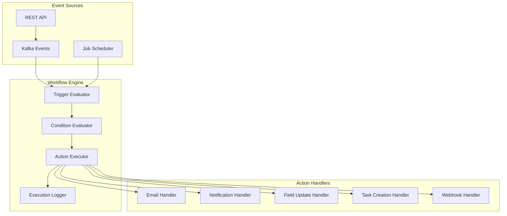
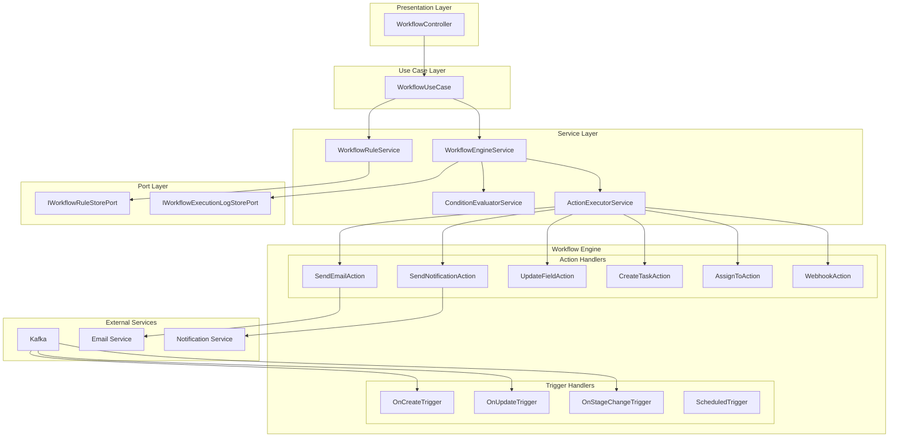

# Workflow Automation Module - Thiết Kế Chi Tiết

**Module:** CRM Workflow Automation Engine  
**Phiên bản:** 1.0  
**Ngày tạo:** 2025-12-06  
**Tác giả:** AI Assistant

---

## Mục Lục

1. [Tổng Quan](#1-tổng-quan)
2. [Kiến Trúc Module](#2-kiến-trúc-module)
3. [Domain Entities](#3-domain-entities)
4. [Workflow Engine](#4-workflow-engine)
5. [Service Layer](#5-service-layer)
6. [API Endpoints](#6-api-endpoints)
7. [Database Schema](#7-database-schema)
8. [Event Integration](#8-event-integration)
9. [Built-in Actions](#9-built-in-actions)
10. [Implementation Guide](#10-implementation-guide)

---

## 1. Tổng Quan

### 1.1. Mục Tiêu

Workflow Automation Module cung cấp khả năng:
- **Rule-based Automation:** Tự động thực thi actions dựa trên triggers và conditions
- **Multi-trigger Support:** Hỗ trợ nhiều loại trigger (create, update, schedule, etc.)
- **Flexible Conditions:** Đánh giá điều kiện phức tạp với AND/OR logic
- **Extensible Actions:** Hỗ trợ nhiều loại actions (email, update field, create task, etc.)
- **Execution Logging:** Ghi log chi tiết cho mọi workflow execution

### 1.2. Use Cases

| Use Case | Trigger | Condition | Action |
|----------|---------|-----------|--------|
| Welcome email cho lead mới | Lead created | None | Send template email |
| Notify manager về deal lớn | Opportunity updated | estimatedValue > $50,000 | Send notification |
| Auto-assign lead | Lead created | leadSource = WEBSITE | Assign to sales rep |
| Follow-up reminder | Scheduled (daily) | Lead status = CONTACTED, no activity in 7 days | Create follow-up task |
| Stage advancement | Opportunity stage changed | Stage = PROPOSAL | Send proposal email |
| SLA escalation | Scheduled (hourly) | Activity overdue > 24h | Notify supervisor |

### 1.3. Architecture Overview



---

## 2. Kiến Trúc Module

### 2.1. Package Structure

```
crm/src/main/java/serp/project/crm/
├── core/
│   ├── domain/
│   │   ├── entity/
│   │   │   ├── WorkflowRuleEntity.java
│   │   │   ├── WorkflowConditionEntity.java
│   │   │   ├── WorkflowActionEntity.java
│   │   │   └── WorkflowExecutionLogEntity.java
│   │   ├── dto/
│   │   │   ├── request/
│   │   │   │   ├── CreateWorkflowRuleRequest.java
│   │   │   │   ├── UpdateWorkflowRuleRequest.java
│   │   │   │   ├── WorkflowConditionDto.java
│   │   │   │   ├── WorkflowActionDto.java
│   │   │   │   └── TestWorkflowRequest.java
│   │   │   ├── response/
│   │   │   │   ├── WorkflowRuleResponse.java
│   │   │   │   ├── WorkflowExecutionLogResponse.java
│   │   │   │   └── WorkflowTestResult.java
│   │   │   └── event/
│   │   │       ├── EntityChangeEvent.java
│   │   │       └── WorkflowTriggerEvent.java
│   │   └── enums/
│   │       ├── TriggerType.java
│   │       ├── ConditionOperator.java
│   │       ├── LogicalOperator.java
│   │       ├── ActionType.java
│   │       └── ExecutionStatus.java
│   ├── service/
│   │   ├── IWorkflowRuleService.java
│   │   ├── IWorkflowEngineService.java
│   │   ├── IConditionEvaluatorService.java
│   │   ├── IActionExecutorService.java
│   │   └── impl/
│   │       ├── WorkflowRuleService.java
│   │       ├── WorkflowEngineService.java
│   │       ├── ConditionEvaluatorService.java
│   │       └── ActionExecutorService.java
│   ├── usecase/
│   │   └── WorkflowUseCase.java
│   ├── port/
│   │   └── store/
│   │       ├── IWorkflowRuleStorePort.java
│   │       └── IWorkflowExecutionLogStorePort.java
│   └── workflow/
│       ├── trigger/
│       │   ├── TriggerHandler.java
│       │   ├── OnCreateTriggerHandler.java
│       │   ├── OnUpdateTriggerHandler.java
│       │   ├── OnDeleteTriggerHandler.java
│       │   ├── OnStageChangeTriggerHandler.java
│       │   └── ScheduledTriggerHandler.java
│       ├── condition/
│       │   ├── ConditionEvaluator.java
│       │   └── FieldConditionEvaluator.java
│       └── action/
│           ├── ActionHandler.java
│           ├── SendEmailActionHandler.java
│           ├── SendNotificationActionHandler.java
│           ├── UpdateFieldActionHandler.java
│           ├── CreateTaskActionHandler.java
│           ├── AssignToActionHandler.java
│           └── WebhookActionHandler.java
├── infrastructure/
│   └── store/
│       ├── adapter/
│       │   ├── WorkflowRuleAdapter.java
│       │   └── WorkflowExecutionLogAdapter.java
│       ├── model/
│       │   ├── WorkflowRuleModel.java
│       │   ├── WorkflowConditionModel.java
│       │   ├── WorkflowActionModel.java
│       │   └── WorkflowExecutionLogModel.java
│       └── repository/
│           ├── WorkflowRuleRepository.java
│           ├── WorkflowConditionRepository.java
│           ├── WorkflowActionRepository.java
│           └── WorkflowExecutionLogRepository.java
└── ui/
    └── controller/
        └── WorkflowController.java
```

### 2.2. Component Diagram



---

## 3. Domain Entities

### 3.1. WorkflowRuleEntity

```java
package serp.project.crm.core.domain.entity;

import lombok.*;
import lombok.experimental.SuperBuilder;
import serp.project.crm.core.domain.enums.TriggerType;
import java.util.List;

@NoArgsConstructor
@AllArgsConstructor
@Getter
@Setter
@SuperBuilder
public class WorkflowRuleEntity extends BaseEntity {
    private String name;
    private String description;
    private TriggerType triggerType;
    private String entityType;           // LEAD, OPPORTUNITY, CUSTOMER, CONTACT, ACTIVITY
    private String triggerField;         // For ON_FIELD_CHANGE: specific field to watch
    
    private Boolean isActive;
    private Integer priority;            // Lower = higher priority
    private Integer maxExecutionsPerEntity; // Limit executions, null = unlimited
    
    // For scheduled triggers
    private String cronExpression;
    private String scheduleTimezone;
    
    // Relationships
    private List<WorkflowConditionEntity> conditions;
    private List<WorkflowActionEntity> actions;
    
    // Statistics
    private Long executionCount;
    private Long successCount;
    private Long failureCount;
    
    public void setDefaults() {
        if (this.isActive == null) this.isActive = true;
        if (this.priority == null) this.priority = 100;
        if (this.executionCount == null) this.executionCount = 0L;
        if (this.successCount == null) this.successCount = 0L;
        if (this.failureCount == null) this.failureCount = 0L;
    }
    
    public boolean isScheduled() {
        return TriggerType.SCHEDULED.equals(this.triggerType) ||
               TriggerType.ON_DATE_FIELD.equals(this.triggerType);
    }
    
    public void incrementExecution(boolean success) {
        this.executionCount++;
        if (success) {
            this.successCount++;
        } else {
            this.failureCount++;
        }
    }
}
```

### 3.2. WorkflowConditionEntity

```java
package serp.project.crm.core.domain.entity;

import lombok.*;
import lombok.experimental.SuperBuilder;
import serp.project.crm.core.domain.enums.ConditionOperator;
import serp.project.crm.core.domain.enums.LogicalOperator;

@NoArgsConstructor
@AllArgsConstructor
@Getter
@Setter
@SuperBuilder
public class WorkflowConditionEntity extends BaseEntity {
    private Long ruleId;
    private Integer conditionOrder;      // Order in the condition chain
    
    private String fieldName;            // e.g., "estimatedValue", "leadStatus"
    private ConditionOperator operator;  // EQUALS, NOT_EQUALS, GREATER_THAN, etc.
    private String value;                // Comparison value (JSON for complex types)
    private String valueType;            // STRING, NUMBER, BOOLEAN, DATE, ENUM
    
    private LogicalOperator logicalOperator; // AND, OR (for combining with next condition)
    
    // For nested conditions
    private Long parentConditionId;
    private Integer groupOrder;
    
    // For change-based conditions
    private Boolean checkOldValue;       // Compare against old value (for ON_UPDATE)
    private String oldValueComparison;   // WAS, WAS_NOT, CHANGED_FROM, CHANGED_TO
}
```

### 3.3. WorkflowActionEntity

```java
package serp.project.crm.core.domain.entity;

import lombok.*;
import lombok.experimental.SuperBuilder;
import serp.project.crm.core.domain.enums.ActionType;

@NoArgsConstructor
@AllArgsConstructor
@Getter
@Setter
@SuperBuilder
public class WorkflowActionEntity extends BaseEntity {
    private Long ruleId;
    private Integer actionOrder;         // Execution order
    
    private ActionType actionType;
    private String configuration;        // JSON configuration for the action
    
    private Boolean stopOnFailure;       // Stop remaining actions if this fails
    private Integer retryCount;          // Number of retries on failure
    private Integer retryDelaySeconds;   // Delay between retries
    
    private Boolean isAsync;             // Execute asynchronously
    private Integer delaySeconds;        // Delay before execution
    
    public void setDefaults() {
        if (this.actionOrder == null) this.actionOrder = 0;
        if (this.stopOnFailure == null) this.stopOnFailure = false;
        if (this.retryCount == null) this.retryCount = 0;
        if (this.retryDelaySeconds == null) this.retryDelaySeconds = 60;
        if (this.isAsync == null) this.isAsync = false;
        if (this.delaySeconds == null) this.delaySeconds = 0;
    }
}
```

### 3.4. WorkflowExecutionLogEntity

```java
package serp.project.crm.core.domain.entity;

import lombok.*;
import lombok.experimental.SuperBuilder;
import serp.project.crm.core.domain.enums.ExecutionStatus;
import java.time.LocalDateTime;

@NoArgsConstructor
@AllArgsConstructor
@Getter
@Setter
@SuperBuilder
public class WorkflowExecutionLogEntity extends BaseEntity {
    private Long ruleId;
    private String ruleName;             // Denormalized for quick reference
    
    private String entityType;
    private Long entityId;
    private String triggerType;
    
    private ExecutionStatus status;      // PENDING, RUNNING, SUCCESS, FAILED, SKIPPED
    private String errorMessage;
    private String errorStackTrace;
    
    private LocalDateTime startedAt;
    private LocalDateTime completedAt;
    private Long executionTimeMs;
    
    private String inputData;            // JSON: Entity data at trigger time
    private String outputData;           // JSON: Results of actions
    
    private Integer actionsTotal;
    private Integer actionsCompleted;
    private Integer actionsFailed;
}
```

### 3.5. Enums

```java
// TriggerType.java
public enum TriggerType {
    ON_CREATE("When entity is created"),
    ON_UPDATE("When entity is updated"),
    ON_DELETE("When entity is deleted"),
    ON_FIELD_CHANGE("When specific field changes"),
    ON_STAGE_CHANGE("When stage/status changes"),
    SCHEDULED("Run on schedule (CRON)"),
    ON_DATE_FIELD("Relative to a date field");
    
    private final String description;
    TriggerType(String description) { this.description = description; }
}

// ConditionOperator.java
public enum ConditionOperator {
    EQUALS("="),
    NOT_EQUALS("!="),
    GREATER_THAN(">"),
    GREATER_THAN_OR_EQUALS(">="),
    LESS_THAN("<"),
    LESS_THAN_OR_EQUALS("<="),
    CONTAINS("contains"),
    NOT_CONTAINS("not contains"),
    STARTS_WITH("starts with"),
    ENDS_WITH("ends with"),
    IN("in list"),
    NOT_IN("not in list"),
    IS_NULL("is null"),
    IS_NOT_NULL("is not null"),
    IS_EMPTY("is empty"),
    IS_NOT_EMPTY("is not empty"),
    BETWEEN("between"),
    CHANGED("was changed"),
    CHANGED_TO("changed to"),
    CHANGED_FROM("changed from");
    
    private final String symbol;
    ConditionOperator(String symbol) { this.symbol = symbol; }
}

// LogicalOperator.java
public enum LogicalOperator {
    AND, OR
}

// ActionType.java
public enum ActionType {
    SEND_EMAIL("Send email from template"),
    SEND_NOTIFICATION("Send in-app notification"),
    UPDATE_FIELD("Update entity field"),
    CREATE_TASK("Create a follow-up task"),
    CREATE_ACTIVITY("Create an activity record"),
    ASSIGN_TO("Assign to user/team"),
    CHANGE_STAGE("Change opportunity stage"),
    CHANGE_STATUS("Change lead/activity status"),
    ADD_TAG("Add tag to entity"),
    REMOVE_TAG("Remove tag from entity"),
    CALL_WEBHOOK("Call external webhook"),
    DELAY("Wait for specified time"),
    TRIGGER_WORKFLOW("Trigger another workflow");
    
    private final String description;
    ActionType(String description) { this.description = description; }
}

// ExecutionStatus.java
public enum ExecutionStatus {
    PENDING("Waiting to execute"),
    RUNNING("Currently executing"),
    SUCCESS("Completed successfully"),
    PARTIAL_SUCCESS("Some actions failed"),
    FAILED("Execution failed"),
    SKIPPED("Conditions not met"),
    CANCELLED("Cancelled by user");
    
    private final String description;
    ExecutionStatus(String description) { this.description = description; }
}
```

---

## 4. Workflow Engine

### 4.1. Core Engine Service

```java
package serp.project.crm.core.service.impl;

import lombok.RequiredArgsConstructor;
import lombok.extern.slf4j.Slf4j;
import org.springframework.kafka.annotation.KafkaListener;
import org.springframework.stereotype.Service;
import org.springframework.transaction.annotation.Transactional;
import serp.project.crm.core.domain.dto.event.EntityChangeEvent;
import serp.project.crm.core.domain.entity.*;
import serp.project.crm.core.domain.enums.*;
import serp.project.crm.core.port.store.*;
import serp.project.crm.core.service.*;

import java.time.LocalDateTime;
import java.util.*;

@Service
@RequiredArgsConstructor
@Slf4j
public class WorkflowEngineService implements IWorkflowEngineService {
    
    private final IWorkflowRuleStorePort ruleStore;
    private final IWorkflowExecutionLogStorePort logStore;
    private final IConditionEvaluatorService conditionEvaluator;
    private final IActionExecutorService actionExecutor;
    
    @KafkaListener(topics = "crm.entity.events", groupId = "workflow-engine")
    public void handleEntityEvent(EntityChangeEvent event) {
        log.info("Received entity event: {} {} {}", 
            event.getEntityType(), event.getChangeType(), event.getEntityId());
        
        try {
            processEvent(event);
        } catch (Exception e) {
            log.error("Error processing workflow event: {}", e.getMessage(), e);
        }
    }
    
    @Override
    @Transactional
    public void processEvent(EntityChangeEvent event) {
        // Find matching rules
        TriggerType triggerType = mapChangeTypeToTrigger(event.getChangeType());
        List<WorkflowRuleEntity> matchingRules = ruleStore.findActiveRulesByTrigger(
            event.getTenantId(), 
            event.getEntityType(), 
            triggerType
        );
        
        // Sort by priority
        matchingRules.sort(Comparator.comparing(WorkflowRuleEntity::getPriority));
        
        for (WorkflowRuleEntity rule : matchingRules) {
            executeRule(rule, event);
        }
    }
    
    @Override
    @Transactional
    public WorkflowExecutionLogEntity executeRule(WorkflowRuleEntity rule, EntityChangeEvent event) {
        LocalDateTime startTime = LocalDateTime.now();
        
        // Create execution log
        WorkflowExecutionLogEntity log = WorkflowExecutionLogEntity.builder()
            .ruleId(rule.getId())
            .ruleName(rule.getName())
            .entityType(event.getEntityType())
            .entityId(event.getEntityId())
            .triggerType(rule.getTriggerType().name())
            .status(ExecutionStatus.RUNNING)
            .startedAt(startTime)
            .inputData(serializeEventData(event))
            .tenantId(event.getTenantId())
            .build();
        
        log = logStore.save(log);
        
        try {
            // Evaluate conditions
            boolean conditionsMet = conditionEvaluator.evaluate(
                rule.getConditions(), 
                event.getNewValues(),
                event.getOldValues()
            );
            
            if (!conditionsMet) {
                log.setStatus(ExecutionStatus.SKIPPED);
                log.setCompletedAt(LocalDateTime.now());
                log.setExecutionTimeMs(calculateDuration(startTime));
                return logStore.save(log);
            }
            
            // Execute actions
            ActionExecutionResult result = actionExecutor.executeActions(
                rule.getActions(),
                event,
                rule.getId()
            );
            
            // Update log
            log.setStatus(result.isSuccess() ? ExecutionStatus.SUCCESS : 
                         result.isPartialSuccess() ? ExecutionStatus.PARTIAL_SUCCESS : 
                         ExecutionStatus.FAILED);
            log.setActionsTotal(result.getTotalActions());
            log.setActionsCompleted(result.getCompletedActions());
            log.setActionsFailed(result.getFailedActions());
            log.setOutputData(result.getOutputJson());
            log.setErrorMessage(result.getErrorMessage());
            
            // Update rule statistics
            rule.incrementExecution(result.isSuccess());
            ruleStore.save(rule);
            
        } catch (Exception e) {
            log.setStatus(ExecutionStatus.FAILED);
            log.setErrorMessage(e.getMessage());
            log.setErrorStackTrace(getStackTrace(e));
        }
        
        log.setCompletedAt(LocalDateTime.now());
        log.setExecutionTimeMs(calculateDuration(startTime));
        
        return logStore.save(log);
    }
    
    private TriggerType mapChangeTypeToTrigger(String changeType) {
        return switch (changeType) {
            case "CREATE" -> TriggerType.ON_CREATE;
            case "UPDATE" -> TriggerType.ON_UPDATE;
            case "DELETE" -> TriggerType.ON_DELETE;
            default -> throw new IllegalArgumentException("Unknown change type: " + changeType);
        };
    }
    
    private long calculateDuration(LocalDateTime startTime) {
        return java.time.Duration.between(startTime, LocalDateTime.now()).toMillis();
    }
}
```

### 4.2. Condition Evaluator

```java
package serp.project.crm.core.service.impl;

import lombok.RequiredArgsConstructor;
import lombok.extern.slf4j.Slf4j;
import org.springframework.stereotype.Service;
import serp.project.crm.core.domain.entity.WorkflowConditionEntity;
import serp.project.crm.core.domain.enums.ConditionOperator;
import serp.project.crm.core.domain.enums.LogicalOperator;
import serp.project.crm.core.service.IConditionEvaluatorService;

import java.math.BigDecimal;
import java.time.LocalDate;
import java.time.LocalDateTime;
import java.util.*;

@Service
@RequiredArgsConstructor
@Slf4j
public class ConditionEvaluatorService implements IConditionEvaluatorService {
    
    @Override
    public boolean evaluate(List<WorkflowConditionEntity> conditions, 
                           Map<String, Object> newValues, 
                           Map<String, Object> oldValues) {
        if (conditions == null || conditions.isEmpty()) {
            return true; // No conditions = always match
        }
        
        // Sort by order
        conditions.sort(Comparator.comparing(WorkflowConditionEntity::getConditionOrder));
        
        Boolean result = null;
        LogicalOperator pendingOperator = null;
        
        for (WorkflowConditionEntity condition : conditions) {
            boolean conditionResult = evaluateSingleCondition(condition, newValues, oldValues);
            
            if (result == null) {
                result = conditionResult;
            } else if (pendingOperator != null) {
                result = applyLogicalOperator(result, conditionResult, pendingOperator);
            }
            
            pendingOperator = condition.getLogicalOperator();
        }
        
        return result != null && result;
    }
    
    private boolean evaluateSingleCondition(WorkflowConditionEntity condition,
                                           Map<String, Object> newValues,
                                           Map<String, Object> oldValues) {
        String fieldName = condition.getFieldName();
        Object currentValue = getNestedValue(newValues, fieldName);
        Object compareValue = parseValue(condition.getValue(), condition.getValueType());
        
        // Handle change-based conditions
        if (condition.getCheckOldValue() != null && condition.getCheckOldValue()) {
            Object oldValue = getNestedValue(oldValues, fieldName);
            return evaluateChange(condition, oldValue, currentValue);
        }
        
        return evaluateOperator(condition.getOperator(), currentValue, compareValue);
    }
    
    private boolean evaluateOperator(ConditionOperator operator, Object actual, Object expected) {
        if (operator == ConditionOperator.IS_NULL) {
            return actual == null;
        }
        if (operator == ConditionOperator.IS_NOT_NULL) {
            return actual != null;
        }
        if (operator == ConditionOperator.IS_EMPTY) {
            return actual == null || actual.toString().isEmpty();
        }
        if (operator == ConditionOperator.IS_NOT_EMPTY) {
            return actual != null && !actual.toString().isEmpty();
        }
        
        if (actual == null) {
            return false;
        }
        
        return switch (operator) {
            case EQUALS -> Objects.equals(actual.toString(), expected.toString());
            case NOT_EQUALS -> !Objects.equals(actual.toString(), expected.toString());
            case GREATER_THAN -> compareNumeric(actual, expected) > 0;
            case GREATER_THAN_OR_EQUALS -> compareNumeric(actual, expected) >= 0;
            case LESS_THAN -> compareNumeric(actual, expected) < 0;
            case LESS_THAN_OR_EQUALS -> compareNumeric(actual, expected) <= 0;
            case CONTAINS -> actual.toString().toLowerCase().contains(expected.toString().toLowerCase());
            case NOT_CONTAINS -> !actual.toString().toLowerCase().contains(expected.toString().toLowerCase());
            case STARTS_WITH -> actual.toString().toLowerCase().startsWith(expected.toString().toLowerCase());
            case ENDS_WITH -> actual.toString().toLowerCase().endsWith(expected.toString().toLowerCase());
            case IN -> isInList(actual, expected);
            case NOT_IN -> !isInList(actual, expected);
            default -> false;
        };
    }
    
    private boolean evaluateChange(WorkflowConditionEntity condition, Object oldValue, Object newValue) {
        String comparison = condition.getOldValueComparison();
        Object compareValue = parseValue(condition.getValue(), condition.getValueType());
        
        return switch (comparison) {
            case "CHANGED" -> !Objects.equals(oldValue, newValue);
            case "CHANGED_TO" -> !Objects.equals(oldValue, newValue) && Objects.equals(newValue, compareValue);
            case "CHANGED_FROM" -> Objects.equals(oldValue, compareValue) && !Objects.equals(newValue, compareValue);
            case "WAS" -> Objects.equals(oldValue, compareValue);
            case "WAS_NOT" -> !Objects.equals(oldValue, compareValue);
            default -> false;
        };
    }
    
    private int compareNumeric(Object a, Object b) {
        BigDecimal numA = new BigDecimal(a.toString());
        BigDecimal numB = new BigDecimal(b.toString());
        return numA.compareTo(numB);
    }
    
    private boolean isInList(Object value, Object listValue) {
        if (listValue instanceof List<?> list) {
            return list.contains(value.toString());
        }
        // Parse JSON array
        String[] items = listValue.toString().replace("[", "").replace("]", "").split(",");
        return Arrays.asList(items).contains(value.toString().trim());
    }
    
    private Object getNestedValue(Map<String, Object> values, String fieldPath) {
        if (values == null) return null;
        
        String[] parts = fieldPath.split("\\.");
        Object current = values;
        
        for (String part : parts) {
            if (current instanceof Map<?, ?> map) {
                current = map.get(part);
            } else {
                return null;
            }
        }
        
        return current;
    }
    
    private Object parseValue(String value, String valueType) {
        if (value == null) return null;
        
        return switch (valueType.toUpperCase()) {
            case "NUMBER" -> new BigDecimal(value);
            case "BOOLEAN" -> Boolean.parseBoolean(value);
            case "DATE" -> LocalDate.parse(value);
            case "DATETIME" -> LocalDateTime.parse(value);
            default -> value;
        };
    }
    
    private boolean applyLogicalOperator(boolean left, boolean right, LogicalOperator operator) {
        return switch (operator) {
            case AND -> left && right;
            case OR -> left || right;
        };
    }
}
```

### 4.3. Action Executor

```java
package serp.project.crm.core.service.impl;

import lombok.RequiredArgsConstructor;
import lombok.extern.slf4j.Slf4j;
import org.springframework.stereotype.Service;
import serp.project.crm.core.domain.dto.event.EntityChangeEvent;
import serp.project.crm.core.domain.entity.WorkflowActionEntity;
import serp.project.crm.core.domain.enums.ActionType;
import serp.project.crm.core.service.IActionExecutorService;
import serp.project.crm.core.workflow.action.*;

import java.util.*;
import java.util.concurrent.CompletableFuture;

@Service
@RequiredArgsConstructor
@Slf4j
public class ActionExecutorService implements IActionExecutorService {
    
    private final Map<ActionType, ActionHandler> actionHandlers;
    
    @Override
    public ActionExecutionResult executeActions(List<WorkflowActionEntity> actions,
                                                EntityChangeEvent event,
                                                Long ruleId) {
        if (actions == null || actions.isEmpty()) {
            return ActionExecutionResult.empty();
        }
        
        // Sort by order
        actions.sort(Comparator.comparing(WorkflowActionEntity::getActionOrder));
        
        List<ActionResult> results = new ArrayList<>();
        boolean hasFailure = false;
        
        for (WorkflowActionEntity action : actions) {
            try {
                // Handle delay
                if (action.getDelaySeconds() != null && action.getDelaySeconds() > 0) {
                    Thread.sleep(action.getDelaySeconds() * 1000L);
                }
                
                // Execute action
                ActionResult result = executeAction(action, event);
                results.add(result);
                
                if (!result.isSuccess()) {
                    hasFailure = true;
                    
                    // Handle retry
                    if (action.getRetryCount() != null && action.getRetryCount() > 0) {
                        result = retryAction(action, event, action.getRetryCount());
                        if (result.isSuccess()) {
                            hasFailure = false;
                        }
                    }
                    
                    // Stop if configured
                    if (hasFailure && Boolean.TRUE.equals(action.getStopOnFailure())) {
                        log.warn("Stopping workflow {} due to action failure", ruleId);
                        break;
                    }
                }
                
            } catch (Exception e) {
                log.error("Error executing action {}: {}", action.getActionType(), e.getMessage());
                results.add(ActionResult.failure(action.getActionType(), e.getMessage()));
                hasFailure = true;
                
                if (Boolean.TRUE.equals(action.getStopOnFailure())) {
                    break;
                }
            }
        }
        
        return ActionExecutionResult.builder()
            .totalActions(actions.size())
            .completedActions((int) results.stream().filter(ActionResult::isSuccess).count())
            .failedActions((int) results.stream().filter(r -> !r.isSuccess()).count())
            .results(results)
            .success(!hasFailure)
            .build();
    }
    
    private ActionResult executeAction(WorkflowActionEntity action, EntityChangeEvent event) {
        ActionHandler handler = actionHandlers.get(action.getActionType());
        
        if (handler == null) {
            throw new IllegalArgumentException("No handler for action type: " + action.getActionType());
        }
        
        ActionContext context = ActionContext.builder()
            .actionConfig(parseConfig(action.getConfiguration()))
            .entityType(event.getEntityType())
            .entityId(event.getEntityId())
            .entityData(event.getNewValues())
            .oldEntityData(event.getOldValues())
            .tenantId(event.getTenantId())
            .changedBy(event.getChangedBy())
            .build();
        
        if (Boolean.TRUE.equals(action.getIsAsync())) {
            CompletableFuture.runAsync(() -> handler.execute(context));
            return ActionResult.success(action.getActionType(), "Queued for async execution");
        }
        
        return handler.execute(context);
    }
    
    private ActionResult retryAction(WorkflowActionEntity action, EntityChangeEvent event, int remainingRetries) {
        for (int i = 0; i < remainingRetries; i++) {
            try {
                Thread.sleep((action.getRetryDelaySeconds() != null ? action.getRetryDelaySeconds() : 60) * 1000L);
                ActionResult result = executeAction(action, event);
                if (result.isSuccess()) {
                    return result;
                }
            } catch (Exception e) {
                log.warn("Retry {} failed for action {}: {}", i + 1, action.getActionType(), e.getMessage());
            }
        }
        return ActionResult.failure(action.getActionType(), "All retries exhausted");
    }
    
    private Map<String, Object> parseConfig(String configJson) {
        // Parse JSON to Map
        // Use Jackson ObjectMapper
        return new HashMap<>(); // Simplified
    }
}
```

---

## 5. Service Layer

### 5.1. IWorkflowRuleService

```java
package serp.project.crm.core.service;

import serp.project.crm.core.domain.entity.WorkflowRuleEntity;
import serp.project.crm.core.domain.entity.WorkflowExecutionLogEntity;
import serp.project.crm.core.domain.dto.PageRequest;
import org.springframework.data.util.Pair;

import java.util.List;
import java.util.Optional;

public interface IWorkflowRuleService {
    
    // CRUD
    WorkflowRuleEntity createRule(WorkflowRuleEntity rule, Long tenantId);
    WorkflowRuleEntity updateRule(Long id, WorkflowRuleEntity updates, Long tenantId);
    Optional<WorkflowRuleEntity> getRuleById(Long id, Long tenantId);
    Pair<List<WorkflowRuleEntity>, Long> getAllRules(Long tenantId, PageRequest pageRequest);
    void deleteRule(Long id, Long tenantId);
    
    // Activation
    WorkflowRuleEntity activateRule(Long id, Long tenantId);
    WorkflowRuleEntity deactivateRule(Long id, Long tenantId);
    
    // Query
    List<WorkflowRuleEntity> getRulesByEntityType(String entityType, Long tenantId);
    List<WorkflowRuleEntity> getActiveRulesByTrigger(String entityType, String triggerType, Long tenantId);
    
    // Logs
    Pair<List<WorkflowExecutionLogEntity>, Long> getExecutionLogs(Long ruleId, Long tenantId, PageRequest pageRequest);
    Optional<WorkflowExecutionLogEntity> getExecutionLogById(Long logId, Long tenantId);
    
    // Testing
    WorkflowTestResult testRule(Long ruleId, Map<String, Object> testData, Long tenantId);
}
```

---

## 6. API Endpoints

### 6.1. WorkflowController

```java
package serp.project.crm.ui.controller;

import jakarta.validation.Valid;
import lombok.RequiredArgsConstructor;
import lombok.extern.slf4j.Slf4j;
import org.springframework.http.ResponseEntity;
import org.springframework.web.bind.annotation.*;
import serp.project.crm.core.domain.dto.PageRequest;
import serp.project.crm.core.domain.dto.request.*;
import serp.project.crm.core.usecase.WorkflowUseCase;
import serp.project.crm.kernel.utils.AuthUtils;

@RestController
@RequestMapping("/api/v1/workflows")
@RequiredArgsConstructor
@Slf4j
public class WorkflowController {
    
    private final WorkflowUseCase workflowUseCase;
    private final AuthUtils authUtils;
    
    @PostMapping
    public ResponseEntity<?> createWorkflowRule(@Valid @RequestBody CreateWorkflowRuleRequest request) {
        Long tenantId = authUtils.getCurrentTenantId()
            .orElseThrow(() -> new IllegalArgumentException("Tenant ID not found"));
        
        var response = workflowUseCase.createRule(request, tenantId);
        return ResponseEntity.status(response.getCode()).body(response);
    }
    
    @GetMapping
    public ResponseEntity<?> getAllWorkflowRules(
            @RequestParam(defaultValue = "1") Integer page,
            @RequestParam(defaultValue = "20") Integer size,
            @RequestParam(required = false) String entityType,
            @RequestParam(required = false) Boolean isActive) {
        Long tenantId = authUtils.getCurrentTenantId()
            .orElseThrow(() -> new IllegalArgumentException("Tenant ID not found"));
        
        PageRequest pageRequest = PageRequest.builder().page(page).size(size).build();
        var response = workflowUseCase.getAllRules(tenantId, pageRequest, entityType, isActive);
        return ResponseEntity.status(response.getCode()).body(response);
    }
    
    @GetMapping("/{id}")
    public ResponseEntity<?> getWorkflowRuleById(@PathVariable Long id) {
        Long tenantId = authUtils.getCurrentTenantId()
            .orElseThrow(() -> new IllegalArgumentException("Tenant ID not found"));
        
        var response = workflowUseCase.getRuleById(id, tenantId);
        return ResponseEntity.status(response.getCode()).body(response);
    }
    
    @PutMapping("/{id}")
    public ResponseEntity<?> updateWorkflowRule(
            @PathVariable Long id,
            @Valid @RequestBody UpdateWorkflowRuleRequest request) {
        Long tenantId = authUtils.getCurrentTenantId()
            .orElseThrow(() -> new IllegalArgumentException("Tenant ID not found"));
        
        var response = workflowUseCase.updateRule(id, request, tenantId);
        return ResponseEntity.status(response.getCode()).body(response);
    }
    
    @DeleteMapping("/{id}")
    public ResponseEntity<?> deleteWorkflowRule(@PathVariable Long id) {
        Long tenantId = authUtils.getCurrentTenantId()
            .orElseThrow(() -> new IllegalArgumentException("Tenant ID not found"));
        
        var response = workflowUseCase.deleteRule(id, tenantId);
        return ResponseEntity.status(response.getCode()).body(response);
    }
    
    @PostMapping("/{id}/activate")
    public ResponseEntity<?> activateWorkflowRule(@PathVariable Long id) {
        Long tenantId = authUtils.getCurrentTenantId()
            .orElseThrow(() -> new IllegalArgumentException("Tenant ID not found"));
        
        var response = workflowUseCase.activateRule(id, tenantId);
        return ResponseEntity.status(response.getCode()).body(response);
    }
    
    @PostMapping("/{id}/deactivate")
    public ResponseEntity<?> deactivateWorkflowRule(@PathVariable Long id) {
        Long tenantId = authUtils.getCurrentTenantId()
            .orElseThrow(() -> new IllegalArgumentException("Tenant ID not found"));
        
        var response = workflowUseCase.deactivateRule(id, tenantId);
        return ResponseEntity.status(response.getCode()).body(response);
    }
    
    @GetMapping("/{id}/logs")
    public ResponseEntity<?> getExecutionLogs(
            @PathVariable Long id,
            @RequestParam(defaultValue = "1") Integer page,
            @RequestParam(defaultValue = "50") Integer size) {
        Long tenantId = authUtils.getCurrentTenantId()
            .orElseThrow(() -> new IllegalArgumentException("Tenant ID not found"));
        
        PageRequest pageRequest = PageRequest.builder().page(page).size(size).build();
        var response = workflowUseCase.getExecutionLogs(id, tenantId, pageRequest);
        return ResponseEntity.status(response.getCode()).body(response);
    }
    
    @PostMapping("/test")
    public ResponseEntity<?> testWorkflow(@Valid @RequestBody TestWorkflowRequest request) {
        Long tenantId = authUtils.getCurrentTenantId()
            .orElseThrow(() -> new IllegalArgumentException("Tenant ID not found"));
        
        var response = workflowUseCase.testRule(request, tenantId);
        return ResponseEntity.status(response.getCode()).body(response);
    }
}
```

### 6.2. API Summary

| Method | Endpoint | Description |
|--------|----------|-------------|
| `GET` | `/api/v1/workflows` | Danh sách workflow rules |
| `POST` | `/api/v1/workflows` | Tạo workflow rule mới |
| `GET` | `/api/v1/workflows/{id}` | Chi tiết workflow rule |
| `PUT` | `/api/v1/workflows/{id}` | Cập nhật workflow rule |
| `DELETE` | `/api/v1/workflows/{id}` | Xóa workflow rule |
| `POST` | `/api/v1/workflows/{id}/activate` | Kích hoạt workflow |
| `POST` | `/api/v1/workflows/{id}/deactivate` | Tắt workflow |
| `GET` | `/api/v1/workflows/{id}/logs` | Xem execution logs |
| `POST` | `/api/v1/workflows/test` | Test workflow với sample data |

---

## 7. Database Schema

```sql
-- Workflow Rules
CREATE TABLE workflow_rules (
    id BIGSERIAL PRIMARY KEY,
    name VARCHAR(255) NOT NULL,
    description TEXT,
    trigger_type VARCHAR(50) NOT NULL,
    entity_type VARCHAR(50) NOT NULL,
    trigger_field VARCHAR(100),
    is_active BOOLEAN DEFAULT true,
    priority INTEGER DEFAULT 100,
    max_executions_per_entity INTEGER,
    cron_expression VARCHAR(100),
    schedule_timezone VARCHAR(50),
    execution_count BIGINT DEFAULT 0,
    success_count BIGINT DEFAULT 0,
    failure_count BIGINT DEFAULT 0,
    tenant_id BIGINT NOT NULL,
    created_by BIGINT,
    updated_by BIGINT,
    created_at TIMESTAMP DEFAULT CURRENT_TIMESTAMP,
    updated_at TIMESTAMP DEFAULT CURRENT_TIMESTAMP
);

CREATE INDEX idx_workflow_rules_tenant ON workflow_rules(tenant_id);
CREATE INDEX idx_workflow_rules_entity_trigger ON workflow_rules(entity_type, trigger_type);
CREATE INDEX idx_workflow_rules_active ON workflow_rules(is_active);

-- Workflow Conditions
CREATE TABLE workflow_conditions (
    id BIGSERIAL PRIMARY KEY,
    rule_id BIGINT NOT NULL REFERENCES workflow_rules(id) ON DELETE CASCADE,
    condition_order INTEGER DEFAULT 0,
    field_name VARCHAR(100) NOT NULL,
    operator VARCHAR(50) NOT NULL,
    value TEXT,
    value_type VARCHAR(20) DEFAULT 'STRING',
    logical_operator VARCHAR(10),
    parent_condition_id BIGINT REFERENCES workflow_conditions(id),
    group_order INTEGER,
    check_old_value BOOLEAN DEFAULT false,
    old_value_comparison VARCHAR(20),
    tenant_id BIGINT NOT NULL,
    created_at TIMESTAMP DEFAULT CURRENT_TIMESTAMP
);

CREATE INDEX idx_workflow_conditions_rule ON workflow_conditions(rule_id);

-- Workflow Actions
CREATE TABLE workflow_actions (
    id BIGSERIAL PRIMARY KEY,
    rule_id BIGINT NOT NULL REFERENCES workflow_rules(id) ON DELETE CASCADE,
    action_order INTEGER DEFAULT 0,
    action_type VARCHAR(50) NOT NULL,
    configuration JSONB,
    stop_on_failure BOOLEAN DEFAULT false,
    retry_count INTEGER DEFAULT 0,
    retry_delay_seconds INTEGER DEFAULT 60,
    is_async BOOLEAN DEFAULT false,
    delay_seconds INTEGER DEFAULT 0,
    tenant_id BIGINT NOT NULL,
    created_at TIMESTAMP DEFAULT CURRENT_TIMESTAMP
);

CREATE INDEX idx_workflow_actions_rule ON workflow_actions(rule_id);

-- Workflow Execution Logs
CREATE TABLE workflow_execution_logs (
    id BIGSERIAL PRIMARY KEY,
    rule_id BIGINT NOT NULL,
    rule_name VARCHAR(255),
    entity_type VARCHAR(50),
    entity_id BIGINT,
    trigger_type VARCHAR(50),
    status VARCHAR(20) NOT NULL,
    error_message TEXT,
    error_stack_trace TEXT,
    started_at TIMESTAMP,
    completed_at TIMESTAMP,
    execution_time_ms BIGINT,
    input_data JSONB,
    output_data JSONB,
    actions_total INTEGER,
    actions_completed INTEGER,
    actions_failed INTEGER,
    tenant_id BIGINT NOT NULL,
    created_at TIMESTAMP DEFAULT CURRENT_TIMESTAMP
);

CREATE INDEX idx_workflow_logs_rule ON workflow_execution_logs(rule_id);
CREATE INDEX idx_workflow_logs_entity ON workflow_execution_logs(entity_type, entity_id);
CREATE INDEX idx_workflow_logs_status ON workflow_execution_logs(status);
CREATE INDEX idx_workflow_logs_tenant_date ON workflow_execution_logs(tenant_id, created_at);
```

---

## 8. Event Integration

### 8.1. Entity Change Event

```java
package serp.project.crm.core.domain.dto.event;

import lombok.*;
import java.time.LocalDateTime;
import java.util.Map;

@Data
@Builder
@NoArgsConstructor
@AllArgsConstructor
public class EntityChangeEvent {
    private String eventId;
    private String entityType;           // LEAD, OPPORTUNITY, CUSTOMER, etc.
    private Long entityId;
    private String changeType;           // CREATE, UPDATE, DELETE
    private Map<String, Object> oldValues;
    private Map<String, Object> newValues;
    private List<String> changedFields;  // List of changed field names
    private Long changedBy;
    private Long tenantId;
    private LocalDateTime timestamp;
    private String source;               // API, IMPORT, WORKFLOW
}
```

### 8.2. Publishing Events

```java
// In LeadService or other entity services
@Service
@RequiredArgsConstructor
public class LeadService implements ILeadService {
    
    private final KafkaTemplate<String, EntityChangeEvent> kafkaTemplate;
    
    @Override
    @Transactional
    public LeadEntity createLead(LeadEntity lead, Long tenantId) {
        // Save lead
        LeadEntity savedLead = leadStore.save(lead);
        
        // Publish event
        EntityChangeEvent event = EntityChangeEvent.builder()
            .eventId(UUID.randomUUID().toString())
            .entityType("LEAD")
            .entityId(savedLead.getId())
            .changeType("CREATE")
            .newValues(convertToMap(savedLead))
            .changedBy(savedLead.getCreatedBy())
            .tenantId(tenantId)
            .timestamp(LocalDateTime.now())
            .source("API")
            .build();
        
        kafkaTemplate.send("crm.entity.events", event);
        
        return savedLead;
    }
}
```

---

## 9. Built-in Actions

### 9.1. Action Configuration Examples

```json
// Send Email Action
{
    "actionType": "SEND_EMAIL",
    "configuration": {
        "templateId": 123,
        "toField": "email",
        "ccEmails": ["manager@company.com"],
        "variables": {
            "leadName": "{{name}}",
            "company": "{{company}}"
        }
    }
}

// Update Field Action
{
    "actionType": "UPDATE_FIELD",
    "configuration": {
        "fieldName": "leadStatus",
        "value": "CONTACTED",
        "valueType": "ENUM"
    }
}

// Create Task Action
{
    "actionType": "CREATE_TASK",
    "configuration": {
        "subject": "Follow up with {{name}}",
        "description": "Initial follow-up call for lead from {{leadSource}}",
        "activityType": "CALL",
        "priority": "HIGH",
        "dueDateOffset": 2,
        "assignToField": "assignedTo"
    }
}

// Assign To Action
{
    "actionType": "ASSIGN_TO",
    "configuration": {
        "assignmentType": "ROUND_ROBIN",
        "teamId": 5,
        "userIds": [10, 11, 12]
    }
}

// Webhook Action
{
    "actionType": "CALL_WEBHOOK",
    "configuration": {
        "url": "https://api.example.com/webhook",
        "method": "POST",
        "headers": {
            "Authorization": "Bearer {{env.WEBHOOK_TOKEN}}"
        },
        "bodyTemplate": {
            "leadId": "{{id}}",
            "name": "{{name}}",
            "event": "lead_created"
        }
    }
}

// Send Notification Action
{
    "actionType": "SEND_NOTIFICATION",
    "configuration": {
        "title": "New Lead Assigned",
        "message": "Lead {{name}} from {{company}} has been assigned to you",
        "toUsers": ["{{assignedTo}}"],
        "priority": "HIGH",
        "actionUrl": "/crm/leads/{{id}}"
    }
}
```

---

## 10. Implementation Guide

### 10.1. Sprint Breakdown

| Sprint | Duration | Tasks |
|--------|----------|-------|
| Sprint 1 | 2 tuần | Database schema, Entities, Repositories, Core services |
| Sprint 2 | 2 tuần | Condition Evaluator, Basic trigger handlers |
| Sprint 3 | 2 tuần | Action handlers (Email, Notification, Update Field) |
| Sprint 4 | 1 tuần | API endpoints, Testing framework |
| Sprint 5 | 1 tuần | Integration testing, Documentation |

### 10.2. Testing Example

```java
@Test
void shouldEvaluateGreaterThanCondition() {
    // Given
    WorkflowConditionEntity condition = WorkflowConditionEntity.builder()
        .fieldName("estimatedValue")
        .operator(ConditionOperator.GREATER_THAN)
        .value("50000")
        .valueType("NUMBER")
        .build();
    
    Map<String, Object> values = Map.of("estimatedValue", new BigDecimal("75000"));
    
    // When
    boolean result = conditionEvaluator.evaluate(List.of(condition), values, null);
    
    // Then
    assertThat(result).isTrue();
}

@Test
void shouldExecuteSendEmailAction() {
    // Given
    WorkflowActionEntity action = WorkflowActionEntity.builder()
        .actionType(ActionType.SEND_EMAIL)
        .configuration("{\"templateId\": 1, \"toField\": \"email\"}")
        .build();
    
    EntityChangeEvent event = createTestEvent();
    
    // When
    ActionExecutionResult result = actionExecutor.executeActions(List.of(action), event, 1L);
    
    // Then
    assertThat(result.isSuccess()).isTrue();
    verify(emailService).sendTemplateEmail(eq(1L), eq("test@example.com"), any());
}
```

---

**Document Version:** 1.0  
**Last Updated:** 2025-12-06
