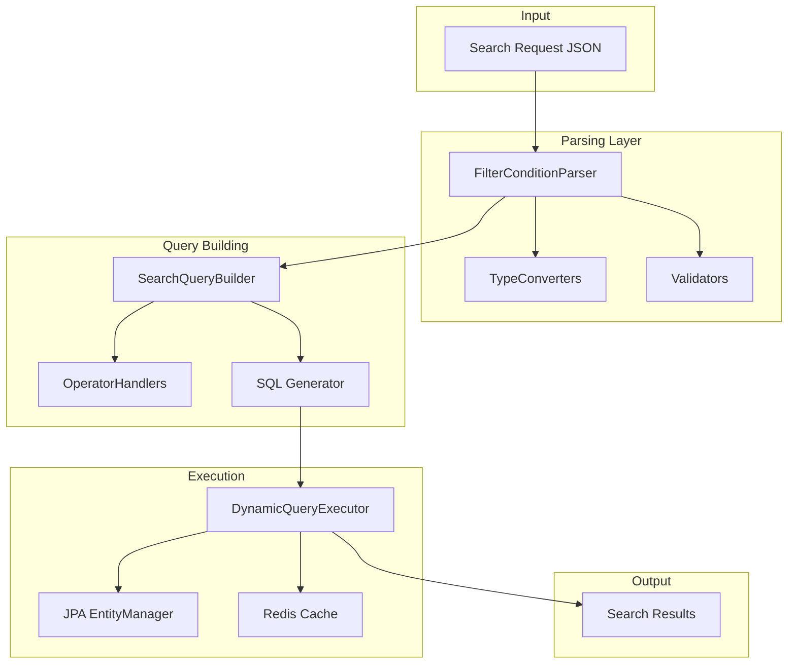

# Search Engine Components - Thiết Kế Chi Tiết

**Module:** CRM Advanced Search - Core Components  
**Phiên bản:** 1.0  
**Ngày tạo:** 2025-12-07

---

## Mục Lục

1. [Tổng Quan](#1-tổng-quan)
2. [Data Models](#2-data-models)
3. [FilterConditionParser](#3-filterconditionparser)
4. [DynamicQueryExecutor](#4-dynamicqueryexecutor)
5. [SearchQueryBuilder](#5-searchquerybuilder)
6. [Type Converters](#6-type-converters)
7. [Operator Handlers](#7-operator-handlers)
8. [Testing](#8-testing)

---

## 1. Tổng Quan

### 1.1. Component Diagram



---

## 2. Data Models

### 2.1. SearchQuery

```java
package serp.project.crm.core.search;

import lombok.*;
import java.util.*;

@Data
@Builder
@NoArgsConstructor
@AllArgsConstructor
public class SearchQuery {
    private String entityType;
    private String tableName;
    private Class<?> entityClass;
    
    // SELECT
    private List<String> selectFields;
    private boolean selectAll;
    
    // FROM with JOINs
    private List<JoinClause> joins;
    
    // WHERE
    private String whereClause;
    private List<WhereCondition> conditions;
    private Map<String, Object> parameters;
    
    // GROUP BY
    private List<String> groupByFields;
    
    // HAVING
    private String havingClause;
    
    // ORDER BY
    private String orderBy;
    private List<SortField> sortFields;
    
    // PAGINATION
    private Integer offset;
    private Integer limit;
    
    // Metadata
    private Long tenantId;
    private boolean countQuery;
    private boolean useCache;
    private int cacheTtlSeconds;
    
    public String toSQL() {
        StringBuilder sql = new StringBuilder();
        
        // SELECT
        sql.append("SELECT ");
        if (countQuery) {
            sql.append("COUNT(*)");
        } else if (selectAll || selectFields == null || selectFields.isEmpty()) {
            sql.append("*");
        } else {
            sql.append(String.join(", ", selectFields));
        }
        
        // FROM
        sql.append(" FROM ").append(tableName);
        
        // JOINs
        if (joins != null) {
            for (JoinClause join : joins) {
                sql.append(" ").append(join.toSQL());
            }
        }
        
        // WHERE
        if (whereClause != null && !whereClause.isEmpty()) {
            sql.append(" WHERE ").append(whereClause);
        }
        
        // GROUP BY
        if (groupByFields != null && !groupByFields.isEmpty()) {
            sql.append(" GROUP BY ").append(String.join(", ", groupByFields));
        }
        
        // HAVING
        if (havingClause != null && !havingClause.isEmpty()) {
            sql.append(" HAVING ").append(havingClause);
        }
        
        // ORDER BY
        if (!countQuery && orderBy != null && !orderBy.isEmpty()) {
            sql.append(" ORDER BY ").append(orderBy);
        }
        
        // LIMIT/OFFSET
        if (!countQuery) {
            if (limit != null) {
                sql.append(" LIMIT ").append(limit);
            }
            if (offset != null) {
                sql.append(" OFFSET ").append(offset);
            }
        }
        
        return sql.toString();
    }
    
    public String toCountSQL() {
        SearchQuery countQuery = this.toBuilder()
            .countQuery(true)
            .build();
        return countQuery.toSQL();
    }
}
```

### 2.2. WhereCondition

```java
package serp.project.crm.core.search;

import lombok.*;
import serp.project.crm.core.domain.enums.*;

@Data
@Builder
@NoArgsConstructor
@AllArgsConstructor
public class WhereCondition {
    private int order;
    private String fieldName;
    private String columnName;
    private FieldType fieldType;
    private FilterOperator operator;
    private Object value;
    private Object value2;           // For BETWEEN
    private LogicalOperator logicalOperator;
    
    // Grouping
    private Integer groupId;
    private boolean groupStart;
    private boolean groupEnd;
    
    // Subquery
    private boolean isSubquery;
    private SearchQuery subquery;
    
    // Reference field handling
    private String referenceTable;
    private String referenceColumn;
    
    public String getParameterName() {
        return "p" + order;
    }
    
    public String getParameterName2() {
        return "p" + order + "_2";
    }
}
```

### 2.3. JoinClause

```java
package serp.project.crm.core.search;

import lombok.*;

@Data
@Builder
@NoArgsConstructor
@AllArgsConstructor
public class JoinClause {
    private JoinType type;           // INNER, LEFT, RIGHT
    private String table;
    private String alias;
    private String onCondition;
    
    public enum JoinType {
        INNER("INNER JOIN"),
        LEFT("LEFT JOIN"),
        RIGHT("RIGHT JOIN"),
        FULL("FULL OUTER JOIN");
        
        private final String sql;
        JoinType(String sql) { this.sql = sql; }
    }
    
    public String toSQL() {
        return String.format("%s %s %s ON %s",
            type.sql,
            table,
            alias != null ? alias : "",
            onCondition
        );
    }
}
```

### 2.4. SortField

```java
package serp.project.crm.core.search;

import lombok.*;

@Data
@Builder
@NoArgsConstructor
@AllArgsConstructor
public class SortField {
    private String fieldName;
    private String columnName;
    private SortDirection direction;
    private NullsPosition nullsPosition;
    
    public enum SortDirection {
        ASC, DESC
    }
    
    public enum NullsPosition {
        FIRST, LAST
    }
    
    public String toSQL() {
        StringBuilder sql = new StringBuilder(columnName);
        sql.append(" ").append(direction.name());
        if (nullsPosition != null) {
            sql.append(" NULLS ").append(nullsPosition.name());
        }
        return sql.toString();
    }
}
```

---

## 3. FilterConditionParser

### 3.1. Interface

```java
package serp.project.crm.core.search;

import serp.project.crm.core.domain.dto.request.FilterConditionDto;
import java.util.List;

public interface IFilterConditionParser {
    
    List<WhereCondition> parse(List<FilterConditionDto> conditions, String entityType);
    
    WhereCondition parseSingle(FilterConditionDto condition, int order, String entityType);
    
    void validate(FilterConditionDto condition, String entityType);
    
    List<String> extractFieldNames(List<FilterConditionDto> conditions);
}
```

### 3.2. Implementation

```java
package serp.project.crm.core.search.impl;

import com.fasterxml.jackson.core.type.TypeReference;
import com.fasterxml.jackson.databind.ObjectMapper;
import lombok.RequiredArgsConstructor;
import lombok.extern.slf4j.Slf4j;
import org.springframework.stereotype.Component;
import serp.project.crm.core.domain.dto.request.FilterConditionDto;
import serp.project.crm.core.domain.enums.*;
import serp.project.crm.core.search.*;

import java.util.*;

@Component
@RequiredArgsConstructor
@Slf4j
public class FilterConditionParser implements IFilterConditionParser {
    
    private final FieldMetadataRegistry fieldRegistry;
    private final TypeConverterRegistry typeConverterRegistry;
    private final ObjectMapper objectMapper;
    
    @Override
    public List<WhereCondition> parse(List<FilterConditionDto> conditions, String entityType) {
        if (conditions == null || conditions.isEmpty()) {
            return Collections.emptyList();
        }
        
        List<WhereCondition> result = new ArrayList<>();
        
        for (int i = 0; i < conditions.size(); i++) {
            FilterConditionDto dto = conditions.get(i);
            validate(dto, entityType);
            WhereCondition condition = parseSingle(dto, i, entityType);
            result.add(condition);
        }
        
        validateGrouping(result);
        return result;
    }
    
    @Override
    public WhereCondition parseSingle(FilterConditionDto dto, int order, String entityType) {
        // Get field metadata
        FieldMetadata fieldMeta = fieldRegistry.getField(entityType, dto.getFieldName())
            .orElseThrow(() -> new IllegalArgumentException(
                "Unknown field: " + dto.getFieldName() + " for entity: " + entityType
            ));
        
        // Parse operator
        FilterOperator operator = parseOperator(dto.getOperator());
        
        // Convert value based on field type
        Object convertedValue = convertValue(dto.getValue(), fieldMeta.getFieldType(), operator);
        Object convertedValue2 = dto.getValue2() != null 
            ? convertValue(dto.getValue2(), fieldMeta.getFieldType(), operator)
            : null;
        
        // Parse logical operator
        LogicalOperator logicalOp = dto.getLogicalOperator() != null 
            ? LogicalOperator.valueOf(dto.getLogicalOperator().toUpperCase())
            : LogicalOperator.AND;
        
        return WhereCondition.builder()
            .order(order)
            .fieldName(dto.getFieldName())
            .columnName(fieldMeta.getColumnName())
            .fieldType(fieldMeta.getFieldType())
            .operator(operator)
            .value(convertedValue)
            .value2(convertedValue2)
            .logicalOperator(logicalOp)
            .groupId(dto.getGroupId())
            .groupStart(Boolean.TRUE.equals(dto.getIsGroupStart()))
            .groupEnd(Boolean.TRUE.equals(dto.getIsGroupEnd()))
            .referenceTable(fieldMeta.getReferenceTable())
            .referenceColumn(fieldMeta.getReferenceColumn())
            .build();
    }
    
    @Override
    public void validate(FilterConditionDto condition, String entityType) {
        // Field must exist
        if (condition.getFieldName() == null || condition.getFieldName().isBlank()) {
            throw new IllegalArgumentException("Field name is required");
        }
        
        FieldMetadata fieldMeta = fieldRegistry.getField(entityType, condition.getFieldName())
            .orElseThrow(() -> new IllegalArgumentException(
                "Unknown field: " + condition.getFieldName()
            ));
        
        // Field must be filterable
        if (!fieldMeta.isFilterable()) {
            throw new IllegalArgumentException("Field is not filterable: " + condition.getFieldName());
        }
        
        // Operator must exist
        if (condition.getOperator() == null || condition.getOperator().isBlank()) {
            throw new IllegalArgumentException("Operator is required");
        }
        
        FilterOperator operator = parseOperator(condition.getOperator());
        
        // Validate operator is compatible with field type
        validateOperatorFieldTypeCompatibility(operator, fieldMeta.getFieldType());
        
        // Value validation for non-null operators
        if (!isNullOperator(operator) && condition.getValue() == null) {
            throw new IllegalArgumentException("Value is required for operator: " + operator);
        }
        
        // BETWEEN requires value2
        if (operator == FilterOperator.BETWEEN && condition.getValue2() == null) {
            throw new IllegalArgumentException("Second value required for BETWEEN operator");
        }
    }
    
    private FilterOperator parseOperator(String operatorStr) {
        try {
            return FilterOperator.valueOf(operatorStr.toUpperCase());
        } catch (IllegalArgumentException e) {
            throw new IllegalArgumentException("Unknown operator: " + operatorStr);
        }
    }
    
    private Object convertValue(String value, FieldType fieldType, FilterOperator operator) {
        if (value == null) return null;
        
        // Handle IN/NOT_IN operators
        if (operator == FilterOperator.IN || operator == FilterOperator.NOT_IN) {
            return parseListValue(value, fieldType);
        }
        
        // Use type converter
        TypeConverter converter = typeConverterRegistry.getConverter(fieldType);
        return converter.convert(value);
    }
    
    private List<?> parseListValue(String value, FieldType fieldType) {
        try {
            // Try parsing as JSON array
            List<String> stringList = objectMapper.readValue(value, new TypeReference<List<String>>() {});
            
            TypeConverter converter = typeConverterRegistry.getConverter(fieldType);
            return stringList.stream()
                .map(converter::convert)
                .toList();
                
        } catch (Exception e) {
            // Fallback: comma-separated
            String[] parts = value.split(",");
            TypeConverter converter = typeConverterRegistry.getConverter(fieldType);
            return Arrays.stream(parts)
                .map(String::trim)
                .map(converter::convert)
                .toList();
        }
    }
    
    private void validateOperatorFieldTypeCompatibility(FilterOperator op, FieldType type) {
        Set<FilterOperator> allowed = getCompatibleOperators(type);
        if (!allowed.contains(op)) {
            throw new IllegalArgumentException(
                String.format("Operator %s not compatible with field type %s", op, type)
            );
        }
    }
    
    private Set<FilterOperator> getCompatibleOperators(FieldType type) {
        Set<FilterOperator> common = EnumSet.of(
            FilterOperator.EQUALS, FilterOperator.NOT_EQUALS,
            FilterOperator.IN, FilterOperator.NOT_IN,
            FilterOperator.IS_NULL, FilterOperator.IS_NOT_NULL
        );
        
        return switch (type) {
            case STRING, TEXT, EMAIL, PHONE, URL -> {
                Set<FilterOperator> ops = EnumSet.copyOf(common);
                ops.addAll(EnumSet.of(
                    FilterOperator.CONTAINS, FilterOperator.NOT_CONTAINS,
                    FilterOperator.STARTS_WITH, FilterOperator.ENDS_WITH,
                    FilterOperator.MATCHES_REGEX
                ));
                yield ops;
            }
            case NUMBER, DECIMAL -> {
                Set<FilterOperator> ops = EnumSet.copyOf(common);
                ops.addAll(EnumSet.of(
                    FilterOperator.GREATER_THAN, FilterOperator.GREATER_THAN_OR_EQUALS,
                    FilterOperator.LESS_THAN, FilterOperator.LESS_THAN_OR_EQUALS,
                    FilterOperator.BETWEEN
                ));
                yield ops;
            }
            case DATE, DATETIME -> {
                Set<FilterOperator> ops = EnumSet.copyOf(common);
                ops.addAll(EnumSet.of(
                    FilterOperator.GREATER_THAN, FilterOperator.GREATER_THAN_OR_EQUALS,
                    FilterOperator.LESS_THAN, FilterOperator.LESS_THAN_OR_EQUALS,
                    FilterOperator.BETWEEN,
                    FilterOperator.IS_TODAY, FilterOperator.IS_YESTERDAY,
                    FilterOperator.IS_THIS_WEEK, FilterOperator.IS_LAST_WEEK,
                    FilterOperator.IS_THIS_MONTH, FilterOperator.IS_LAST_MONTH,
                    FilterOperator.IS_THIS_YEAR,
                    FilterOperator.IS_BEFORE, FilterOperator.IS_AFTER,
                    FilterOperator.IS_ON_OR_BEFORE, FilterOperator.IS_ON_OR_AFTER,
                    FilterOperator.IN_LAST_N_DAYS, FilterOperator.IN_NEXT_N_DAYS
                ));
                yield ops;
            }
            case BOOLEAN -> EnumSet.of(
                FilterOperator.EQUALS, FilterOperator.NOT_EQUALS,
                FilterOperator.IS_TRUE, FilterOperator.IS_FALSE,
                FilterOperator.IS_NULL, FilterOperator.IS_NOT_NULL
            );
            case ENUM -> common;
            case REFERENCE -> common;
        };
    }
    
    private boolean isNullOperator(FilterOperator op) {
        return op == FilterOperator.IS_NULL || op == FilterOperator.IS_NOT_NULL ||
               op == FilterOperator.IS_TODAY || op == FilterOperator.IS_YESTERDAY ||
               op == FilterOperator.IS_THIS_WEEK || op == FilterOperator.IS_LAST_WEEK ||
               op == FilterOperator.IS_THIS_MONTH || op == FilterOperator.IS_LAST_MONTH ||
               op == FilterOperator.IS_THIS_YEAR ||
               op == FilterOperator.IS_TRUE || op == FilterOperator.IS_FALSE;
    }
    
    private void validateGrouping(List<WhereCondition> conditions) {
        Map<Integer, Integer> groupCounts = new HashMap<>();
        
        for (WhereCondition c : conditions) {
            if (c.getGroupId() != null) {
                int count = groupCounts.getOrDefault(c.getGroupId(), 0);
                if (c.isGroupStart()) count++;
                if (c.isGroupEnd()) count--;
                groupCounts.put(c.getGroupId(), count);
            }
        }
        
        for (Map.Entry<Integer, Integer> entry : groupCounts.entrySet()) {
            if (entry.getValue() != 0) {
                throw new IllegalArgumentException(
                    "Unbalanced group markers for group: " + entry.getKey()
                );
            }
        }
    }
    
    @Override
    public List<String> extractFieldNames(List<FilterConditionDto> conditions) {
        if (conditions == null) return Collections.emptyList();
        return conditions.stream()
            .map(FilterConditionDto::getFieldName)
            .distinct()
            .toList();
    }
}
```

### 3.3. FieldMetadataRegistry

```java
package serp.project.crm.core.search;

import lombok.*;
import org.springframework.stereotype.Component;
import serp.project.crm.core.domain.enums.FieldType;
import jakarta.annotation.PostConstruct;

import java.util.*;

@Component
public class FieldMetadataRegistry {
    
    private final Map<String, Map<String, FieldMetadata>> registry = new HashMap<>();
    
    @PostConstruct
    public void init() {
        registerLeadFields();
        registerOpportunityFields();
        registerCustomerFields();
        registerContactFields();
        registerActivityFields();
    }
    
    private void registerLeadFields() {
        Map<String, FieldMetadata> fields = new LinkedHashMap<>();
        
        fields.put("name", FieldMetadata.builder()
            .fieldName("name").columnName("name").displayName("Name")
            .fieldType(FieldType.STRING).searchable(true).filterable(true).sortable(true)
            .build());
        
        fields.put("email", FieldMetadata.builder()
            .fieldName("email").columnName("email").displayName("Email")
            .fieldType(FieldType.EMAIL).searchable(true).filterable(true).sortable(true)
            .build());
        
        fields.put("phone", FieldMetadata.builder()
            .fieldName("phone").columnName("phone").displayName("Phone")
            .fieldType(FieldType.PHONE).searchable(true).filterable(true).sortable(false)
            .build());
        
        fields.put("company", FieldMetadata.builder()
            .fieldName("company").columnName("company").displayName("Company")
            .fieldType(FieldType.STRING).searchable(true).filterable(true).sortable(true)
            .build());
        
        fields.put("leadStatus", FieldMetadata.builder()
            .fieldName("leadStatus").columnName("lead_status").displayName("Status")
            .fieldType(FieldType.ENUM).enumClass("LeadStatus")
            .searchable(false).filterable(true).sortable(true)
            .build());
        
        fields.put("leadSource", FieldMetadata.builder()
            .fieldName("leadSource").columnName("lead_source").displayName("Source")
            .fieldType(FieldType.ENUM).enumClass("LeadSource")
            .searchable(false).filterable(true).sortable(true)
            .build());
        
        fields.put("estimatedValue", FieldMetadata.builder()
            .fieldName("estimatedValue").columnName("estimated_value").displayName("Estimated Value")
            .fieldType(FieldType.DECIMAL).searchable(false).filterable(true).sortable(true)
            .build());
        
        fields.put("probability", FieldMetadata.builder()
            .fieldName("probability").columnName("probability").displayName("Probability")
            .fieldType(FieldType.NUMBER).searchable(false).filterable(true).sortable(true)
            .build());
        
        fields.put("expectedCloseDate", FieldMetadata.builder()
            .fieldName("expectedCloseDate").columnName("expected_close_date").displayName("Expected Close")
            .fieldType(FieldType.DATE).searchable(false).filterable(true).sortable(true)
            .build());
        
        fields.put("assignedTo", FieldMetadata.builder()
            .fieldName("assignedTo").columnName("assigned_to").displayName("Assigned To")
            .fieldType(FieldType.REFERENCE).referenceTable("users").referenceColumn("id")
            .searchable(false).filterable(true).sortable(false)
            .build());
        
        fields.put("createdAt", FieldMetadata.builder()
            .fieldName("createdAt").columnName("created_at").displayName("Created At")
            .fieldType(FieldType.DATETIME).searchable(false).filterable(true).sortable(true)
            .build());
        
        registry.put("LEAD", fields);
    }
    
    // Similar methods for other entities...
    private void registerOpportunityFields() { /* ... */ }
    private void registerCustomerFields() { /* ... */ }
    private void registerContactFields() { /* ... */ }
    private void registerActivityFields() { /* ... */ }
    
    public Optional<FieldMetadata> getField(String entityType, String fieldName) {
        Map<String, FieldMetadata> fields = registry.get(entityType.toUpperCase());
        if (fields == null) return Optional.empty();
        return Optional.ofNullable(fields.get(fieldName));
    }
    
    public List<FieldMetadata> getFilterableFields(String entityType) {
        Map<String, FieldMetadata> fields = registry.get(entityType.toUpperCase());
        if (fields == null) return Collections.emptyList();
        return fields.values().stream()
            .filter(FieldMetadata::isFilterable)
            .toList();
    }
    
    public List<FieldMetadata> getSearchableFields(String entityType) {
        Map<String, FieldMetadata> fields = registry.get(entityType.toUpperCase());
        if (fields == null) return Collections.emptyList();
        return fields.values().stream()
            .filter(FieldMetadata::isSearchable)
            .toList();
    }
}

@Data
@Builder
@NoArgsConstructor
@AllArgsConstructor
public class FieldMetadata {
    private String fieldName;
    private String columnName;
    private String displayName;
    private FieldType fieldType;
    private boolean searchable;
    private boolean filterable;
    private boolean sortable;
    private String enumClass;
    private String referenceTable;
    private String referenceColumn;
    private String format;
}
```

---

## 4. DynamicQueryExecutor

### 4.1. Interface

```java
package serp.project.crm.core.search;

import java.util.List;

public interface IDynamicQueryExecutor {
    
    <T> SearchExecutionResult<T> execute(SearchQuery query, Class<T> entityClass);
    
    <T> List<T> executeList(SearchQuery query, Class<T> entityClass);
    
    long executeCount(SearchQuery query);
    
    List<GlobalSearchResult> executeGlobalSearch(SearchQuery query);
    
    <T> T executeSingle(SearchQuery query, Class<T> entityClass);
}

@Data
@Builder
@NoArgsConstructor
@AllArgsConstructor
public class SearchExecutionResult<T> {
    private List<T> items;
    private long total;
    private int page;
    private int size;
    private long executionTimeMs;
    private String querySQL;
    private boolean fromCache;
}
```

### 4.2. Implementation

```java
package serp.project.crm.core.search.impl;

import jakarta.persistence.*;
import lombok.RequiredArgsConstructor;
import lombok.extern.slf4j.Slf4j;
import org.springframework.data.redis.core.RedisTemplate;
import org.springframework.stereotype.Component;
import serp.project.crm.core.search.*;

import java.util.*;
import java.util.concurrent.TimeUnit;

@Component
@RequiredArgsConstructor
@Slf4j
public class DynamicQueryExecutor implements IDynamicQueryExecutor {
    
    private final EntityManager entityManager;
    private final RedisTemplate<String, Object> redisTemplate;
    private final SQLGenerator sqlGenerator;
    private final ResultMapper resultMapper;
    
    private static final String CACHE_PREFIX = "search:";
    
    @Override
    @SuppressWarnings("unchecked")
    public <T> SearchExecutionResult<T> execute(SearchQuery query, Class<T> entityClass) {
        long startTime = System.currentTimeMillis();
        
        // Check cache
        String cacheKey = generateCacheKey(query);
        if (query.isUseCache()) {
            SearchExecutionResult<T> cached = (SearchExecutionResult<T>) redisTemplate.opsForValue().get(cacheKey);
            if (cached != null) {
                cached.setFromCache(true);
                return cached;
            }
        }
        
        // Execute count query
        long total = executeCount(query);
        
        // Execute main query
        List<T> items = executeList(query, entityClass);
        
        long executionTime = System.currentTimeMillis() - startTime;
        
        SearchExecutionResult<T> result = SearchExecutionResult.<T>builder()
            .items(items)
            .total(total)
            .page(query.getOffset() != null ? (query.getOffset() / query.getLimit()) + 1 : 1)
            .size(query.getLimit() != null ? query.getLimit() : items.size())
            .executionTimeMs(executionTime)
            .querySQL(query.toSQL())
            .fromCache(false)
            .build();
        
        // Cache result
        if (query.isUseCache() && query.getCacheTtlSeconds() > 0) {
            redisTemplate.opsForValue().set(cacheKey, result, query.getCacheTtlSeconds(), TimeUnit.SECONDS);
        }
        
        logSlowQuery(query, executionTime);
        
        return result;
    }
    
    @Override
    @SuppressWarnings("unchecked")
    public <T> List<T> executeList(SearchQuery query, Class<T> entityClass) {
        String sql = query.toSQL();
        log.debug("Executing query: {}", sql);
        log.debug("Parameters: {}", query.getParameters());
        
        try {
            Query nativeQuery = entityManager.createNativeQuery(sql, entityClass);
            
            // Set parameters
            if (query.getParameters() != null) {
                for (Map.Entry<String, Object> entry : query.getParameters().entrySet()) {
                    setParameter(nativeQuery, entry.getKey(), entry.getValue());
                }
            }
            
            return nativeQuery.getResultList();
            
        } catch (Exception e) {
            log.error("Query execution failed: {} - Error: {}", sql, e.getMessage());
            throw new RuntimeException("Query execution failed", e);
        }
    }
    
    @Override
    public long executeCount(SearchQuery query) {
        String countSql = query.toCountSQL();
        log.debug("Executing count query: {}", countSql);
        
        try {
            Query nativeQuery = entityManager.createNativeQuery(countSql);
            
            // Set parameters
            if (query.getParameters() != null) {
                for (Map.Entry<String, Object> entry : query.getParameters().entrySet()) {
                    setParameter(nativeQuery, entry.getKey(), entry.getValue());
                }
            }
            
            Object result = nativeQuery.getSingleResult();
            return ((Number) result).longValue();
            
        } catch (Exception e) {
            log.error("Count query failed: {}", e.getMessage());
            return 0;
        }
    }
    
    @Override
    public List<GlobalSearchResult> executeGlobalSearch(SearchQuery query) {
        String sql = buildGlobalSearchSQL(query);
        log.debug("Executing global search: {}", sql);
        
        try {
            Query nativeQuery = entityManager.createNativeQuery(sql);
            
            if (query.getParameters() != null) {
                for (Map.Entry<String, Object> entry : query.getParameters().entrySet()) {
                    setParameter(nativeQuery, entry.getKey(), entry.getValue());
                }
            }
            
            @SuppressWarnings("unchecked")
            List<Object[]> results = nativeQuery.getResultList();
            
            return results.stream()
                .map(this::mapToGlobalSearchResult)
                .toList();
            
        } catch (Exception e) {
            log.error("Global search failed: {}", e.getMessage());
            return Collections.emptyList();
        }
    }
    
    @Override
    @SuppressWarnings("unchecked")
    public <T> T executeSingle(SearchQuery query, Class<T> entityClass) {
        query.setLimit(1);
        String sql = query.toSQL();
        
        try {
            Query nativeQuery = entityManager.createNativeQuery(sql, entityClass);
            
            if (query.getParameters() != null) {
                for (Map.Entry<String, Object> entry : query.getParameters().entrySet()) {
                    setParameter(nativeQuery, entry.getKey(), entry.getValue());
                }
            }
            
            List<T> results = nativeQuery.getResultList();
            return results.isEmpty() ? null : results.get(0);
            
        } catch (Exception e) {
            log.error("Single query failed: {}", e.getMessage());
            return null;
        }
    }
    
    private void setParameter(Query query, String name, Object value) {
        if (value instanceof Collection) {
            // Handle IN clause with collection
            query.setParameter(name, value);
        } else if (value instanceof Enum) {
            query.setParameter(name, ((Enum<?>) value).name());
        } else {
            query.setParameter(name, value);
        }
    }
    
    private String buildGlobalSearchSQL(SearchQuery query) {
        // Build UNION query for global search across all entities
        return String.format("""
            SELECT id, 'LEAD' as entity_type, name, email, company as subtitle
            FROM leads WHERE tenant_id = :tenantId AND (
                LOWER(name) LIKE LOWER(:query) OR 
                LOWER(email) LIKE LOWER(:query) OR 
                LOWER(company) LIKE LOWER(:query)
            )
            UNION ALL
            SELECT id, 'OPPORTUNITY' as entity_type, name, NULL as email, stage as subtitle
            FROM opportunities WHERE tenant_id = :tenantId AND (
                LOWER(name) LIKE LOWER(:query) OR 
                LOWER(description) LIKE LOWER(:query)
            )
            UNION ALL
            SELECT id, 'CUSTOMER' as entity_type, name, email, industry as subtitle
            FROM customers WHERE tenant_id = :tenantId AND (
                LOWER(name) LIKE LOWER(:query) OR 
                LOWER(email) LIKE LOWER(:query)
            )
            LIMIT %d
            """, query.getLimit() != null ? query.getLimit() : 20);
    }
    
    private GlobalSearchResult mapToGlobalSearchResult(Object[] row) {
        return GlobalSearchResult.builder()
            .id(((Number) row[0]).longValue())
            .entityType((String) row[1])
            .title((String) row[2])
            .subtitle((String) row[3])
            .description((String) row[4])
            .build();
    }
    
    private String generateCacheKey(SearchQuery query) {
        return CACHE_PREFIX + query.getEntityType() + ":" + 
               query.getTenantId() + ":" + 
               query.toSQL().hashCode() + ":" + 
               Objects.hashCode(query.getParameters());
    }
    
    private void logSlowQuery(SearchQuery query, long executionTimeMs) {
        if (executionTimeMs > 1000) {
            log.warn("Slow query detected ({}ms): {} - Params: {}", 
                executionTimeMs, query.toSQL(), query.getParameters());
        }
    }
}

@Data
@Builder
@NoArgsConstructor
@AllArgsConstructor
public class GlobalSearchResult {
    private Long id;
    private String entityType;
    private String title;
    private String subtitle;
    private String description;
    private String url;
    private String highlightedTitle;
}
```

---

## 5. SearchQueryBuilder (Enhanced)

```java
package serp.project.crm.core.search.impl;

import lombok.RequiredArgsConstructor;
import lombok.extern.slf4j.Slf4j;
import org.springframework.stereotype.Component;
import serp.project.crm.core.domain.entity.SavedFilterEntity;
import serp.project.crm.core.search.*;

import java.util.*;

@Component
@RequiredArgsConstructor
@Slf4j
public class SearchQueryBuilder {
    
    private final FieldMetadataRegistry fieldRegistry;
    private final OperatorHandlerRegistry operatorHandlerRegistry;
    
    private static final Map<String, String> ENTITY_TABLE_MAP = Map.of(
        "LEAD", "leads",
        "OPPORTUNITY", "opportunities",
        "CUSTOMER", "customers",
        "CONTACT", "contacts",
        "ACTIVITY", "activities"
    );
    
    private static final Map<String, Class<?>> ENTITY_CLASS_MAP = Map.of(
        "LEAD", LeadEntity.class,
        "OPPORTUNITY", OpportunityEntity.class,
        "CUSTOMER", CustomerEntity.class,
        "CONTACT", ContactEntity.class,
        "ACTIVITY", ActivityEntity.class
    );
    
    public SearchQuery buildSimpleSearch(String entityType, String query, Long tenantId) {
        List<FieldMetadata> searchableFields = fieldRegistry.getSearchableFields(entityType);
        
        Map<String, Object> parameters = new HashMap<>();
        parameters.put("tenantId", tenantId);
        parameters.put("query", "%" + query.toLowerCase() + "%");
        
        StringBuilder whereClause = new StringBuilder("tenant_id = :tenantId");
        
        if (!searchableFields.isEmpty()) {
            whereClause.append(" AND (");
            for (int i = 0; i < searchableFields.size(); i++) {
                if (i > 0) whereClause.append(" OR ");
                whereClause.append(String.format("LOWER(%s) LIKE :query", 
                    searchableFields.get(i).getColumnName()));
            }
            whereClause.append(")");
        }
        
        return SearchQuery.builder()
            .entityType(entityType)
            .tableName(getTableName(entityType))
            .entityClass(getEntityClass(entityType))
            .selectAll(true)
            .whereClause(whereClause.toString())
            .parameters(parameters)
            .orderBy("created_at DESC")
            .tenantId(tenantId)
            .useCache(true)
            .cacheTtlSeconds(60)
            .build();
    }
    
    public SearchQuery buildAdvancedSearch(
            String entityType,
            List<WhereCondition> conditions,
            List<SortField> sortFields,
            Long tenantId) {
        
        Map<String, Object> parameters = new HashMap<>();
        parameters.put("tenantId", tenantId);
        
        // Build WHERE clause
        StringBuilder whereClause = new StringBuilder("tenant_id = :tenantId");
        
        if (conditions != null && !conditions.isEmpty()) {
            whereClause.append(" AND (");
            whereClause.append(buildConditionsClause(conditions, parameters));
            whereClause.append(")");
        }
        
        // Build ORDER BY
        String orderBy = buildOrderByClause(sortFields, entityType);
        
        return SearchQuery.builder()
            .entityType(entityType)
            .tableName(getTableName(entityType))
            .entityClass(getEntityClass(entityType))
            .selectAll(true)
            .conditions(conditions)
            .whereClause(whereClause.toString())
            .parameters(parameters)
            .sortFields(sortFields)
            .orderBy(orderBy)
            .tenantId(tenantId)
            .useCache(false)
            .build();
    }
    
    private String buildConditionsClause(List<WhereCondition> conditions, Map<String, Object> params) {
        StringBuilder clause = new StringBuilder();
        Stack<Integer> openGroups = new Stack<>();
        
        for (int i = 0; i < conditions.size(); i++) {
            WhereCondition c = conditions.get(i);
            
            // Add logical operator (except for first condition)
            if (i > 0) {
                LogicalOperator prevLogical = conditions.get(i - 1).getLogicalOperator();
                clause.append(prevLogical == LogicalOperator.OR ? " OR " : " AND ");
            }
            
            // Handle group start
            if (c.isGroupStart()) {
                clause.append("(");
                openGroups.push(c.getGroupId());
            }
            
            // Build condition SQL
            String conditionSql = buildSingleCondition(c, params);
            clause.append(conditionSql);
            
            // Handle group end
            if (c.isGroupEnd() && !openGroups.isEmpty()) {
                clause.append(")");
                openGroups.pop();
            }
        }
        
        // Close any remaining open groups
        while (!openGroups.isEmpty()) {
            clause.append(")");
            openGroups.pop();
        }
        
        return clause.toString();
    }
    
    private String buildSingleCondition(WhereCondition c, Map<String, Object> params) {
        OperatorHandler handler = operatorHandlerRegistry.getHandler(c.getOperator());
        return handler.buildSQL(c, params);
    }
    
    private String buildOrderByClause(List<SortField> sortFields, String entityType) {
        if (sortFields == null || sortFields.isEmpty()) {
            return "created_at DESC";
        }
        
        return sortFields.stream()
            .map(SortField::toSQL)
            .reduce((a, b) -> a + ", " + b)
            .orElse("created_at DESC");
    }
    
    public SearchQuery buildFromSavedFilter(SavedFilterEntity filter, Long tenantId) {
        // Parse saved filter conditions
        // ... implementation
    }
    
    private String getTableName(String entityType) {
        return ENTITY_TABLE_MAP.getOrDefault(entityType.toUpperCase(), 
            entityType.toLowerCase() + "s");
    }
    
    private Class<?> getEntityClass(String entityType) {
        return ENTITY_CLASS_MAP.get(entityType.toUpperCase());
    }
}
```

---

## 6. Type Converters

```java
package serp.project.crm.core.search;

import org.springframework.stereotype.Component;
import serp.project.crm.core.domain.enums.FieldType;

import java.math.BigDecimal;
import java.time.*;
import java.time.format.DateTimeFormatter;
import java.util.*;

public interface TypeConverter {
    Object convert(String value);
    FieldType getFieldType();
}

@Component
public class TypeConverterRegistry {
    
    private final Map<FieldType, TypeConverter> converters = new EnumMap<>(FieldType.class);
    
    public TypeConverterRegistry() {
        converters.put(FieldType.STRING, new StringConverter());
        converters.put(FieldType.TEXT, new StringConverter());
        converters.put(FieldType.EMAIL, new StringConverter());
        converters.put(FieldType.PHONE, new StringConverter());
        converters.put(FieldType.URL, new StringConverter());
        converters.put(FieldType.NUMBER, new IntegerConverter());
        converters.put(FieldType.DECIMAL, new BigDecimalConverter());
        converters.put(FieldType.BOOLEAN, new BooleanConverter());
        converters.put(FieldType.DATE, new LocalDateConverter());
        converters.put(FieldType.DATETIME, new LocalDateTimeConverter());
        converters.put(FieldType.ENUM, new StringConverter());
        converters.put(FieldType.REFERENCE, new LongConverter());
    }
    
    public TypeConverter getConverter(FieldType fieldType) {
        return converters.getOrDefault(fieldType, new StringConverter());
    }
}

class StringConverter implements TypeConverter {
    @Override
    public Object convert(String value) { return value; }
    @Override
    public FieldType getFieldType() { return FieldType.STRING; }
}

class IntegerConverter implements TypeConverter {
    @Override
    public Object convert(String value) {
        return value != null ? Integer.parseInt(value.trim()) : null;
    }
    @Override
    public FieldType getFieldType() { return FieldType.NUMBER; }
}

class LongConverter implements TypeConverter {
    @Override
    public Object convert(String value) {
        return value != null ? Long.parseLong(value.trim()) : null;
    }
    @Override
    public FieldType getFieldType() { return FieldType.REFERENCE; }
}

class BigDecimalConverter implements TypeConverter {
    @Override
    public Object convert(String value) {
        return value != null ? new BigDecimal(value.trim()) : null;
    }
    @Override
    public FieldType getFieldType() { return FieldType.DECIMAL; }
}

class BooleanConverter implements TypeConverter {
    @Override
    public Object convert(String value) {
        if (value == null) return null;
        return "true".equalsIgnoreCase(value.trim()) || "1".equals(value.trim());
    }
    @Override
    public FieldType getFieldType() { return FieldType.BOOLEAN; }
}

class LocalDateConverter implements TypeConverter {
    private static final DateTimeFormatter FORMATTER = DateTimeFormatter.ISO_LOCAL_DATE;
    @Override
    public Object convert(String value) {
        return value != null ? LocalDate.parse(value.trim(), FORMATTER) : null;
    }
    @Override
    public FieldType getFieldType() { return FieldType.DATE; }
}

class LocalDateTimeConverter implements TypeConverter {
    private static final DateTimeFormatter FORMATTER = DateTimeFormatter.ISO_LOCAL_DATE_TIME;
    @Override
    public Object convert(String value) {
        return value != null ? LocalDateTime.parse(value.trim(), FORMATTER) : null;
    }
    @Override
    public FieldType getFieldType() { return FieldType.DATETIME; }
}
```

---

## 7. Operator Handlers

```java
package serp.project.crm.core.search;

import org.springframework.stereotype.Component;
import serp.project.crm.core.domain.enums.FilterOperator;
import java.util.*;

public interface OperatorHandler {
    String buildSQL(WhereCondition condition, Map<String, Object> params);
    FilterOperator getOperator();
}

@Component
public class OperatorHandlerRegistry {
    
    private final Map<FilterOperator, OperatorHandler> handlers = new EnumMap<>(FilterOperator.class);
    
    public OperatorHandlerRegistry() {
        // Equality
        handlers.put(FilterOperator.EQUALS, new EqualsHandler());
        handlers.put(FilterOperator.NOT_EQUALS, new NotEqualsHandler());
        
        // String
        handlers.put(FilterOperator.CONTAINS, new ContainsHandler());
        handlers.put(FilterOperator.NOT_CONTAINS, new NotContainsHandler());
        handlers.put(FilterOperator.STARTS_WITH, new StartsWithHandler());
        handlers.put(FilterOperator.ENDS_WITH, new EndsWithHandler());
        
        // Comparison
        handlers.put(FilterOperator.GREATER_THAN, new ComparisonHandler(">"));
        handlers.put(FilterOperator.GREATER_THAN_OR_EQUALS, new ComparisonHandler(">="));
        handlers.put(FilterOperator.LESS_THAN, new ComparisonHandler("<"));
        handlers.put(FilterOperator.LESS_THAN_OR_EQUALS, new ComparisonHandler("<="));
        handlers.put(FilterOperator.BETWEEN, new BetweenHandler());
        
        // List
        handlers.put(FilterOperator.IN, new InHandler());
        handlers.put(FilterOperator.NOT_IN, new NotInHandler());
        
        // Null
        handlers.put(FilterOperator.IS_NULL, new NullHandler(true));
        handlers.put(FilterOperator.IS_NOT_NULL, new NullHandler(false));
        
        // Boolean
        handlers.put(FilterOperator.IS_TRUE, new BooleanHandler(true));
        handlers.put(FilterOperator.IS_FALSE, new BooleanHandler(false));
        
        // Date
        handlers.put(FilterOperator.IS_TODAY, new DateFunctionHandler("DATE(%s) = CURRENT_DATE"));
        handlers.put(FilterOperator.IS_YESTERDAY, new DateFunctionHandler("DATE(%s) = CURRENT_DATE - 1"));
        handlers.put(FilterOperator.IS_THIS_WEEK, new DateFunctionHandler("DATE(%s) >= DATE_TRUNC('week', CURRENT_DATE)"));
        handlers.put(FilterOperator.IS_THIS_MONTH, new DateFunctionHandler("DATE(%s) >= DATE_TRUNC('month', CURRENT_DATE)"));
        handlers.put(FilterOperator.IN_LAST_N_DAYS, new LastNDaysHandler());
    }
    
    public OperatorHandler getHandler(FilterOperator operator) {
        OperatorHandler handler = handlers.get(operator);
        if (handler == null) {
            throw new IllegalArgumentException("No handler for operator: " + operator);
        }
        return handler;
    }
}

// Handler implementations

class EqualsHandler implements OperatorHandler {
    @Override
    public String buildSQL(WhereCondition c, Map<String, Object> params) {
        params.put(c.getParameterName(), c.getValue());
        return String.format("%s = :%s", c.getColumnName(), c.getParameterName());
    }
    @Override
    public FilterOperator getOperator() { return FilterOperator.EQUALS; }
}

class NotEqualsHandler implements OperatorHandler {
    @Override
    public String buildSQL(WhereCondition c, Map<String, Object> params) {
        params.put(c.getParameterName(), c.getValue());
        return String.format("%s != :%s", c.getColumnName(), c.getParameterName());
    }
    @Override
    public FilterOperator getOperator() { return FilterOperator.NOT_EQUALS; }
}

class ContainsHandler implements OperatorHandler {
    @Override
    public String buildSQL(WhereCondition c, Map<String, Object> params) {
        params.put(c.getParameterName(), "%" + c.getValue() + "%");
        return String.format("LOWER(%s) LIKE LOWER(:%s)", c.getColumnName(), c.getParameterName());
    }
    @Override
    public FilterOperator getOperator() { return FilterOperator.CONTAINS; }
}

class NotContainsHandler implements OperatorHandler {
    @Override
    public String buildSQL(WhereCondition c, Map<String, Object> params) {
        params.put(c.getParameterName(), "%" + c.getValue() + "%");
        return String.format("LOWER(%s) NOT LIKE LOWER(:%s)", c.getColumnName(), c.getParameterName());
    }
    @Override
    public FilterOperator getOperator() { return FilterOperator.NOT_CONTAINS; }
}

class StartsWithHandler implements OperatorHandler {
    @Override
    public String buildSQL(WhereCondition c, Map<String, Object> params) {
        params.put(c.getParameterName(), c.getValue() + "%");
        return String.format("LOWER(%s) LIKE LOWER(:%s)", c.getColumnName(), c.getParameterName());
    }
    @Override
    public FilterOperator getOperator() { return FilterOperator.STARTS_WITH; }
}

class EndsWithHandler implements OperatorHandler {
    @Override
    public String buildSQL(WhereCondition c, Map<String, Object> params) {
        params.put(c.getParameterName(), "%" + c.getValue());
        return String.format("LOWER(%s) LIKE LOWER(:%s)", c.getColumnName(), c.getParameterName());
    }
    @Override
    public FilterOperator getOperator() { return FilterOperator.ENDS_WITH; }
}

class ComparisonHandler implements OperatorHandler {
    private final String symbol;
    ComparisonHandler(String symbol) { this.symbol = symbol; }
    @Override
    public String buildSQL(WhereCondition c, Map<String, Object> params) {
        params.put(c.getParameterName(), c.getValue());
        return String.format("%s %s :%s", c.getColumnName(), symbol, c.getParameterName());
    }
    @Override
    public FilterOperator getOperator() { return null; }
}

class BetweenHandler implements OperatorHandler {
    @Override
    public String buildSQL(WhereCondition c, Map<String, Object> params) {
        params.put(c.getParameterName(), c.getValue());
        params.put(c.getParameterName2(), c.getValue2());
        return String.format("%s BETWEEN :%s AND :%s", 
            c.getColumnName(), c.getParameterName(), c.getParameterName2());
    }
    @Override
    public FilterOperator getOperator() { return FilterOperator.BETWEEN; }
}

class InHandler implements OperatorHandler {
    @Override
    public String buildSQL(WhereCondition c, Map<String, Object> params) {
        params.put(c.getParameterName(), c.getValue());
        return String.format("%s IN (:%s)", c.getColumnName(), c.getParameterName());
    }
    @Override
    public FilterOperator getOperator() { return FilterOperator.IN; }
}

class NotInHandler implements OperatorHandler {
    @Override
    public String buildSQL(WhereCondition c, Map<String, Object> params) {
        params.put(c.getParameterName(), c.getValue());
        return String.format("%s NOT IN (:%s)", c.getColumnName(), c.getParameterName());
    }
    @Override
    public FilterOperator getOperator() { return FilterOperator.NOT_IN; }
}

class NullHandler implements OperatorHandler {
    private final boolean isNull;
    NullHandler(boolean isNull) { this.isNull = isNull; }
    @Override
    public String buildSQL(WhereCondition c, Map<String, Object> params) {
        return String.format("%s IS %sNULL", c.getColumnName(), isNull ? "" : "NOT ");
    }
    @Override
    public FilterOperator getOperator() { return isNull ? FilterOperator.IS_NULL : FilterOperator.IS_NOT_NULL; }
}

class BooleanHandler implements OperatorHandler {
    private final boolean value;
    BooleanHandler(boolean value) { this.value = value; }
    @Override
    public String buildSQL(WhereCondition c, Map<String, Object> params) {
        return String.format("%s = %s", c.getColumnName(), value);
    }
    @Override
    public FilterOperator getOperator() { return value ? FilterOperator.IS_TRUE : FilterOperator.IS_FALSE; }
}

class DateFunctionHandler implements OperatorHandler {
    private final String template;
    DateFunctionHandler(String template) { this.template = template; }
    @Override
    public String buildSQL(WhereCondition c, Map<String, Object> params) {
        return String.format(template, c.getColumnName());
    }
    @Override
    public FilterOperator getOperator() { return null; }
}

class LastNDaysHandler implements OperatorHandler {
    @Override
    public String buildSQL(WhereCondition c, Map<String, Object> params) {
        int days = ((Number) c.getValue()).intValue();
        return String.format("DATE(%s) >= CURRENT_DATE - INTERVAL '%d days'", 
            c.getColumnName(), days);
    }
    @Override
    public FilterOperator getOperator() { return FilterOperator.IN_LAST_N_DAYS; }
}
```

---

## 8. Testing

### 8.1. Unit Tests

```java
@ExtendWith(MockitoExtension.class)
class FilterConditionParserTest {
    
    @Mock
    private FieldMetadataRegistry fieldRegistry;
    
    @Mock
    private TypeConverterRegistry typeConverterRegistry;
    
    @InjectMocks
    private FilterConditionParser parser;
    
    @Test
    void shouldParseSimpleEqualsCondition() {
        // Given
        when(fieldRegistry.getField("LEAD", "leadStatus"))
            .thenReturn(Optional.of(FieldMetadata.builder()
                .fieldName("leadStatus")
                .columnName("lead_status")
                .fieldType(FieldType.ENUM)
                .filterable(true)
                .build()));
        
        when(typeConverterRegistry.getConverter(FieldType.ENUM))
            .thenReturn(new StringConverter());
        
        FilterConditionDto dto = FilterConditionDto.builder()
            .fieldName("leadStatus")
            .operator("EQUALS")
            .value("QUALIFIED")
            .build();
        
        // When
        List<WhereCondition> conditions = parser.parse(List.of(dto), "LEAD");
        
        // Then
        assertThat(conditions).hasSize(1);
        assertThat(conditions.get(0).getColumnName()).isEqualTo("lead_status");
        assertThat(conditions.get(0).getOperator()).isEqualTo(FilterOperator.EQUALS);
        assertThat(conditions.get(0).getValue()).isEqualTo("QUALIFIED");
    }
    
    @Test
    void shouldRejectNonFilterableField() {
        // Given
        when(fieldRegistry.getField("LEAD", "notes"))
            .thenReturn(Optional.of(FieldMetadata.builder()
                .fieldName("notes")
                .filterable(false)
                .build()));
        
        FilterConditionDto dto = FilterConditionDto.builder()
            .fieldName("notes")
            .operator("CONTAINS")
            .value("test")
            .build();
        
        // When/Then
        assertThatThrownBy(() -> parser.parse(List.of(dto), "LEAD"))
            .isInstanceOf(IllegalArgumentException.class)
            .hasMessageContaining("not filterable");
    }
}

@ExtendWith(MockitoExtension.class)
class DynamicQueryExecutorTest {
    
    @Mock
    private EntityManager entityManager;
    
    @Mock
    private Query nativeQuery;
    
    @InjectMocks
    private DynamicQueryExecutor executor;
    
    @Test
    void shouldExecuteSimpleQuery() {
        // Given
        SearchQuery query = SearchQuery.builder()
            .entityType("LEAD")
            .tableName("leads")
            .whereClause("tenant_id = :tenantId")
            .parameters(Map.of("tenantId", 1L))
            .limit(10)
            .build();
        
        when(entityManager.createNativeQuery(anyString(), eq(LeadEntity.class)))
            .thenReturn(nativeQuery);
        when(nativeQuery.getResultList()).thenReturn(List.of(new LeadEntity()));
        
        // When
        List<LeadEntity> results = executor.executeList(query, LeadEntity.class);
        
        // Then
        assertThat(results).hasSize(1);
        verify(nativeQuery).setParameter("tenantId", 1L);
    }
}
```

---

**Document Version:** 1.0  
**Last Updated:** 2025-12-07
