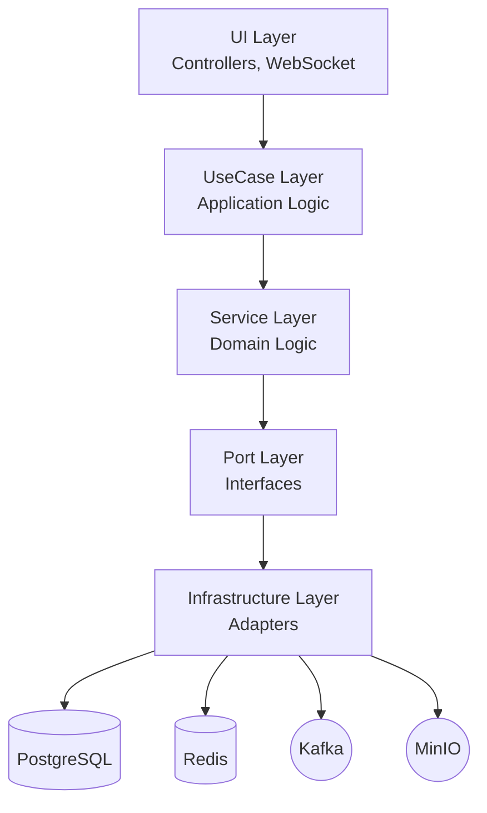

# SERP Discuss Service

Real-time team communication service for the SERP ERP system. Supports channels, direct messaging, file attachments, and presence tracking.

## Overview

Built with **Java 21** (virtual threads) and **Spring Boot 3.5**, following **Clean Architecture** principles. Uses **WebSocket (STOMP)** with server-side fan-out for instant message delivery and **Kafka** for event processing.

### Key Features

- **Messaging**: Rich text, threading, emoji reactions, read receipts, mentions
- **Channels**: Direct (1-on-1), Group (teams), Topic (linked to ERP entities like Tasks/Projects)
- **Real-time**: WebSocket delivery, typing indicators, presence (online/offline), unread counters
- **Attachments**: S3/MinIO storage with presigned URLs, image thumbnails
- **Search**: Full-text search for messages

## Tech Stack

| Component | Technology |
|-----------|------------|
| Language | Java 21 (Virtual Threads) |
| Framework | Spring Boot 3.5 |
| Database | PostgreSQL + Flyway |
| Cache | Redis |
| Messaging | Kafka |
| Storage | MinIO / S3 |
| WebSocket | STOMP (server-side fan-out) |
| Auth | Keycloak (OAuth2/JWT) |

## Architecture



### Message Flow (Server-side Fan-out)

```
Client sends message -> REST/WebSocket -> MessageUseCase -> MessageService (DB persist)
  -> Spring Event (AFTER_COMMIT) -> Kafka publish -> Kafka Consumer -> MessageNewHandler
    -> WebSocketHubAdapter.fanOutToChannelMembers()
      -> channelMemberService.getMemberIds() (from DB/cache)
      -> presenceService.getOnlineUsers() (from Redis)
      -> sendToUser(userId, event) for each online member
```

Clients subscribe to a **single personal queue**. Server handles all routing.

## Project Structure

```
src/main/java/serp/project/discuss_service/
├── core/
│   ├── domain/          # Entities, DTOs, Enums, Events, Value Objects
│   ├── port/            # Interfaces (store, client)
│   ├── service/         # Domain services + implementations
│   ├── usecase/         # Application use cases
│   └── listener/        # Spring event listeners
├── infrastructure/
│   ├── client/          # WebSocket, Kafka, Redis, S3 adapters
│   └── store/           # JPA repositories, models, mappers
├── kernel/
│   ├── config/          # WebSocket, Kafka, Redis, Security configs
│   ├── websocket/       # Auth interceptor, event listener
│   ├── property/        # Configuration properties
│   └── utils/           # Shared utilities
└── ui/
    ├── controller/      # REST controllers
    ├── websocket/       # STOMP message handlers
    └── messaging/       # Kafka consumers, event handlers
```

## Configuration

Key environment variables (see `.env` for defaults):

| Variable | Description | Default |
|----------|-------------|---------|
| `SERVER_PORT` | Service port | `8092` |
| `DB_URL` | PostgreSQL JDBC URL | - |
| `DB_USERNAME` | Database username | - |
| `DB_PASSWORD` | Database password | - |
| `REDIS_HOST` | Redis host | `localhost` |
| `REDIS_PORT` | Redis port | `6379` |
| `KAFKA_BOOTSTRAP_SERVERS` | Kafka brokers | `localhost:9092` |
| `KEYCLOAK_URL` | Keycloak base URL | - |
| `CLIENT_SECRET` | Keycloak client secret | - |
| `STORAGE_ENDPOINT` | MinIO/S3 endpoint | `http://localhost:9000` |
| `STORAGE_BUCKET` | S3 bucket name | `discuss-attachments` |
| `ACCOUNT_SERVICE_URL` | Account service URL | `http://localhost:8081/account-service` |

## Getting Started

### Prerequisites

- JDK 21
- Docker & Docker Compose
- Maven

### Running Locally

1. **Start infrastructure** (from repo root):
   ```bash
   docker-compose -f docker-compose.dev.yml up -d
   ```

2. **Run the service**:
   ```bash
   ./run-dev.sh
   ```

3. **Verify**:
   - Health: `http://localhost:8092/discuss/actuator/health`

## WebSocket API

**Endpoint**: `/ws/discuss` (STOMP over WebSocket + SockJS fallback)

### Client Subscribe (single destination)

```javascript
stompClient.subscribe('/user/queue/events', (message) => {
  const event = JSON.parse(message.body);
  // event.type: MESSAGE_NEW, TYPING_START, REACTION_ADDED, ERROR, etc.
  // event.channelId: route to correct UI
  // event.payload: event-specific data
});
```

### Client Send

| Destination | Purpose | Payload |
|-------------|---------|---------|
| `/app/channels/{channelId}/message` | Send message | `{ content, mentions }` |
| `/app/channels/{channelId}/typing` | Typing indicator | `{ isTyping: true/false }` |
| `/app/channels/{channelId}/read` | Mark as read | `{ messageId }` |

### Event Types

| Type | Description |
|------|-------------|
| `MESSAGE_NEW` | New message in channel |
| `MESSAGE_UPDATED` | Message edited |
| `MESSAGE_DELETED` | Message deleted |
| `REACTION_ADDED` | Reaction added |
| `REACTION_REMOVED` | Reaction removed |
| `TYPING_START` | User started typing |
| `TYPING_STOP` | User stopped typing |
| `USER_ONLINE` | User came online |
| `USER_OFFLINE` | User went offline |
| `ERROR` | Error response |

## Kafka Topics

| Topic | Events |
|-------|--------|
| `discuss.message.events` | MESSAGE_NEW, MESSAGE_UPDATED, MESSAGE_DELETED |
| `discuss.reaction.events` | REACTION_ADDED, REACTION_REMOVED |
| `discuss.presence.events` | TYPING_START, TYPING_STOP, USER_ONLINE, USER_OFFLINE |
| `discuss.channel.events` | CHANNEL_CREATED, CHANNEL_UPDATED, CHANNEL_ARCHIVED |
| `discuss.member.events` | MEMBER_JOINED, MEMBER_LEFT, MEMBER_REMOVED |

## Testing

```bash
./mvnw test                           # Run all tests
./mvnw test -Dtest=MessageUseCaseTest # Run specific test class
```

## License

MIT License. See [LICENSE](../LICENSE) in the repository root.
