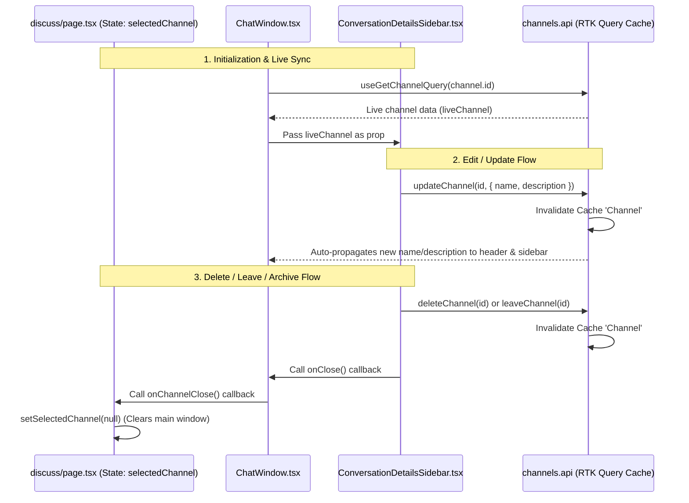

# Design Specification: Channel Management Integration

This design document outlines the technical specification for integrating channel management operations (Edit Name/Description, Archive, Delete, and Leave) into the frontend Discuss module of `serp_web`, communicating with the backend `discuss_service`.

## 1. Goal

Enhance the user experience of the Discuss module by allowing channel managers (owners and admins) to edit, archive, or delete channels, and allowing members to leave group or topic channels directly from the `ConversationDetailsSidebar`.

---

## 2. Technical Architecture & Data Flow

To keep the UI reactive and avoid manual state synchronization issues across parent and child components:
1. The `ChatWindow` will use `useGetChannelQuery(channelId)` to fetch and subscribe to live channel details.
2. Changes to the channel name or description (via `updateChannel` mutation) will invalidate the channel cache, auto-refreshing the header name, description, and the details sidebar.
3. Actions that terminate the user's presence in a channel (Archive, Delete, Leave) will trigger a callback to close the chat window and reset the active selected channel to `null` on the main page.



---

## 3. Detailed Component Changes

### A. Main Page: `serp_web/src/app/discuss/page.tsx`
- Add a callback function `handleChannelClose`:
  ```typescript
  const handleChannelClose = () => {
    setSelectedChannel(null);
  };
  ```
- Pass it to the `<ChatWindow>` component:
  ```tsx
  <ChatWindow
    channel={selectedChannel}
    currentUserId={currentUserId}
    currentUserName={user?.fullName}
    currentUserAvatarUrl={user?.avatarUrl}
    onChannelClose={handleChannelClose}
    className='w-full h-full'
  />
  ```

### B. Chat Window: `serp_web/src/modules/discuss/components/ChatWindow.tsx`
- Accept the new prop:
  ```typescript
  interface ChatWindowProps {
    channel: Channel;
    currentUserId: string;
    currentUserName?: string;
    currentUserAvatarUrl?: string;
    className?: string;
    onChannelClose?: () => void;
  }
  ```
- Fetch live channel data:
  ```typescript
  const { data: liveChannelResponse } = useGetChannelQuery(channel.id);
  const liveChannel = liveChannelResponse?.data || channel;
  ```
- Use `liveChannel` for the header name, description, avatar, and members count.
- Pass `liveChannel` and `onChannelClose` to the details sidebar:
  ```tsx
  <ConversationDetailsSidebar
    channel={liveChannel}
    currentUserId={currentUserId}
    open={detailsSidebarOpen}
    onOpenChange={setDetailsSidebarOpen}
    onClose={onChannelClose}
  />
  ```

### C. Sidebar: `serp_web/src/modules/discuss/components/ConversationDetailsSidebar.tsx`
- Accept the new prop:
  ```typescript
  interface ConversationDetailsSidebarProps {
    channel: Channel;
    currentUserId: string;
    open: boolean;
    onOpenChange: (open: boolean) => void;
    onClose?: () => void;
  }
  ```
- Define management permissions:
  ```typescript
  const currentUserMember = channel.members?.find(
    (m) => String(m.userId) === String(currentUserId)
  );
  const canManage =
    channel.createdBy === currentUserId ||
    currentUserMember?.role === 'OWNER' ||
    currentUserMember?.role === 'ADMIN';

  const canLeave =
    channel.type !== 'DIRECT' && currentUserMember?.role !== 'OWNER';
  ```
- Define mutations:
  ```typescript
  const [updateChannel, { isLoading: isUpdating }] = useUpdateChannelMutation();
  const [archiveChannel, { isLoading: isArchiving }] = useArchiveChannelMutation();
  const [deleteChannel, { isLoading: isDeleting }] = useDeleteChannelMutation();
  const [leaveChannel, { isLoading: isLeaving }] = useLeaveChannelMutation();
  ```
- Define Inline Edit states:
  - `isEditing` (boolean)
  - `editName` (string)
  - `editDescription` (string)
- Render states:
  - **View Mode**: Normal name, description, and an "Edit" button if `canManage === true`.
  - **Edit Mode**: Input fields for name and description, "Save" and "Cancel" buttons.
- Render **Danger Zone** at the bottom of the Overview tab:
  - **Archive Channel** button (grey/amber, visible if `canManage === true`). Confirm: *"Are you sure you want to archive this channel? Archived channels will become read-only."*
  - **Delete Channel** button (red, visible if `canManage === true`). Confirm: *"Are you sure you want to delete this channel? This action is permanent and cannot be undone."*
  - **Leave Channel** button (red, visible if `canLeave === true`). Confirm: *"Are you sure you want to leave this channel? You will no longer receive messages from it."*

---

## 4. Verification Plan

### Manual Verification
1. **Inline Edit**:
   - Log in as Owner/Admin, open a channel, toggle "Edit Details", change name and description, click "Save". Verify changes reflect immediately in the header and sidebar list.
   - Click "Cancel" and verify inputs discard modifications.
   - Log in as a regular Member, verify the "Edit Details" button is hidden.
2. **Leave Channel**:
   - Log in as a Member of a group channel, click "Leave Channel", confirm the browser prompt. Verify the chat window closes, and the channel disappears from the sidebar list.
3. **Archive Channel**:
   - Log in as Owner, click "Archive Channel", confirm. Verify the chat window closes and is deselected.
4. **Delete Channel**:
   - Log in as Owner, click "Delete Channel", confirm. Verify the chat window closes, is deselected, and channel disappears from list.
